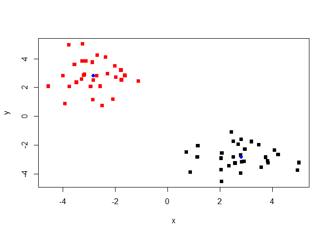
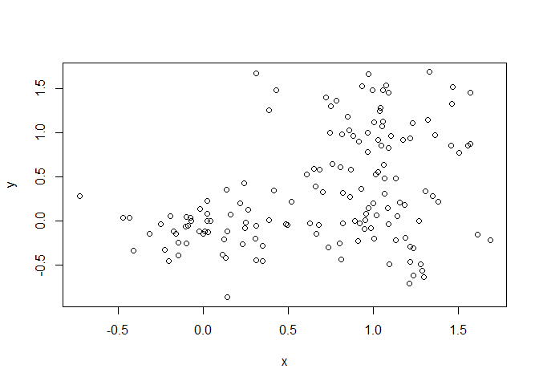
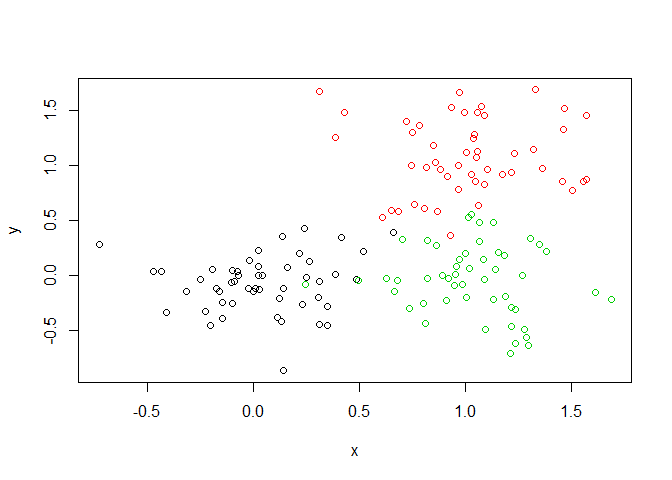

---
chris
title: "lecture 8"
output: 
  html_document: 
    keep_md: yes
---


generating example data for clustering

```r
tmp <-  c(rnorm(30,-3), rnorm(30,3))
x <- cbind( x=tmp, y=rev( tmp))

plot(x)
```

<!-- -->

using kmeans center with k=2 and nstart=20

```r
km <- kmeans(x, centers = 2, nstart = 20)
km
```

```
## K-means clustering with 2 clusters of sizes 30, 30
## 
## Cluster means:
##           x         y
## 1  2.812682 -2.830179
## 2 -2.830179  2.812682
## 
## Clustering vector:
##  [1] 2 2 2 2 2 2 2 2 2 2 2 2 2 2 2 2 2 2 2 2 2 2 2 2 2 2 2 2 2 2 1 1 1 1 1
## [36] 1 1 1 1 1 1 1 1 1 1 1 1 1 1 1 1 1 1 1 1 1 1 1 1 1
## 
## Within cluster sum of squares by cluster:
## [1] 52.12733 52.12733
##  (between_SS / total_SS =  90.2 %)
## 
## Available components:
## 
## [1] "cluster"      "centers"      "totss"        "withinss"    
## [5] "tot.withinss" "betweenss"    "size"         "iter"        
## [9] "ifault"
```
 inspect/print results
 

```r
#cluster sie
km$size
```

```
## [1] 30 30
```

```r
#cluster assignment
km$cluster
```

```
##  [1] 2 2 2 2 2 2 2 2 2 2 2 2 2 2 2 2 2 2 2 2 2 2 2 2 2 2 2 2 2 2 1 1 1 1 1
## [36] 1 1 1 1 1 1 1 1 1 1 1 1 1 1 1 1 1 1 1 1 1 1 1 1 1
```

```r
#cluster centers
km$centers
```

```
##           x         y
## 1  2.812682 -2.830179
## 2 -2.830179  2.812682
```
 plot x colored by kmeans assignment ad add cluster centers
 

```r
plot(x, col=km$cluster, pch=15)
points(km$centers, col="blue", pch=16)
```

<!-- -->

Hierachical clustering

```r
# First we need to calculate point (dis)similarity
# as the Euclidean distance between observations
dist_matrix <- dist(x)
# The hclust() function returns a hierarchical
# clustering model
hc <- hclust(d = dist_matrix)
# the print method is not so useful here
hc 
```

```
## 
## Call:
## hclust(d = dist_matrix)
## 
## Cluster method   : complete 
## Distance         : euclidean 
## Number of objects: 60
```
 
regular viewing will not work, `dist()` does not output into data frame. 


```r
View( as.matrix(dist_matrix))
dim(as.matrix(dist_matrix))
```

```
## [1] 60 60
```

plotting

```r
plot(hc)
```

<!-- -->

adding abline
and cutting tree to define clusters

```r
plot(hc)
abline(h=6, col="red")
```

<!-- -->

```r
#can either cut by h or by k 
grps <- cutree(hc, h=6)
table( grps)
```

```
## grps
##  1  2 
## 30 30
```

```r
plot(x, col=grps) # returns same colors as k means clustering above!
```

<!-- -->


try different cutting


```r
plot(x, col=cutree(hc, k=3))
```

<!-- -->


```r
# Draws a dendrogram
plot(hc)
abline(h=6, col="red")
```

<!-- -->

```r
grps2<- cutree(hc, k=2 ) # Cut into k grps
plot(hc, col=grps2)
```

<!-- -->

Trying hierarchal clustering


```r
# Step 1. Generate some example data for clustering
x <- rbind(
 matrix(rnorm(100, mean=0, sd = 0.3), ncol = 2), # c1
 matrix(rnorm(100, mean = 1, sd = 0.3), ncol = 2), # c2
 matrix(c(rnorm(50, mean = 1, sd = 0.3), # c3
 rnorm(50, mean = 0, sd = 0.3)), ncol = 2))
colnames(x) <- c("x", "y")
# Step 2. Plot the data without clustering
plot(x)
```

<!-- -->

```r
# Step 3. Generate colors for known clusters
# (just so we can compare to hclust results)
col <- as.factor( rep(c("c1","c2","c3"), each=50) )
plot(x, col=col)
```

<!-- -->

my attempts

```r
my.dist.matrix<- dist(x)
hc2<- hclust(my.dist.matrix)
grps2<- cutree(hc2, k = 3)
plot(hc2)
```

<!-- -->

```r
table(grps2)
```

```
## grps2
##  1  2  3 
## 19 89 42
```

plotting data colored by cluster


```r
plot(x, col=grps2)
```

<!-- -->

