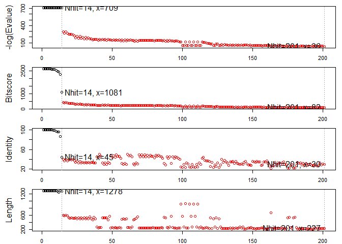
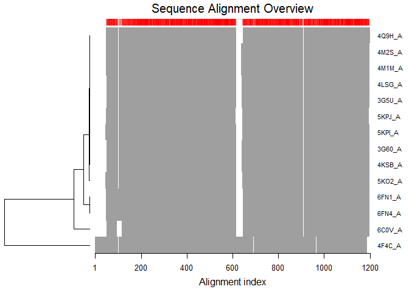
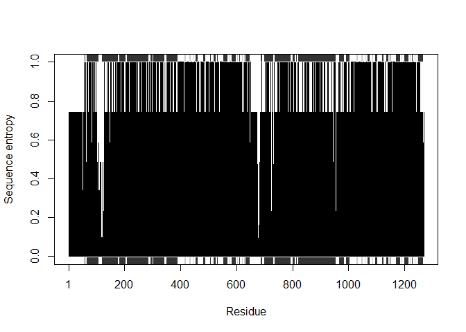

PDB analysis
================

<!-- ## PDB statistics  -->
<!-- import our PDB statistics CSV file and calculate percent structures by experimental method.  -->
<!-- ```{r} -->
<!-- p <- read.csv("Data Export Summary.csv", row.names=1) -->
<!-- ``` -->
<!-- ```{r} -->
<!-- percent <- (p$Total / sum(p$Total))*100 -->
<!-- names(percent) <- row.names(p) -->
<!-- percent -->
\`\`\`

``` r
library (bio3d)
```

    ## Warning: package 'bio3d' was built under R version 3.4.4

reading pdb for stripping out drug molecule.

<!-- ```{r} -->
<!-- pdb <- read.pdb("1hsg") -->
<!-- print(pdb) -->
<!-- attributes(pdb) -->
<!-- head(pdb$atom) -->
<!-- plot.bio3d(pdb$atom$b[pdb$calpha], sse=pdb, typ="l", ylab="B-factor") -->
<!-- ``` -->
<!-- selecting protein/ligand elements -->
<!-- ```{r} -->
<!-- inds.ligand <- atom.select(pdb, "ligand") -->
<!-- inds.protein <- atom.select(pdb, "protein") -->
<!-- inds.ligand -->
<!-- ``` -->
<!-- checking we have what we want  -->
<!-- ```{r} -->
<!-- head(pdb$atom[inds.protein$atom,]) -->
<!-- ``` -->
<!-- creating new pdb file outputs -->
<!-- ```{r} -->
<!-- pdb.ligand <- trim.pdb(pdb,inds = inds.ligand) -->
<!-- pdb.ligand -->
<!-- write.pdb(pdb.ligand, file="1hsg_ligand.pdb") -->
<!-- pdb.protein <- trim.pdb(pdb,inds = inds.protein) -->
<!-- write.pdb(pdb.ligand, file="1hsg_protein.pdb") -->
<!-- ``` -->
<!-- aligning multiple structures -->
<!-- ```{r} -->
<!-- ids <- c("1TND_B","1AGR_A","1TAG_A","1GG2_A","1KJY_A","4G5Q_A") -->
<!-- files <- get.pdb(ids, split = TRUE) -->
<!-- #extract and align the chains we are interested in  -->
<!-- pdbs <- pdbaln(files, fit = TRUE) -->
<!-- ``` -->
<!-- ```{r} -->
<!-- pdbs -->
<!-- ``` -->
getting sequence for interested protein OXA 23 start here for other applications

``` r
aa <-  get.seq("5KPI_A")
```

    ## Warning in get.seq("5KPI_A"): Removing existing file: seqs.fasta

``` r
aa
```

    ##              1        .         .         .         .         .         60 
    ## pdb|5KPI|A   MELEEDLKGRADKNFSKMGKKSKKEKKEKKPAVSVLTMFRYAGWLDRLYMLVGTLAAIIH
    ##              1        .         .         .         .         .         60 
    ## 
    ##             61        .         .         .         .         .         120 
    ## pdb|5KPI|A   GVALPLMMLIFGDMTDSFASVGNVSKNSTNMSEADKRAMFAKLEEEMTTYAYYYTGIGAG
    ##             61        .         .         .         .         .         120 
    ## 
    ##            121        .         .         .         .         .         180 
    ## pdb|5KPI|A   VLIVAYIQVSFWCLAAGRQIHKIRQKFFHAIMNQEIGWFDVHDVGELNTRLTDDVSKINE
    ##            121        .         .         .         .         .         180 
    ## 
    ##            181        .         .         .         .         .         240 
    ## pdb|5KPI|A   GIGDKIGMFFQAMATFFGGFIIGFTRGWKLTLVILAISPVLGLSAGIWAKILSSFTDKEL
    ##            181        .         .         .         .         .         240 
    ## 
    ##            241        .         .         .         .         .         300 
    ## pdb|5KPI|A   HAYAKAGAVAEEVLAAIRTVIAFGGQKKELERYNNNLEEAKRLGIKKAITANISMGAAFL
    ##            241        .         .         .         .         .         300 
    ## 
    ##            301        .         .         .         .         .         360 
    ## pdb|5KPI|A   LIYASYALAFWYGTSLVISKEYSIGQVLTVFFSVLIGAFSVGQASPNIEAFANARGAAYE
    ##            301        .         .         .         .         .         360 
    ## 
    ##            361        .         .         .         .         .         420 
    ## pdb|5KPI|A   VFKIIDNKPSIDSFSKSGHKPDNIQGNLEFKNIHFSYPSRKEVQILKGLNLKVKSGQTVA
    ##            361        .         .         .         .         .         420 
    ## 
    ##            421        .         .         .         .         .         480 
    ## pdb|5KPI|A   LVGNSGCGKSTTVQLMQRLYDPLDGMVSIDGQDIRTINVRYLREIIGVVSQEPVLFATTI
    ##            421        .         .         .         .         .         480 
    ## 
    ##            481        .         .         .         .         .         540 
    ## pdb|5KPI|A   AENIRYGREDVTMDEIEKAVKEANAYDFIMKLPHQFDTLVGERGAQLSGGQKQRIAIARA
    ##            481        .         .         .         .         .         540 
    ## 
    ##            541        .         .         .         .         .         600 
    ## pdb|5KPI|A   LVRNPKILLLDEATSALDTESEAVVQAALDKAREGRTTIVIAHRLSTVRNADVIAGFDGG
    ##            541        .         .         .         .         .         600 
    ## 
    ##            601        .         .         .         .         .         660 
    ## pdb|5KPI|A   VIVEQGNHDELMREKGIYFKLVMTQTAGNEIELGNEACKSKDEIDNLDMSSKDSGSSLIR
    ##            601        .         .         .         .         .         660 
    ## 
    ##            661        .         .         .         .         .         720 
    ## pdb|5KPI|A   RRSTRKSICGPHDQDRKLSTKEALDEDVPPASFWRILKLNSTEWPYFVVGIFCAIINGGL
    ##            661        .         .         .         .         .         720 
    ## 
    ##            721        .         .         .         .         .         780 
    ## pdb|5KPI|A   QPAFSVIFSKVVGVFTNGGPPETQRQNSNLFSLLFLILGIISFITFFLQGFTFGKAGEIL
    ##            721        .         .         .         .         .         780 
    ## 
    ##            781        .         .         .         .         .         840 
    ## pdb|5KPI|A   TKRLRYMVFKSMLRQDVSWFDDPKNTTGALTTRLANDAAQVKGATGSRLAVIFQNIANLG
    ##            781        .         .         .         .         .         840 
    ## 
    ##            841        .         .         .         .         .         900 
    ## pdb|5KPI|A   TGIIISLIYGWQLTLLLLAIVPIIAIAGVVEMKMLSGQALKDKKELEGSGKIATEAIENF
    ##            841        .         .         .         .         .         900 
    ## 
    ##            901        .         .         .         .         .         960 
    ## pdb|5KPI|A   RTVVSLTREQKFETMYAQSLQIPYRNAMKKAHVFGITFSFTQAMMYFSYAACFRFGAYLV
    ##            901        .         .         .         .         .         960 
    ## 
    ##            961        .         .         .         .         .         1020 
    ## pdb|5KPI|A   TQQLMTFENVLLVFSAIVFGAMAVGQVSSFAPDYAKATVSASHIIRIIEKTPEIDSYSTQ
    ##            961        .         .         .         .         .         1020 
    ## 
    ##           1021        .         .         .         .         .         1080 
    ## pdb|5KPI|A   GLKPNMLEGNVQFSGVVFNYPTRPSIPVLQGLSLEVKKGQTLALVGSSGCGKSTVVQLLE
    ##           1021        .         .         .         .         .         1080 
    ## 
    ##           1081        .         .         .         .         .         1140 
    ## pdb|5KPI|A   RFYDPMAGSVFLDGKEIKQLNVQWLRAQLGIVSQEPILFDCSIAENIAYGDNSRVVSYEE
    ##           1081        .         .         .         .         .         1140 
    ## 
    ##           1141        .         .         .         .         .         1200 
    ## pdb|5KPI|A   IVRAAKEANIHQFIDSLPDKYNTRVGDKGTQLSGGQKQRIAIARALVRQPHILLLDEATS
    ##           1141        .         .         .         .         .         1200 
    ## 
    ##           1201        .         .         .         .         .         1260 
    ## pdb|5KPI|A   ALDTESEKVVQEALDKAREGRTCIVIAHRLSTIQNADLIVVIQNGKVKEHGTHQQLLAQK
    ##           1201        .         .         .         .         .         1260 
    ## 
    ##           1261        .         . 1282 
    ## pdb|5KPI|A   GIYFSMVSVQAGAKRSHHHHHH
    ##           1261        .         . 1282 
    ## 
    ## Call:
    ##   read.fasta(file = outfile)
    ## 
    ## Class:
    ##   fasta
    ## 
    ## Alignment dimensions:
    ##   1 sequence rows; 1282 position columns (1282 non-gap, 0 gap) 
    ## 
    ## + attr: id, ali, call

``` r
b <- blast.pdb(aa)
```

    ##  Searching ... please wait (updates every 5 seconds) RID = FY42ZUWV015 
    ##  .
    ##  Reporting 201 hits

``` r
hits <- plot(b)#,# cutoff = 200)
```

    ##   * Possible cutoff values:    709 36 
    ##             Yielding Nhits:    14 201 
    ## 
    ##   * Chosen cutoff value of:    709 
    ##             Yielding Nhits:    14



``` r
# Fetch PDBs
files <- get.pdb(hits$pdb.id, path = "pdbs", split = TRUE, gzip =
TRUE)
```

    ## Warning in get.pdb(hits$pdb.id, path = "pdbs", split = TRUE, gzip = TRUE):
    ## pdbs/5KPI.pdb exists. Skipping download

    ## Warning in get.pdb(hits$pdb.id, path = "pdbs", split = TRUE, gzip = TRUE):
    ## pdbs/5KPJ.pdb exists. Skipping download

    ## Warning in get.pdb(hits$pdb.id, path = "pdbs", split = TRUE, gzip = TRUE):
    ## pdbs/3G60.pdb exists. Skipping download

    ## Warning in get.pdb(hits$pdb.id, path = "pdbs", split = TRUE, gzip = TRUE):
    ## pdbs/4KSB.pdb exists. Skipping download

    ## Warning in get.pdb(hits$pdb.id, path = "pdbs", split = TRUE, gzip = TRUE):
    ## pdbs/4M2S.pdb exists. Skipping download

    ## Warning in get.pdb(hits$pdb.id, path = "pdbs", split = TRUE, gzip = TRUE):
    ## pdbs/3G5U.pdb exists. Skipping download

    ## Warning in get.pdb(hits$pdb.id, path = "pdbs", split = TRUE, gzip = TRUE):
    ## pdbs/4LSG.pdb exists. Skipping download

    ## Warning in get.pdb(hits$pdb.id, path = "pdbs", split = TRUE, gzip = TRUE):
    ## pdbs/4M1M.pdb exists. Skipping download

    ## Warning in get.pdb(hits$pdb.id, path = "pdbs", split = TRUE, gzip = TRUE):
    ## pdbs/4Q9H.pdb exists. Skipping download

    ## Warning in get.pdb(hits$pdb.id, path = "pdbs", split = TRUE, gzip = TRUE):
    ## pdbs/5KO2.pdb exists. Skipping download

    ## Warning in get.pdb(hits$pdb.id, path = "pdbs", split = TRUE, gzip = TRUE):
    ## pdbs/6FN4.pdb exists. Skipping download

    ## Warning in get.pdb(hits$pdb.id, path = "pdbs", split = TRUE, gzip = TRUE):
    ## pdbs/6FN1.pdb exists. Skipping download

    ## Warning in get.pdb(hits$pdb.id, path = "pdbs", split = TRUE, gzip = TRUE):
    ## pdbs/6C0V.pdb exists. Skipping download

    ## Warning in get.pdb(hits$pdb.id, path = "pdbs", split = TRUE, gzip = TRUE):
    ## pdbs/4F4C.pdb exists. Skipping download

    ## 
      |                                                                       
      |                                                                 |   0%
      |                                                                       
      |=====                                                            |   7%
      |                                                                       
      |=========                                                        |  14%
      |                                                                       
      |==============                                                   |  21%
      |                                                                       
      |===================                                              |  29%
      |                                                                       
      |=======================                                          |  36%
      |                                                                       
      |============================                                     |  43%
      |                                                                       
      |================================                                 |  50%
      |                                                                       
      |=====================================                            |  57%
      |                                                                       
      |==========================================                       |  64%
      |                                                                       
      |==============================================                   |  71%
      |                                                                       
      |===================================================              |  79%
      |                                                                       
      |========================================================         |  86%
      |                                                                       
      |============================================================     |  93%
      |                                                                       
      |=================================================================| 100%

``` r
# Align structures
pdbs <- pdbaln(files)
```

    ## Reading PDB files:
    ## pdbs/split_chain/5KPI_A.pdb
    ## pdbs/split_chain/5KPJ_A.pdb
    ## pdbs/split_chain/3G60_A.pdb
    ## pdbs/split_chain/4KSB_A.pdb
    ## pdbs/split_chain/4M2S_A.pdb
    ## pdbs/split_chain/3G5U_A.pdb
    ## pdbs/split_chain/4LSG_A.pdb
    ## pdbs/split_chain/4M1M_A.pdb
    ## pdbs/split_chain/4Q9H_A.pdb
    ## pdbs/split_chain/5KO2_A.pdb
    ## pdbs/split_chain/6FN4_A.pdb
    ## pdbs/split_chain/6FN1_A.pdb
    ## pdbs/split_chain/6C0V_A.pdb
    ## pdbs/split_chain/4F4C_A.pdb
    ## ..............
    ## 
    ## Extracting sequences
    ## 
    ## pdb/seq: 1   name: pdbs/split_chain/5KPI_A.pdb 
    ## pdb/seq: 2   name: pdbs/split_chain/5KPJ_A.pdb 
    ## pdb/seq: 3   name: pdbs/split_chain/3G60_A.pdb 
    ## pdb/seq: 4   name: pdbs/split_chain/4KSB_A.pdb 
    ## pdb/seq: 5   name: pdbs/split_chain/4M2S_A.pdb 
    ## pdb/seq: 6   name: pdbs/split_chain/3G5U_A.pdb 
    ## pdb/seq: 7   name: pdbs/split_chain/4LSG_A.pdb 
    ## pdb/seq: 8   name: pdbs/split_chain/4M1M_A.pdb 
    ## pdb/seq: 9   name: pdbs/split_chain/4Q9H_A.pdb 
    ## pdb/seq: 10   name: pdbs/split_chain/5KO2_A.pdb 
    ## pdb/seq: 11   name: pdbs/split_chain/6FN4_A.pdb 
    ## pdb/seq: 12   name: pdbs/split_chain/6FN1_A.pdb 
    ## pdb/seq: 13   name: pdbs/split_chain/6C0V_A.pdb 
    ## pdb/seq: 14   name: pdbs/split_chain/4F4C_A.pdb

``` r
# Vector containing PDB codes
ids <- basename.pdb(pdbs$id)
# Draw schematic alignment
plot(pdbs, labels=ids)
```

 5.2 Sequence conservation analysis

``` r
# Calculate sequence conservation
cons <- conserv(pdbs, method="entropy22")
# SSE annotations
sse <- pdbs2sse(pdbs, ind=1, rm.gaps=FALSE)
```

    ## Extracting SSE from pdbs$sse attribute

``` r
# Plot conservation per residue
plotb3(cons, sse=sse, ylab="Sequence entropy")
```



``` r
# find invariant core
core <- core.find(pdbs)
```

    ##  core size 1135 of 1136  vol = 17173.77 
    ##  core size 1134 of 1136  vol = 17041.33 
    ##  core size 1133 of 1136  vol = 16897.3 
    ##  core size 1132 of 1136  vol = 16764.54 
    ##  core size 1131 of 1136  vol = 16627.84 
    ##  core size 1130 of 1136  vol = 16499.21 
    ##  core size 1129 of 1136  vol = 16371 
    ##  core size 1128 of 1136  vol = 16248.27 
    ##  core size 1127 of 1136  vol = 16139.73 
    ##  core size 1126 of 1136  vol = 16022.61 
    ##  core size 1125 of 1136  vol = 15911.2 
    ##  core size 1124 of 1136  vol = 15800.97 
    ##  core size 1123 of 1136  vol = 15695.74 
    ##  core size 1122 of 1136  vol = 15609.69 
    ##  core size 1121 of 1136  vol = 15513.7 
    ##  core size 1120 of 1136  vol = 15424.34 
    ##  core size 1119 of 1136  vol = 15330.67 
    ##  core size 1118 of 1136  vol = 15237.26 
    ##  core size 1117 of 1136  vol = 15143.84 
    ##  core size 1116 of 1136  vol = 15057.49 
    ##  core size 1115 of 1136  vol = 14973.73 
    ##  core size 1114 of 1136  vol = 14890.8 
    ##  core size 1113 of 1136  vol = 14815.77 
    ##  core size 1112 of 1136  vol = 14734.65 
    ##  core size 1111 of 1136  vol = 14660.83 
    ##  core size 1110 of 1136  vol = 14593.02 
    ##  core size 1109 of 1136  vol = 14516.51 
    ##  core size 1108 of 1136  vol = 14440.55 
    ##  core size 1107 of 1136  vol = 14369.08 
    ##  core size 1106 of 1136  vol = 14307.29 
    ##  core size 1105 of 1136  vol = 14235.43 
    ##  core size 1104 of 1136  vol = 14161.35 
    ##  core size 1103 of 1136  vol = 14095.83 
    ##  core size 1102 of 1136  vol = 14027.49 
    ##  core size 1101 of 1136  vol = 13956.1 
    ##  core size 1100 of 1136  vol = 13890.2 
    ##  core size 1099 of 1136  vol = 13827.2 
    ##  core size 1098 of 1136  vol = 13758.99 
    ##  core size 1097 of 1136  vol = 13692.76 
    ##  core size 1096 of 1136  vol = 13635.22 
    ##  core size 1095 of 1136  vol = 13572.6 
    ##  core size 1094 of 1136  vol = 13506.44 
    ##  core size 1093 of 1136  vol = 13444.56 
    ##  core size 1092 of 1136  vol = 13383.87 
    ##  core size 1091 of 1136  vol = 13324.43 
    ##  core size 1090 of 1136  vol = 13262.37 
    ##  core size 1089 of 1136  vol = 13201.97 
    ##  core size 1088 of 1136  vol = 13137.44 
    ##  core size 1087 of 1136  vol = 13085.38 
    ##  core size 1086 of 1136  vol = 13034.18 
    ##  core size 1085 of 1136  vol = 12974.48 
    ##  core size 1084 of 1136  vol = 12923.41 
    ##  core size 1083 of 1136  vol = 12862.26 
    ##  core size 1082 of 1136  vol = 12802.06 
    ##  core size 1081 of 1136  vol = 12745.17 
    ##  core size 1080 of 1136  vol = 12689.62 
    ##  core size 1079 of 1136  vol = 12632.22 
    ##  core size 1078 of 1136  vol = 12573.02 
    ##  core size 1077 of 1136  vol = 12521.35 
    ##  core size 1076 of 1136  vol = 12465.28 
    ##  core size 1075 of 1136  vol = 12408.88 
    ##  core size 1074 of 1136  vol = 12359.86 
    ##  core size 1073 of 1136  vol = 12307.61 
    ##  core size 1072 of 1136  vol = 12254.16 
    ##  core size 1071 of 1136  vol = 12203.57 
    ##  core size 1070 of 1136  vol = 12153.38 
    ##  core size 1069 of 1136  vol = 12108.43 
    ##  core size 1068 of 1136  vol = 12054.36 
    ##  core size 1067 of 1136  vol = 12003.23 
    ##  core size 1066 of 1136  vol = 11959.03 
    ##  core size 1065 of 1136  vol = 11909.28 
    ##  core size 1064 of 1136  vol = 11860.7 
    ##  core size 1063 of 1136  vol = 11815.48 
    ##  core size 1062 of 1136  vol = 11769.4 
    ##  core size 1061 of 1136  vol = 11719.33 
    ##  core size 1060 of 1136  vol = 11669.07 
    ##  core size 1059 of 1136  vol = 11617.91 
    ##  core size 1058 of 1136  vol = 11573.49 
    ##  core size 1057 of 1136  vol = 11523.98 
    ##  core size 1056 of 1136  vol = 11480.37 
    ##  core size 1055 of 1136  vol = 11429.66 
    ##  core size 1054 of 1136  vol = 11381.72 
    ##  core size 1053 of 1136  vol = 11328.93 
    ##  core size 1052 of 1136  vol = 11282.03 
    ##  core size 1051 of 1136  vol = 11233.53 
    ##  core size 1050 of 1136  vol = 11184.73 
    ##  core size 1049 of 1136  vol = 11136.71 
    ##  core size 1048 of 1136  vol = 11091.94 
    ##  core size 1047 of 1136  vol = 11044.19 
    ##  core size 1046 of 1136  vol = 10998.55 
    ##  core size 1045 of 1136  vol = 10954.12 
    ##  core size 1044 of 1136  vol = 10906.01 
    ##  core size 1043 of 1136  vol = 10858.72 
    ##  core size 1042 of 1136  vol = 10812.69 
    ##  core size 1041 of 1136  vol = 10761.99 
    ##  core size 1040 of 1136  vol = 10718.52 
    ##  core size 1039 of 1136  vol = 10674.93 
    ##  core size 1038 of 1136  vol = 10629.56 
    ##  core size 1037 of 1136  vol = 10584.71 
    ##  core size 1036 of 1136  vol = 10539.28 
    ##  core size 1035 of 1136  vol = 10489.14 
    ##  core size 1034 of 1136  vol = 10442.02 
    ##  core size 1033 of 1136  vol = 10392.39 
    ##  core size 1032 of 1136  vol = 10343.27 
    ##  core size 1031 of 1136  vol = 10298.25 
    ##  core size 1030 of 1136  vol = 10250.26 
    ##  core size 1029 of 1136  vol = 10202.61 
    ##  core size 1028 of 1136  vol = 10156.68 
    ##  core size 1027 of 1136  vol = 10109.65 
    ##  core size 1026 of 1136  vol = 10064.55 
    ##  core size 1025 of 1136  vol = 10020.49 
    ##  core size 1024 of 1136  vol = 9973.26 
    ##  core size 1023 of 1136  vol = 9930.392 
    ##  core size 1022 of 1136  vol = 9883.984 
    ##  core size 1021 of 1136  vol = 9836.751 
    ##  core size 1020 of 1136  vol = 9793.492 
    ##  core size 1019 of 1136  vol = 9751.303 
    ##  core size 1018 of 1136  vol = 9707.977 
    ##  core size 1017 of 1136  vol = 9664.573 
    ##  core size 1016 of 1136  vol = 9621.395 
    ##  core size 1015 of 1136  vol = 9571.832 
    ##  core size 1014 of 1136  vol = 9527.842 
    ##  core size 1013 of 1136  vol = 9480.679 
    ##  core size 1012 of 1136  vol = 9434.927 
    ##  core size 1011 of 1136  vol = 9393.196 
    ##  core size 1010 of 1136  vol = 9350.597 
    ##  core size 1009 of 1136  vol = 9310.011 
    ##  core size 1008 of 1136  vol = 9268.819 
    ##  core size 1007 of 1136  vol = 9226.722 
    ##  core size 1006 of 1136  vol = 9185.02 
    ##  core size 1005 of 1136  vol = 9141.188 
    ##  core size 1004 of 1136  vol = 9100.913 
    ##  core size 1003 of 1136  vol = 9060.533 
    ##  core size 1002 of 1136  vol = 9021.92 
    ##  core size 1001 of 1136  vol = 8980.497 
    ##  core size 1000 of 1136  vol = 8937.674 
    ##  core size 999 of 1136  vol = 8893.537 
    ##  core size 998 of 1136  vol = 8853.54 
    ##  core size 997 of 1136  vol = 8811.955 
    ##  core size 996 of 1136  vol = 8770.547 
    ##  core size 995 of 1136  vol = 8731.97 
    ##  core size 994 of 1136  vol = 8693.055 
    ##  core size 993 of 1136  vol = 8654.245 
    ##  core size 992 of 1136  vol = 8613.977 
    ##  core size 991 of 1136  vol = 8569.675 
    ##  core size 990 of 1136  vol = 8527.486 
    ##  core size 989 of 1136  vol = 8484.598 
    ##  core size 988 of 1136  vol = 8447.421 
    ##  core size 987 of 1136  vol = 8406.562 
    ##  core size 986 of 1136  vol = 8367.775 
    ##  core size 985 of 1136  vol = 8326.26 
    ##  core size 984 of 1136  vol = 8283.916 
    ##  core size 983 of 1136  vol = 8243.961 
    ##  core size 982 of 1136  vol = 8208.194 
    ##  core size 981 of 1136  vol = 8170.42 
    ##  core size 980 of 1136  vol = 8132.928 
    ##  core size 979 of 1136  vol = 8098.092 
    ##  core size 978 of 1136  vol = 8060.371 
    ##  core size 977 of 1136  vol = 8021.153 
    ##  core size 976 of 1136  vol = 7985.043 
    ##  core size 975 of 1136  vol = 7947.261 
    ##  core size 974 of 1136  vol = 7910.375 
    ##  core size 973 of 1136  vol = 7876.739 
    ##  core size 972 of 1136  vol = 7840.156 
    ##  core size 971 of 1136  vol = 7800.853 
    ##  core size 970 of 1136  vol = 7763.104 
    ##  core size 969 of 1136  vol = 7725.679 
    ##  core size 968 of 1136  vol = 7689.766 
    ##  core size 967 of 1136  vol = 7653.066 
    ##  core size 966 of 1136  vol = 7617.848 
    ##  core size 965 of 1136  vol = 7580.45 
    ##  core size 964 of 1136  vol = 7543.284 
    ##  core size 963 of 1136  vol = 7508.85 
    ##  core size 962 of 1136  vol = 7474.627 
    ##  core size 961 of 1136  vol = 7438.318 
    ##  core size 960 of 1136  vol = 7401.051 
    ##  core size 959 of 1136  vol = 7365.507 
    ##  core size 958 of 1136  vol = 7329.42 
    ##  core size 957 of 1136  vol = 7295.749 
    ##  core size 956 of 1136  vol = 7262.022 
    ##  core size 955 of 1136  vol = 7227.636 
    ##  core size 954 of 1136  vol = 7198.878 
    ##  core size 953 of 1136  vol = 7163.46 
    ##  core size 952 of 1136  vol = 7130.179 
    ##  core size 951 of 1136  vol = 7095.652 
    ##  core size 950 of 1136  vol = 7062.623 
    ##  core size 949 of 1136  vol = 7028.285 
    ##  core size 948 of 1136  vol = 6995.285 
    ##  core size 947 of 1136  vol = 6961.808 
    ##  core size 946 of 1136  vol = 6926.587 
    ##  core size 945 of 1136  vol = 6894.209 
    ##  core size 944 of 1136  vol = 6862.385 
    ##  core size 943 of 1136  vol = 6829.845 
    ##  core size 942 of 1136  vol = 6804.031 
    ##  core size 941 of 1136  vol = 6770.533 
    ##  core size 940 of 1136  vol = 6739.552 
    ##  core size 939 of 1136  vol = 6707.683 
    ##  core size 938 of 1136  vol = 6676.335 
    ##  core size 937 of 1136  vol = 6644.095 
    ##  core size 936 of 1136  vol = 6613.599 
    ##  core size 935 of 1136  vol = 6583.198 
    ##  core size 934 of 1136  vol = 6549.258 
    ##  core size 933 of 1136  vol = 6517.222 
    ##  core size 932 of 1136  vol = 6485.435 
    ##  core size 931 of 1136  vol = 6454.006 
    ##  core size 930 of 1136  vol = 6423.259 
    ##  core size 929 of 1136  vol = 6391.323 
    ##  core size 928 of 1136  vol = 6360.298 
    ##  core size 927 of 1136  vol = 6329.776 
    ##  core size 926 of 1136  vol = 6297.611 
    ##  core size 925 of 1136  vol = 6263.875 
    ##  core size 924 of 1136  vol = 6230.664 
    ##  core size 923 of 1136  vol = 6198.93 
    ##  core size 922 of 1136  vol = 6167.492 
    ##  core size 921 of 1136  vol = 6137.151 
    ##  core size 920 of 1136  vol = 6103.554 
    ##  core size 919 of 1136  vol = 6070.882 
    ##  core size 918 of 1136  vol = 6039.566 
    ##  core size 917 of 1136  vol = 6008.072 
    ##  core size 916 of 1136  vol = 5976.172 
    ##  core size 915 of 1136  vol = 5943.801 
    ##  core size 914 of 1136  vol = 5914.399 
    ##  core size 913 of 1136  vol = 5884.31 
    ##  core size 912 of 1136  vol = 5851.258 
    ##  core size 911 of 1136  vol = 5819.026 
    ##  core size 910 of 1136  vol = 5788.375 
    ##  core size 909 of 1136  vol = 5757.496 
    ##  core size 908 of 1136  vol = 5730.191 
    ##  core size 907 of 1136  vol = 5697.869 
    ##  core size 906 of 1136  vol = 5665.44 
    ##  core size 905 of 1136  vol = 5638.757 
    ##  core size 904 of 1136  vol = 5612.305 
    ##  core size 903 of 1136  vol = 5583.995 
    ##  core size 902 of 1136  vol = 5554.534 
    ##  core size 901 of 1136  vol = 5526.445 
    ##  core size 900 of 1136  vol = 5498.269 
    ##  core size 899 of 1136  vol = 5470.483 
    ##  core size 898 of 1136  vol = 5443.28 
    ##  core size 897 of 1136  vol = 5414.583 
    ##  core size 896 of 1136  vol = 5385.42 
    ##  core size 895 of 1136  vol = 5356.208 
    ##  core size 894 of 1136  vol = 5327.404 
    ##  core size 893 of 1136  vol = 5298.637 
    ##  core size 892 of 1136  vol = 5270.274 
    ##  core size 891 of 1136  vol = 5241.122 
    ##  core size 890 of 1136  vol = 5212.689 
    ##  core size 889 of 1136  vol = 5183.336 
    ##  core size 888 of 1136  vol = 5152.475 
    ##  core size 887 of 1136  vol = 5124.012 
    ##  core size 886 of 1136  vol = 5094.581 
    ##  core size 885 of 1136  vol = 5064.847 
    ##  core size 884 of 1136  vol = 5038.719 
    ##  core size 883 of 1136  vol = 5011.552 
    ##  core size 882 of 1136  vol = 4982.49 
    ##  core size 881 of 1136  vol = 4955.914 
    ##  core size 880 of 1136  vol = 4929.73 
    ##  core size 879 of 1136  vol = 4901.485 
    ##  core size 878 of 1136  vol = 4873.642 
    ##  core size 877 of 1136  vol = 4845.163 
    ##  core size 876 of 1136  vol = 4815.062 
    ##  core size 875 of 1136  vol = 4786.363 
    ##  core size 874 of 1136  vol = 4755.696 
    ##  core size 873 of 1136  vol = 4727.023 
    ##  core size 872 of 1136  vol = 4697.276 
    ##  core size 871 of 1136  vol = 4668.078 
    ##  core size 870 of 1136  vol = 4638.767 
    ##  core size 869 of 1136  vol = 4609.664 
    ##  core size 868 of 1136  vol = 4580.103 
    ##  core size 867 of 1136  vol = 4549.196 
    ##  core size 866 of 1136  vol = 4520.621 
    ##  core size 865 of 1136  vol = 4494.518 
    ##  core size 864 of 1136  vol = 4468.995 
    ##  core size 863 of 1136  vol = 4439.436 
    ##  core size 862 of 1136  vol = 4410.735 
    ##  core size 861 of 1136  vol = 4381.234 
    ##  core size 860 of 1136  vol = 4351.428 
    ##  core size 859 of 1136  vol = 4321.728 
    ##  core size 858 of 1136  vol = 4291.797 
    ##  core size 857 of 1136  vol = 4261.611 
    ##  core size 856 of 1136  vol = 4233.199 
    ##  core size 855 of 1136  vol = 4205.695 
    ##  core size 854 of 1136  vol = 4176.831 
    ##  core size 853 of 1136  vol = 4151.45 
    ##  core size 852 of 1136  vol = 4126.574 
    ##  core size 851 of 1136  vol = 4099.827 
    ##  core size 850 of 1136  vol = 4070.87 
    ##  core size 849 of 1136  vol = 4040.831 
    ##  core size 848 of 1136  vol = 4010.64 
    ##  core size 847 of 1136  vol = 3979.876 
    ##  core size 846 of 1136  vol = 3948.94 
    ##  core size 845 of 1136  vol = 3918.425 
    ##  core size 844 of 1136  vol = 3888.445 
    ##  core size 843 of 1136  vol = 3858.571 
    ##  core size 842 of 1136  vol = 3829.252 
    ##  core size 841 of 1136  vol = 3799.398 
    ##  core size 840 of 1136  vol = 3769.522 
    ##  core size 839 of 1136  vol = 3742.531 
    ##  core size 838 of 1136  vol = 3717.426 
    ##  core size 837 of 1136  vol = 3687.74 
    ##  core size 836 of 1136  vol = 3657.436 
    ##  core size 835 of 1136  vol = 3631.187 
    ##  core size 834 of 1136  vol = 3604.832 
    ##  core size 833 of 1136  vol = 3578.266 
    ##  core size 832 of 1136  vol = 3558.892 
    ##  core size 831 of 1136  vol = 3530.107 
    ##  core size 830 of 1136  vol = 3501.307 
    ##  core size 829 of 1136  vol = 3481.596 
    ##  core size 828 of 1136  vol = 3454.468 
    ##  core size 827 of 1136  vol = 3425.192 
    ##  core size 826 of 1136  vol = 3401.163 
    ##  core size 825 of 1136  vol = 3374.13 
    ##  core size 824 of 1136  vol = 3353.938 
    ##  core size 823 of 1136  vol = 3326.794 
    ##  core size 822 of 1136  vol = 3303.261 
    ##  core size 821 of 1136  vol = 3279.666 
    ##  core size 820 of 1136  vol = 3258.092 
    ##  core size 819 of 1136  vol = 3237.855 
    ##  core size 818 of 1136  vol = 3214.663 
    ##  core size 817 of 1136  vol = 3192 
    ##  core size 816 of 1136  vol = 3174.678 
    ##  core size 815 of 1136  vol = 3153.774 
    ##  core size 814 of 1136  vol = 3136.215 
    ##  core size 813 of 1136  vol = 3112.858 
    ##  core size 812 of 1136  vol = 3094.039 
    ##  core size 811 of 1136  vol = 3069.368 
    ##  core size 810 of 1136  vol = 3047.027 
    ##  core size 809 of 1136  vol = 3025.422 
    ##  core size 808 of 1136  vol = 3007.75 
    ##  core size 807 of 1136  vol = 2991.584 
    ##  core size 806 of 1136  vol = 2972.618 
    ##  core size 805 of 1136  vol = 2958.044 
    ##  core size 804 of 1136  vol = 2940.728 
    ##  core size 803 of 1136  vol = 2926.67 
    ##  core size 802 of 1136  vol = 2907.496 
    ##  core size 801 of 1136  vol = 2890.026 
    ##  core size 800 of 1136  vol = 2875.982 
    ##  core size 799 of 1136  vol = 2851.695 
    ##  core size 798 of 1136  vol = 2836.734 
    ##  core size 797 of 1136  vol = 2817.276 
    ##  core size 796 of 1136  vol = 2793.604 
    ##  core size 795 of 1136  vol = 2779.577 
    ##  core size 794 of 1136  vol = 2757.821 
    ##  core size 793 of 1136  vol = 2741.365 
    ##  core size 792 of 1136  vol = 2724.658 
    ##  core size 791 of 1136  vol = 2709.652 
    ##  core size 790 of 1136  vol = 2693.432 
    ##  core size 789 of 1136  vol = 2677.06 
    ##  core size 788 of 1136  vol = 2663.177 
    ##  core size 787 of 1136  vol = 2653.132 
    ##  core size 786 of 1136  vol = 2630.616 
    ##  core size 785 of 1136  vol = 2616.755 
    ##  core size 784 of 1136  vol = 2600.387 
    ##  core size 783 of 1136  vol = 2589.704 
    ##  core size 782 of 1136  vol = 2574.127 
    ##  core size 781 of 1136  vol = 2558.391 
    ##  core size 780 of 1136  vol = 2542.307 
    ##  core size 779 of 1136  vol = 2529.608 
    ##  core size 778 of 1136  vol = 2511.494 
    ##  core size 777 of 1136  vol = 2496.71 
    ##  core size 776 of 1136  vol = 2481.336 
    ##  core size 775 of 1136  vol = 2468.693 
    ##  core size 774 of 1136  vol = 2451.478 
    ##  core size 773 of 1136  vol = 2433.482 
    ##  core size 772 of 1136  vol = 2423.985 
    ##  core size 771 of 1136  vol = 2408.115 
    ##  core size 770 of 1136  vol = 2394.436 
    ##  core size 769 of 1136  vol = 2379.247 
    ##  core size 768 of 1136  vol = 2369.521 
    ##  core size 767 of 1136  vol = 2353.756 
    ##  core size 766 of 1136  vol = 2342.162 
    ##  core size 765 of 1136  vol = 2327.893 
    ##  core size 764 of 1136  vol = 2314.552 
    ##  core size 763 of 1136  vol = 2300.852 
    ##  core size 762 of 1136  vol = 2290.984 
    ##  core size 761 of 1136  vol = 2277.165 
    ##  core size 760 of 1136  vol = 2262.577 
    ##  core size 759 of 1136  vol = 2252.392 
    ##  core size 758 of 1136  vol = 2241.68 
    ##  core size 757 of 1136  vol = 2233.216 
    ##  core size 756 of 1136  vol = 2223.75 
    ##  core size 755 of 1136  vol = 2212.899 
    ##  core size 754 of 1136  vol = 2199.461 
    ##  core size 753 of 1136  vol = 2187.01 
    ##  core size 752 of 1136  vol = 2171.124 
    ##  core size 751 of 1136  vol = 2159.592 
    ##  core size 750 of 1136  vol = 2144.362 
    ##  core size 749 of 1136  vol = 2134.89 
    ##  core size 748 of 1136  vol = 2120.621 
    ##  core size 747 of 1136  vol = 2111.25 
    ##  core size 746 of 1136  vol = 2098.933 
    ##  core size 745 of 1136  vol = 2088.631 
    ##  core size 744 of 1136  vol = 2077.933 
    ##  core size 743 of 1136  vol = 2068.82 
    ##  core size 742 of 1136  vol = 2058.896 
    ##  core size 741 of 1136  vol = 2048.221 
    ##  core size 740 of 1136  vol = 2037.987 
    ##  core size 739 of 1136  vol = 2027.245 
    ##  core size 738 of 1136  vol = 2016.426 
    ##  core size 737 of 1136  vol = 2006.322 
    ##  core size 736 of 1136  vol = 1996.094 
    ##  core size 735 of 1136  vol = 1984.243 
    ##  core size 734 of 1136  vol = 1972.286 
    ##  core size 733 of 1136  vol = 1961.405 
    ##  core size 732 of 1136  vol = 1950.918 
    ##  core size 731 of 1136  vol = 1940.73 
    ##  core size 730 of 1136  vol = 1929.623 
    ##  core size 729 of 1136  vol = 1920.993 
    ##  core size 728 of 1136  vol = 1912.419 
    ##  core size 727 of 1136  vol = 1901.084 
    ##  core size 726 of 1136  vol = 1890.945 
    ##  core size 725 of 1136  vol = 1882.999 
    ##  core size 724 of 1136  vol = 1870.995 
    ##  core size 723 of 1136  vol = 1856.459 
    ##  core size 722 of 1136  vol = 1842.479 
    ##  core size 721 of 1136  vol = 1832.198 
    ##  core size 720 of 1136  vol = 1823.971 
    ##  core size 719 of 1136  vol = 1813.604 
    ##  core size 718 of 1136  vol = 1804.124 
    ##  core size 717 of 1136  vol = 1792.425 
    ##  core size 716 of 1136  vol = 1781.311 
    ##  core size 715 of 1136  vol = 1768.999 
    ##  core size 714 of 1136  vol = 1758.135 
    ##  core size 713 of 1136  vol = 1749.808 
    ##  core size 712 of 1136  vol = 1737.046 
    ##  core size 711 of 1136  vol = 1726.357 
    ##  core size 710 of 1136  vol = 1716.987 
    ##  core size 709 of 1136  vol = 1706.482 
    ##  core size 708 of 1136  vol = 1695.389 
    ##  core size 707 of 1136  vol = 1681.44 
    ##  core size 706 of 1136  vol = 1670.605 
    ##  core size 705 of 1136  vol = 1654.078 
    ##  core size 704 of 1136  vol = 1642.64 
    ##  core size 703 of 1136  vol = 1633.083 
    ##  core size 702 of 1136  vol = 1621.54 
    ##  core size 701 of 1136  vol = 1612.969 
    ##  core size 700 of 1136  vol = 1601.859 
    ##  core size 699 of 1136  vol = 1591.061 
    ##  core size 698 of 1136  vol = 1580.311 
    ##  core size 697 of 1136  vol = 1572.092 
    ##  core size 696 of 1136  vol = 1561.975 
    ##  core size 695 of 1136  vol = 1551.08 
    ##  core size 694 of 1136  vol = 1541.617 
    ##  core size 693 of 1136  vol = 1530.255 
    ##  core size 692 of 1136  vol = 1522 
    ##  core size 691 of 1136  vol = 1511.034 
    ##  core size 690 of 1136  vol = 1502.704 
    ##  core size 689 of 1136  vol = 1491.7 
    ##  core size 688 of 1136  vol = 1481.569 
    ##  core size 687 of 1136  vol = 1470.696 
    ##  core size 686 of 1136  vol = 1462.639 
    ##  core size 685 of 1136  vol = 1452.209 
    ##  core size 684 of 1136  vol = 1446.142 
    ##  core size 683 of 1136  vol = 1438.9 
    ##  core size 682 of 1136  vol = 1428.463 
    ##  core size 681 of 1136  vol = 1417.99 
    ##  core size 680 of 1136  vol = 1407.428 
    ##  core size 679 of 1136  vol = 1399.622 
    ##  core size 678 of 1136  vol = 1389.34 
    ##  core size 677 of 1136  vol = 1380.674 
    ##  core size 676 of 1136  vol = 1369.697 
    ##  core size 675 of 1136  vol = 1358.542 
    ##  core size 674 of 1136  vol = 1347.639 
    ##  core size 673 of 1136  vol = 1336.288 
    ##  core size 672 of 1136  vol = 1325.542 
    ##  core size 671 of 1136  vol = 1313.462 
    ##  core size 670 of 1136  vol = 1302.677 
    ##  core size 669 of 1136  vol = 1287.191 
    ##  core size 668 of 1136  vol = 1278.126 
    ##  core size 667 of 1136  vol = 1269.006 
    ##  core size 666 of 1136  vol = 1260.789 
    ##  core size 665 of 1136  vol = 1249.735 
    ##  core size 664 of 1136  vol = 1240.93 
    ##  core size 663 of 1136  vol = 1232.006 
    ##  core size 662 of 1136  vol = 1220.76 
    ##  core size 661 of 1136  vol = 1209.981 
    ##  core size 660 of 1136  vol = 1201.464 
    ##  core size 659 of 1136  vol = 1191.068 
    ##  core size 658 of 1136  vol = 1180.924 
    ##  core size 657 of 1136  vol = 1171.981 
    ##  core size 656 of 1136  vol = 1163.328 
    ##  core size 655 of 1136  vol = 1154.763 
    ##  core size 654 of 1136  vol = 1144.301 
    ##  core size 653 of 1136  vol = 1134.497 
    ##  core size 652 of 1136  vol = 1126.5 
    ##  core size 651 of 1136  vol = 1118.497 
    ##  core size 650 of 1136  vol = 1110.27 
    ##  core size 649 of 1136  vol = 1101.622 
    ##  core size 648 of 1136  vol = 1092.825 
    ##  core size 647 of 1136  vol = 1083.583 
    ##  core size 646 of 1136  vol = 1073.185 
    ##  core size 645 of 1136  vol = 1065.072 
    ##  core size 644 of 1136  vol = 1055.858 
    ##  core size 643 of 1136  vol = 1046.853 
    ##  core size 642 of 1136  vol = 1039.279 
    ##  core size 641 of 1136  vol = 1030.14 
    ##  core size 640 of 1136  vol = 1022.742 
    ##  core size 639 of 1136  vol = 1013.128 
    ##  core size 638 of 1136  vol = 1003.216 
    ##  core size 637 of 1136  vol = 993.594 
    ##  core size 636 of 1136  vol = 983.654 
    ##  core size 635 of 1136  vol = 976.432 
    ##  core size 634 of 1136  vol = 968.765 
    ##  core size 633 of 1136  vol = 961.82 
    ##  core size 632 of 1136  vol = 953.618 
    ##  core size 631 of 1136  vol = 945.427 
    ##  core size 630 of 1136  vol = 936.233 
    ##  core size 629 of 1136  vol = 928.224 
    ##  core size 628 of 1136  vol = 920.395 
    ##  core size 627 of 1136  vol = 912.578 
    ##  core size 626 of 1136  vol = 903.521 
    ##  core size 625 of 1136  vol = 895.452 
    ##  core size 624 of 1136  vol = 887.208 
    ##  core size 623 of 1136  vol = 878.515 
    ##  core size 622 of 1136  vol = 870.832 
    ##  core size 621 of 1136  vol = 860.923 
    ##  core size 620 of 1136  vol = 852.443 
    ##  core size 619 of 1136  vol = 844.629 
    ##  core size 618 of 1136  vol = 836.791 
    ##  core size 617 of 1136  vol = 828.21 
    ##  core size 616 of 1136  vol = 819.355 
    ##  core size 615 of 1136  vol = 812.071 
    ##  core size 614 of 1136  vol = 803.136 
    ##  core size 613 of 1136  vol = 795.93 
    ##  core size 612 of 1136  vol = 788.263 
    ##  core size 611 of 1136  vol = 780.873 
    ##  core size 610 of 1136  vol = 773.88 
    ##  core size 609 of 1136  vol = 765.522 
    ##  core size 608 of 1136  vol = 758.446 
    ##  core size 607 of 1136  vol = 751.324 
    ##  core size 606 of 1136  vol = 742.661 
    ##  core size 605 of 1136  vol = 735.052 
    ##  core size 604 of 1136  vol = 728.146 
    ##  core size 603 of 1136  vol = 718.357 
    ##  core size 602 of 1136  vol = 711.087 
    ##  core size 601 of 1136  vol = 703.45 
    ##  core size 600 of 1136  vol = 695.906 
    ##  core size 599 of 1136  vol = 689.206 
    ##  core size 598 of 1136  vol = 682.534 
    ##  core size 597 of 1136  vol = 676.055 
    ##  core size 596 of 1136  vol = 669.697 
    ##  core size 595 of 1136  vol = 661.372 
    ##  core size 594 of 1136  vol = 655.124 
    ##  core size 593 of 1136  vol = 648.92 
    ##  core size 592 of 1136  vol = 643.278 
    ##  core size 591 of 1136  vol = 637.27 
    ##  core size 590 of 1136  vol = 631.38 
    ##  core size 589 of 1136  vol = 625.616 
    ##  core size 588 of 1136  vol = 620 
    ##  core size 587 of 1136  vol = 614.327 
    ##  core size 586 of 1136  vol = 608.551 
    ##  core size 585 of 1136  vol = 602.589 
    ##  core size 584 of 1136  vol = 596.551 
    ##  core size 583 of 1136  vol = 590.62 
    ##  core size 582 of 1136  vol = 585.024 
    ##  core size 581 of 1136  vol = 579.404 
    ##  core size 580 of 1136  vol = 573.085 
    ##  core size 579 of 1136  vol = 568.096 
    ##  core size 578 of 1136  vol = 561.727 
    ##  core size 577 of 1136  vol = 556.913 
    ##  core size 576 of 1136  vol = 551.214 
    ##  core size 575 of 1136  vol = 546.175 
    ##  core size 574 of 1136  vol = 541.167 
    ##  core size 573 of 1136  vol = 536.496 
    ##  core size 572 of 1136  vol = 531.842 
    ##  core size 571 of 1136  vol = 526.299 
    ##  core size 570 of 1136  vol = 520.588 
    ##  core size 569 of 1136  vol = 515.988 
    ##  core size 568 of 1136  vol = 511.425 
    ##  core size 567 of 1136  vol = 506.469 
    ##  core size 566 of 1136  vol = 501.088 
    ##  core size 565 of 1136  vol = 496.632 
    ##  core size 564 of 1136  vol = 491.685 
    ##  core size 563 of 1136  vol = 487.21 
    ##  core size 562 of 1136  vol = 483.055 
    ##  core size 561 of 1136  vol = 478.598 
    ##  core size 560 of 1136  vol = 474.468 
    ##  core size 559 of 1136  vol = 469.927 
    ##  core size 558 of 1136  vol = 465.773 
    ##  core size 557 of 1136  vol = 461.655 
    ##  core size 556 of 1136  vol = 457.033 
    ##  core size 555 of 1136  vol = 452.755 
    ##  core size 554 of 1136  vol = 449.077 
    ##  core size 553 of 1136  vol = 444.138 
    ##  core size 552 of 1136  vol = 440.605 
    ##  core size 551 of 1136  vol = 436.859 
    ##  core size 550 of 1136  vol = 432.45 
    ##  core size 549 of 1136  vol = 429.227 
    ##  core size 548 of 1136  vol = 425.084 
    ##  core size 547 of 1136  vol = 420.604 
    ##  core size 546 of 1136  vol = 417.256 
    ##  core size 545 of 1136  vol = 413.759 
    ##  core size 544 of 1136  vol = 410.717 
    ##  core size 543 of 1136  vol = 405.961 
    ##  core size 542 of 1136  vol = 401.566 
    ##  core size 541 of 1136  vol = 398.558 
    ##  core size 540 of 1136  vol = 395.078 
    ##  core size 539 of 1136  vol = 392.195 
    ##  core size 538 of 1136  vol = 388.525 
    ##  core size 537 of 1136  vol = 385.708 
    ##  core size 536 of 1136  vol = 381.718 
    ##  core size 535 of 1136  vol = 378.682 
    ##  core size 534 of 1136  vol = 375.789 
    ##  core size 533 of 1136  vol = 372.516 
    ##  core size 532 of 1136  vol = 369.438 
    ##  core size 531 of 1136  vol = 366.442 
    ##  core size 530 of 1136  vol = 362.977 
    ##  core size 529 of 1136  vol = 360.161 
    ##  core size 528 of 1136  vol = 357.309 
    ##  core size 527 of 1136  vol = 354.63 
    ##  core size 526 of 1136  vol = 351.577 
    ##  core size 525 of 1136  vol = 348.609 
    ##  core size 524 of 1136  vol = 345.717 
    ##  core size 523 of 1136  vol = 343.039 
    ##  core size 522 of 1136  vol = 340.406 
    ##  core size 521 of 1136  vol = 337.814 
    ##  core size 520 of 1136  vol = 335.257 
    ##  core size 519 of 1136  vol = 332.154 
    ##  core size 518 of 1136  vol = 329.516 
    ##  core size 517 of 1136  vol = 326.898 
    ##  core size 516 of 1136  vol = 324.501 
    ##  core size 515 of 1136  vol = 322.065 
    ##  core size 514 of 1136  vol = 319.226 
    ##  core size 513 of 1136  vol = 316.94 
    ##  core size 512 of 1136  vol = 314.148 
    ##  core size 511 of 1136  vol = 311.719 
    ##  core size 510 of 1136  vol = 308.955 
    ##  core size 509 of 1136  vol = 306.008 
    ##  core size 508 of 1136  vol = 302.994 
    ##  core size 507 of 1136  vol = 300.388 
    ##  core size 506 of 1136  vol = 297.935 
    ##  core size 505 of 1136  vol = 295.653 
    ##  core size 504 of 1136  vol = 292.901 
    ##  core size 503 of 1136  vol = 290.013 
    ##  core size 502 of 1136  vol = 286.972 
    ##  core size 501 of 1136  vol = 284.413 
    ##  core size 500 of 1136  vol = 282.174 
    ##  core size 499 of 1136  vol = 279.785 
    ##  core size 498 of 1136  vol = 277.682 
    ##  core size 497 of 1136  vol = 275.231 
    ##  core size 496 of 1136  vol = 272.781 
    ##  core size 495 of 1136  vol = 270.137 
    ##  core size 494 of 1136  vol = 267.898 
    ##  core size 493 of 1136  vol = 265.862 
    ##  core size 492 of 1136  vol = 263.715 
    ##  core size 491 of 1136  vol = 261.386 
    ##  core size 490 of 1136  vol = 259.34 
    ##  core size 489 of 1136  vol = 257.263 
    ##  core size 488 of 1136  vol = 255.179 
    ##  core size 487 of 1136  vol = 252.825 
    ##  core size 486 of 1136  vol = 250.567 
    ##  core size 485 of 1136  vol = 248.277 
    ##  core size 484 of 1136  vol = 246.011 
    ##  core size 483 of 1136  vol = 244.118 
    ##  core size 482 of 1136  vol = 242.092 
    ##  core size 481 of 1136  vol = 239.628 
    ##  core size 480 of 1136  vol = 237.319 
    ##  core size 479 of 1136  vol = 234.918 
    ##  core size 478 of 1136  vol = 233.089 
    ##  core size 477 of 1136  vol = 230.784 
    ##  core size 476 of 1136  vol = 228.737 
    ##  core size 475 of 1136  vol = 226.883 
    ##  core size 474 of 1136  vol = 224.967 
    ##  core size 473 of 1136  vol = 222.891 
    ##  core size 472 of 1136  vol = 221.058 
    ##  core size 471 of 1136  vol = 219.294 
    ##  core size 470 of 1136  vol = 217.614 
    ##  core size 469 of 1136  vol = 216.09 
    ##  core size 468 of 1136  vol = 214.385 
    ##  core size 467 of 1136  vol = 212.812 
    ##  core size 466 of 1136  vol = 211.046 
    ##  core size 465 of 1136  vol = 209.077 
    ##  core size 464 of 1136  vol = 207.308 
    ##  core size 463 of 1136  vol = 205.461 
    ##  core size 462 of 1136  vol = 203.862 
    ##  core size 461 of 1136  vol = 202.146 
    ##  core size 460 of 1136  vol = 200.567 
    ##  core size 459 of 1136  vol = 198.936 
    ##  core size 458 of 1136  vol = 197.437 
    ##  core size 457 of 1136  vol = 195.971 
    ##  core size 456 of 1136  vol = 194.369 
    ##  core size 455 of 1136  vol = 192.663 
    ##  core size 454 of 1136  vol = 191.027 
    ##  core size 453 of 1136  vol = 189.295 
    ##  core size 452 of 1136  vol = 187.646 
    ##  core size 451 of 1136  vol = 186.138 
    ##  core size 450 of 1136  vol = 184.722 
    ##  core size 449 of 1136  vol = 183.111 
    ##  core size 448 of 1136  vol = 181.594 
    ##  core size 447 of 1136  vol = 180.046 
    ##  core size 446 of 1136  vol = 178.457 
    ##  core size 445 of 1136  vol = 176.955 
    ##  core size 444 of 1136  vol = 175.508 
    ##  core size 443 of 1136  vol = 173.939 
    ##  core size 442 of 1136  vol = 172.483 
    ##  core size 441 of 1136  vol = 171.057 
    ##  core size 440 of 1136  vol = 169.591 
    ##  core size 439 of 1136  vol = 168.157 
    ##  core size 438 of 1136  vol = 166.722 
    ##  core size 437 of 1136  vol = 165.411 
    ##  core size 436 of 1136  vol = 164.092 
    ##  core size 435 of 1136  vol = 162.591 
    ##  core size 434 of 1136  vol = 161.224 
    ##  core size 433 of 1136  vol = 159.975 
    ##  core size 432 of 1136  vol = 158.642 
    ##  core size 431 of 1136  vol = 157.271 
    ##  core size 430 of 1136  vol = 155.86 
    ##  core size 429 of 1136  vol = 154.496 
    ##  core size 428 of 1136  vol = 153.081 
    ##  core size 427 of 1136  vol = 151.806 
    ##  core size 426 of 1136  vol = 150.721 
    ##  core size 425 of 1136  vol = 149.404 
    ##  core size 424 of 1136  vol = 148.049 
    ##  core size 423 of 1136  vol = 146.828 
    ##  core size 422 of 1136  vol = 145.636 
    ##  core size 421 of 1136  vol = 144.522 
    ##  core size 420 of 1136  vol = 143.52 
    ##  core size 419 of 1136  vol = 142.36 
    ##  core size 418 of 1136  vol = 141.08 
    ##  core size 417 of 1136  vol = 139.938 
    ##  core size 416 of 1136  vol = 138.854 
    ##  core size 415 of 1136  vol = 137.633 
    ##  core size 414 of 1136  vol = 136.152 
    ##  core size 413 of 1136  vol = 134.982 
    ##  core size 412 of 1136  vol = 133.954 
    ##  core size 411 of 1136  vol = 132.983 
    ##  core size 410 of 1136  vol = 131.95 
    ##  core size 409 of 1136  vol = 130.976 
    ##  core size 408 of 1136  vol = 129.884 
    ##  core size 407 of 1136  vol = 128.801 
    ##  core size 406 of 1136  vol = 127.89 
    ##  core size 405 of 1136  vol = 126.82 
    ##  core size 404 of 1136  vol = 125.829 
    ##  core size 403 of 1136  vol = 124.931 
    ##  core size 402 of 1136  vol = 124.014 
    ##  core size 401 of 1136  vol = 122.875 
    ##  core size 400 of 1136  vol = 121.898 
    ##  core size 399 of 1136  vol = 120.868 
    ##  core size 398 of 1136  vol = 119.951 
    ##  core size 397 of 1136  vol = 118.865 
    ##  core size 396 of 1136  vol = 117.796 
    ##  core size 395 of 1136  vol = 116.677 
    ##  core size 394 of 1136  vol = 115.663 
    ##  core size 393 of 1136  vol = 114.685 
    ##  core size 392 of 1136  vol = 113.64 
    ##  core size 391 of 1136  vol = 112.583 
    ##  core size 390 of 1136  vol = 111.708 
    ##  core size 389 of 1136  vol = 110.736 
    ##  core size 388 of 1136  vol = 109.87 
    ##  core size 387 of 1136  vol = 108.905 
    ##  core size 386 of 1136  vol = 108.118 
    ##  core size 385 of 1136  vol = 107.303 
    ##  core size 384 of 1136  vol = 106.552 
    ##  core size 383 of 1136  vol = 105.778 
    ##  core size 382 of 1136  vol = 105.021 
    ##  core size 381 of 1136  vol = 104.277 
    ##  core size 380 of 1136  vol = 103.3 
    ##  core size 379 of 1136  vol = 102.333 
    ##  core size 378 of 1136  vol = 101.589 
    ##  core size 377 of 1136  vol = 100.812 
    ##  core size 376 of 1136  vol = 99.863 
    ##  core size 375 of 1136  vol = 99.078 
    ##  core size 374 of 1136  vol = 98.27 
    ##  core size 373 of 1136  vol = 97.448 
    ##  core size 372 of 1136  vol = 96.605 
    ##  core size 371 of 1136  vol = 95.909 
    ##  core size 370 of 1136  vol = 95.145 
    ##  core size 369 of 1136  vol = 94.418 
    ##  core size 368 of 1136  vol = 93.704 
    ##  core size 367 of 1136  vol = 92.837 
    ##  core size 366 of 1136  vol = 92.153 
    ##  core size 365 of 1136  vol = 91.38 
    ##  core size 364 of 1136  vol = 90.675 
    ##  core size 363 of 1136  vol = 89.933 
    ##  core size 362 of 1136  vol = 89.239 
    ##  core size 361 of 1136  vol = 88.581 
    ##  core size 360 of 1136  vol = 88.015 
    ##  core size 359 of 1136  vol = 87.328 
    ##  core size 358 of 1136  vol = 86.714 
    ##  core size 357 of 1136  vol = 86.037 
    ##  core size 356 of 1136  vol = 85.408 
    ##  core size 355 of 1136  vol = 84.785 
    ##  core size 354 of 1136  vol = 84.078 
    ##  core size 353 of 1136  vol = 83.281 
    ##  core size 352 of 1136  vol = 82.493 
    ##  core size 351 of 1136  vol = 81.793 
    ##  core size 350 of 1136  vol = 81.205 
    ##  core size 349 of 1136  vol = 80.513 
    ##  core size 348 of 1136  vol = 79.976 
    ##  core size 347 of 1136  vol = 79.251 
    ##  core size 346 of 1136  vol = 78.579 
    ##  core size 345 of 1136  vol = 78.045 
    ##  core size 344 of 1136  vol = 77.534 
    ##  core size 343 of 1136  vol = 76.914 
    ##  core size 342 of 1136  vol = 76.485 
    ##  core size 341 of 1136  vol = 75.97 
    ##  core size 340 of 1136  vol = 75.454 
    ##  core size 339 of 1136  vol = 74.902 
    ##  core size 338 of 1136  vol = 74.272 
    ##  core size 337 of 1136  vol = 73.662 
    ##  core size 336 of 1136  vol = 73.102 
    ##  core size 335 of 1136  vol = 72.457 
    ##  core size 334 of 1136  vol = 71.965 
    ##  core size 333 of 1136  vol = 71.483 
    ##  core size 332 of 1136  vol = 70.959 
    ##  core size 331 of 1136  vol = 70.475 
    ##  core size 330 of 1136  vol = 69.889 
    ##  core size 329 of 1136  vol = 69.234 
    ##  core size 328 of 1136  vol = 68.725 
    ##  core size 327 of 1136  vol = 68.093 
    ##  core size 326 of 1136  vol = 67.596 
    ##  core size 325 of 1136  vol = 67.02 
    ##  core size 324 of 1136  vol = 66.446 
    ##  core size 323 of 1136  vol = 65.88 
    ##  core size 322 of 1136  vol = 65.481 
    ##  core size 321 of 1136  vol = 64.966 
    ##  core size 320 of 1136  vol = 64.518 
    ##  core size 319 of 1136  vol = 64.11 
    ##  core size 318 of 1136  vol = 63.674 
    ##  core size 317 of 1136  vol = 63.117 
    ##  core size 316 of 1136  vol = 62.623 
    ##  core size 315 of 1136  vol = 62.109 
    ##  core size 314 of 1136  vol = 61.519 
    ##  core size 313 of 1136  vol = 60.922 
    ##  core size 312 of 1136  vol = 60.448 
    ##  core size 311 of 1136  vol = 59.992 
    ##  core size 310 of 1136  vol = 59.397 
    ##  core size 309 of 1136  vol = 58.908 
    ##  core size 308 of 1136  vol = 58.29 
    ##  core size 307 of 1136  vol = 57.681 
    ##  core size 306 of 1136  vol = 57.122 
    ##  core size 305 of 1136  vol = 56.678 
    ##  core size 304 of 1136  vol = 55.997 
    ##  core size 303 of 1136  vol = 55.605 
    ##  core size 302 of 1136  vol = 54.986 
    ##  core size 301 of 1136  vol = 54.541 
    ##  core size 300 of 1136  vol = 53.798 
    ##  core size 299 of 1136  vol = 53.333 
    ##  core size 298 of 1136  vol = 52.752 
    ##  core size 297 of 1136  vol = 52.224 
    ##  core size 296 of 1136  vol = 51.793 
    ##  core size 295 of 1136  vol = 51.251 
    ##  core size 294 of 1136  vol = 50.813 
    ##  core size 293 of 1136  vol = 50.395 
    ##  core size 292 of 1136  vol = 49.95 
    ##  core size 291 of 1136  vol = 49.478 
    ##  core size 290 of 1136  vol = 48.912 
    ##  core size 289 of 1136  vol = 48.274 
    ##  core size 288 of 1136  vol = 47.706 
    ##  core size 287 of 1136  vol = 47.111 
    ##  core size 286 of 1136  vol = 46.583 
    ##  core size 285 of 1136  vol = 46.109 
    ##  core size 284 of 1136  vol = 45.623 
    ##  core size 283 of 1136  vol = 45.081 
    ##  core size 282 of 1136  vol = 44.614 
    ##  core size 281 of 1136  vol = 44.087 
    ##  core size 280 of 1136  vol = 43.566 
    ##  core size 279 of 1136  vol = 43.004 
    ##  core size 278 of 1136  vol = 42.507 
    ##  core size 277 of 1136  vol = 42.072 
    ##  core size 276 of 1136  vol = 41.635 
    ##  core size 275 of 1136  vol = 41.121 
    ##  core size 274 of 1136  vol = 40.599 
    ##  core size 273 of 1136  vol = 40.133 
    ##  core size 272 of 1136  vol = 39.725 
    ##  core size 271 of 1136  vol = 39.242 
    ##  core size 270 of 1136  vol = 38.72 
    ##  core size 269 of 1136  vol = 38.262 
    ##  core size 268 of 1136  vol = 37.749 
    ##  core size 267 of 1136  vol = 37.258 
    ##  core size 266 of 1136  vol = 36.771 
    ##  core size 265 of 1136  vol = 36.249 
    ##  core size 264 of 1136  vol = 35.808 
    ##  core size 263 of 1136  vol = 35.385 
    ##  core size 262 of 1136  vol = 34.943 
    ##  core size 261 of 1136  vol = 34.492 
    ##  core size 260 of 1136  vol = 34.044 
    ##  core size 259 of 1136  vol = 33.671 
    ##  core size 258 of 1136  vol = 33.21 
    ##  core size 257 of 1136  vol = 32.786 
    ##  core size 256 of 1136  vol = 32.227 
    ##  core size 255 of 1136  vol = 31.777 
    ##  core size 254 of 1136  vol = 31.406 
    ##  core size 253 of 1136  vol = 31.088 
    ##  core size 252 of 1136  vol = 30.743 
    ##  core size 251 of 1136  vol = 30.352 
    ##  core size 250 of 1136  vol = 29.962 
    ##  core size 249 of 1136  vol = 29.573 
    ##  core size 248 of 1136  vol = 29.244 
    ##  core size 247 of 1136  vol = 28.844 
    ##  core size 246 of 1136  vol = 28.49 
    ##  core size 245 of 1136  vol = 28.142 
    ##  core size 244 of 1136  vol = 27.703 
    ##  core size 243 of 1136  vol = 27.352 
    ##  core size 242 of 1136  vol = 27.011 
    ##  core size 241 of 1136  vol = 26.654 
    ##  core size 240 of 1136  vol = 26.366 
    ##  core size 239 of 1136  vol = 26.098 
    ##  core size 238 of 1136  vol = 25.707 
    ##  core size 237 of 1136  vol = 25.419 
    ##  core size 236 of 1136  vol = 25.055 
    ##  core size 235 of 1136  vol = 24.695 
    ##  core size 234 of 1136  vol = 24.329 
    ##  core size 233 of 1136  vol = 24.051 
    ##  core size 232 of 1136  vol = 23.656 
    ##  core size 231 of 1136  vol = 23.381 
    ##  core size 230 of 1136  vol = 23.107 
    ##  core size 229 of 1136  vol = 22.848 
    ##  core size 228 of 1136  vol = 22.501 
    ##  core size 227 of 1136  vol = 22.238 
    ##  core size 226 of 1136  vol = 21.971 
    ##  core size 225 of 1136  vol = 21.649 
    ##  core size 224 of 1136  vol = 21.408 
    ##  core size 223 of 1136  vol = 21.129 
    ##  core size 222 of 1136  vol = 20.879 
    ##  core size 221 of 1136  vol = 20.606 
    ##  core size 220 of 1136  vol = 20.386 
    ##  core size 219 of 1136  vol = 20.131 
    ##  core size 218 of 1136  vol = 19.901 
    ##  core size 217 of 1136  vol = 19.63 
    ##  core size 216 of 1136  vol = 19.399 
    ##  core size 215 of 1136  vol = 19.211 
    ##  core size 214 of 1136  vol = 18.99 
    ##  core size 213 of 1136  vol = 18.793 
    ##  core size 212 of 1136  vol = 18.576 
    ##  core size 211 of 1136  vol = 18.358 
    ##  core size 210 of 1136  vol = 18.146 
    ##  core size 209 of 1136  vol = 17.922 
    ##  core size 208 of 1136  vol = 17.709 
    ##  core size 207 of 1136  vol = 17.5 
    ##  core size 206 of 1136  vol = 17.288 
    ##  core size 205 of 1136  vol = 17.065 
    ##  core size 204 of 1136  vol = 16.856 
    ##  core size 203 of 1136  vol = 16.624 
    ##  core size 202 of 1136  vol = 16.442 
    ##  core size 201 of 1136  vol = 16.26 
    ##  core size 200 of 1136  vol = 16.087 
    ##  core size 199 of 1136  vol = 15.916 
    ##  core size 198 of 1136  vol = 15.747 
    ##  core size 197 of 1136  vol = 15.585 
    ##  core size 196 of 1136  vol = 15.421 
    ##  core size 195 of 1136  vol = 15.249 
    ##  core size 194 of 1136  vol = 15.079 
    ##  core size 193 of 1136  vol = 14.917 
    ##  core size 192 of 1136  vol = 14.733 
    ##  core size 191 of 1136  vol = 14.549 
    ##  core size 190 of 1136  vol = 14.373 
    ##  core size 189 of 1136  vol = 14.213 
    ##  core size 188 of 1136  vol = 14.045 
    ##  core size 187 of 1136  vol = 13.881 
    ##  core size 186 of 1136  vol = 13.712 
    ##  core size 185 of 1136  vol = 13.532 
    ##  core size 184 of 1136  vol = 13.349 
    ##  core size 183 of 1136  vol = 13.177 
    ##  core size 182 of 1136  vol = 13.026 
    ##  core size 181 of 1136  vol = 12.88 
    ##  core size 180 of 1136  vol = 12.713 
    ##  core size 179 of 1136  vol = 12.573 
    ##  core size 178 of 1136  vol = 12.434 
    ##  core size 177 of 1136  vol = 12.266 
    ##  core size 176 of 1136  vol = 12.126 
    ##  core size 175 of 1136  vol = 11.962 
    ##  core size 174 of 1136  vol = 11.79 
    ##  core size 173 of 1136  vol = 11.629 
    ##  core size 172 of 1136  vol = 11.473 
    ##  core size 171 of 1136  vol = 11.315 
    ##  core size 170 of 1136  vol = 11.163 
    ##  core size 169 of 1136  vol = 10.995 
    ##  core size 168 of 1136  vol = 10.849 
    ##  core size 167 of 1136  vol = 10.693 
    ##  core size 166 of 1136  vol = 10.548 
    ##  core size 165 of 1136  vol = 10.399 
    ##  core size 164 of 1136  vol = 10.239 
    ##  core size 163 of 1136  vol = 10.105 
    ##  core size 162 of 1136  vol = 9.956 
    ##  core size 161 of 1136  vol = 9.825 
    ##  core size 160 of 1136  vol = 9.692 
    ##  core size 159 of 1136  vol = 9.531 
    ##  core size 158 of 1136  vol = 9.405 
    ##  core size 157 of 1136  vol = 9.257 
    ##  core size 156 of 1136  vol = 9.132 
    ##  core size 155 of 1136  vol = 9.002 
    ##  core size 154 of 1136  vol = 8.875 
    ##  core size 153 of 1136  vol = 8.751 
    ##  core size 152 of 1136  vol = 8.609 
    ##  core size 151 of 1136  vol = 8.468 
    ##  core size 150 of 1136  vol = 8.332 
    ##  core size 149 of 1136  vol = 8.212 
    ##  core size 148 of 1136  vol = 8.091 
    ##  core size 147 of 1136  vol = 7.965 
    ##  core size 146 of 1136  vol = 7.846 
    ##  core size 145 of 1136  vol = 7.722 
    ##  core size 144 of 1136  vol = 7.609 
    ##  core size 143 of 1136  vol = 7.501 
    ##  core size 142 of 1136  vol = 7.352 
    ##  core size 141 of 1136  vol = 7.202 
    ##  core size 140 of 1136  vol = 7.074 
    ##  core size 139 of 1136  vol = 6.963 
    ##  core size 138 of 1136  vol = 6.872 
    ##  core size 137 of 1136  vol = 6.77 
    ##  core size 136 of 1136  vol = 6.684 
    ##  core size 135 of 1136  vol = 6.584 
    ##  core size 134 of 1136  vol = 6.491 
    ##  core size 133 of 1136  vol = 6.385 
    ##  core size 132 of 1136  vol = 6.283 
    ##  core size 131 of 1136  vol = 6.188 
    ##  core size 130 of 1136  vol = 6.101 
    ##  core size 129 of 1136  vol = 5.989 
    ##  core size 128 of 1136  vol = 5.909 
    ##  core size 127 of 1136  vol = 5.805 
    ##  core size 126 of 1136  vol = 5.708 
    ##  core size 125 of 1136  vol = 5.645 
    ##  core size 124 of 1136  vol = 5.539 
    ##  core size 123 of 1136  vol = 5.446 
    ##  core size 122 of 1136  vol = 5.355 
    ##  core size 121 of 1136  vol = 5.261 
    ##  core size 120 of 1136  vol = 5.18 
    ##  core size 119 of 1136  vol = 5.107 
    ##  core size 118 of 1136  vol = 5.014 
    ##  core size 117 of 1136  vol = 4.922 
    ##  core size 116 of 1136  vol = 4.843 
    ##  core size 115 of 1136  vol = 4.759 
    ##  core size 114 of 1136  vol = 4.671 
    ##  core size 113 of 1136  vol = 4.592 
    ##  core size 112 of 1136  vol = 4.518 
    ##  core size 111 of 1136  vol = 4.41 
    ##  core size 110 of 1136  vol = 4.324 
    ##  core size 109 of 1136  vol = 4.235 
    ##  core size 108 of 1136  vol = 4.143 
    ##  core size 107 of 1136  vol = 4.062 
    ##  core size 106 of 1136  vol = 3.977 
    ##  core size 105 of 1136  vol = 3.882 
    ##  core size 104 of 1136  vol = 3.801 
    ##  core size 103 of 1136  vol = 3.734 
    ##  core size 102 of 1136  vol = 3.646 
    ##  core size 101 of 1136  vol = 3.58 
    ##  core size 100 of 1136  vol = 3.513 
    ##  core size 99 of 1136  vol = 3.445 
    ##  core size 98 of 1136  vol = 3.376 
    ##  core size 97 of 1136  vol = 3.309 
    ##  core size 96 of 1136  vol = 3.235 
    ##  core size 95 of 1136  vol = 3.176 
    ##  core size 94 of 1136  vol = 3.12 
    ##  core size 93 of 1136  vol = 3.055 
    ##  core size 92 of 1136  vol = 2.993 
    ##  core size 91 of 1136  vol = 2.95 
    ##  core size 90 of 1136  vol = 2.898 
    ##  core size 89 of 1136  vol = 2.843 
    ##  core size 88 of 1136  vol = 2.79 
    ##  core size 87 of 1136  vol = 2.741 
    ##  core size 86 of 1136  vol = 2.691 
    ##  core size 85 of 1136  vol = 2.634 
    ##  core size 84 of 1136  vol = 2.575 
    ##  core size 83 of 1136  vol = 2.52 
    ##  core size 82 of 1136  vol = 2.473 
    ##  core size 81 of 1136  vol = 2.42 
    ##  core size 80 of 1136  vol = 2.365 
    ##  core size 79 of 1136  vol = 2.307 
    ##  core size 78 of 1136  vol = 2.26 
    ##  core size 77 of 1136  vol = 2.214 
    ##  core size 76 of 1136  vol = 2.173 
    ##  core size 75 of 1136  vol = 2.119 
    ##  core size 74 of 1136  vol = 2.071 
    ##  core size 73 of 1136  vol = 2.025 
    ##  core size 72 of 1136  vol = 1.978 
    ##  core size 71 of 1136  vol = 1.935 
    ##  core size 70 of 1136  vol = 1.886 
    ##  core size 69 of 1136  vol = 1.833 
    ##  core size 68 of 1136  vol = 1.77 
    ##  core size 67 of 1136  vol = 1.702 
    ##  core size 66 of 1136  vol = 1.645 
    ##  core size 65 of 1136  vol = 1.584 
    ##  core size 64 of 1136  vol = 1.526 
    ##  core size 63 of 1136  vol = 1.475 
    ##  core size 62 of 1136  vol = 1.429 
    ##  core size 61 of 1136  vol = 1.384 
    ##  core size 60 of 1136  vol = 1.338 
    ##  core size 59 of 1136  vol = 1.292 
    ##  core size 58 of 1136  vol = 1.246 
    ##  core size 57 of 1136  vol = 1.204 
    ##  core size 56 of 1136  vol = 1.161 
    ##  core size 55 of 1136  vol = 1.118 
    ##  core size 54 of 1136  vol = 1.08 
    ##  core size 53 of 1136  vol = 1.045 
    ##  core size 52 of 1136  vol = 1.012 
    ##  core size 51 of 1136  vol = 0.979 
    ##  core size 50 of 1136  vol = 0.949 
    ##  core size 49 of 1136  vol = 0.912 
    ##  core size 48 of 1136  vol = 0.877 
    ##  core size 47 of 1136  vol = 0.841 
    ##  core size 46 of 1136  vol = 0.81 
    ##  core size 45 of 1136  vol = 0.779 
    ##  core size 44 of 1136  vol = 0.749 
    ##  core size 43 of 1136  vol = 0.718 
    ##  core size 42 of 1136  vol = 0.688 
    ##  core size 41 of 1136  vol = 0.662 
    ##  core size 40 of 1136  vol = 0.633 
    ##  core size 39 of 1136  vol = 0.602 
    ##  core size 38 of 1136  vol = 0.575 
    ##  core size 37 of 1136  vol = 0.549 
    ##  core size 36 of 1136  vol = 0.524 
    ##  core size 35 of 1136  vol = 0.5 
    ##  FINISHED: Min vol ( 0.5 ) reached

``` r
# superimpose all structures to core
pdbs$xyz = pdbfit(pdbs, core)
# Perform PCA
pc.xray <- pca(pdbs)
```

    ## NOTE: In input xyz (MxN),  N > 3000 and M < N
    ##       Singular Value Decomposition (SVD) approach is faster
    ##       and is recommended (set 'use.svd = TRUE')

rmsd structure based clustering

``` r
# find invariant core
core <- core.find(pdbs)
```

    ##  core size 1135 of 1136  vol = 17173.77 
    ##  core size 1134 of 1136  vol = 17041.33 
    ##  core size 1133 of 1136  vol = 16897.3 
    ##  core size 1132 of 1136  vol = 16764.54 
    ##  core size 1131 of 1136  vol = 16627.84 
    ##  core size 1130 of 1136  vol = 16499.21 
    ##  core size 1129 of 1136  vol = 16371 
    ##  core size 1128 of 1136  vol = 16248.27 
    ##  core size 1127 of 1136  vol = 16139.73 
    ##  core size 1126 of 1136  vol = 16022.61 
    ##  core size 1125 of 1136  vol = 15911.2 
    ##  core size 1124 of 1136  vol = 15800.97 
    ##  core size 1123 of 1136  vol = 15695.74 
    ##  core size 1122 of 1136  vol = 15609.69 
    ##  core size 1121 of 1136  vol = 15513.7 
    ##  core size 1120 of 1136  vol = 15424.34 
    ##  core size 1119 of 1136  vol = 15330.67 
    ##  core size 1118 of 1136  vol = 15237.26 
    ##  core size 1117 of 1136  vol = 15143.84 
    ##  core size 1116 of 1136  vol = 15057.49 
    ##  core size 1115 of 1136  vol = 14973.73 
    ##  core size 1114 of 1136  vol = 14890.8 
    ##  core size 1113 of 1136  vol = 14815.77 
    ##  core size 1112 of 1136  vol = 14734.65 
    ##  core size 1111 of 1136  vol = 14660.83 
    ##  core size 1110 of 1136  vol = 14593.02 
    ##  core size 1109 of 1136  vol = 14516.51 
    ##  core size 1108 of 1136  vol = 14440.55 
    ##  core size 1107 of 1136  vol = 14369.08 
    ##  core size 1106 of 1136  vol = 14307.29 
    ##  core size 1105 of 1136  vol = 14235.43 
    ##  core size 1104 of 1136  vol = 14161.35 
    ##  core size 1103 of 1136  vol = 14095.83 
    ##  core size 1102 of 1136  vol = 14027.49 
    ##  core size 1101 of 1136  vol = 13956.1 
    ##  core size 1100 of 1136  vol = 13890.2 
    ##  core size 1099 of 1136  vol = 13827.2 
    ##  core size 1098 of 1136  vol = 13758.99 
    ##  core size 1097 of 1136  vol = 13692.76 
    ##  core size 1096 of 1136  vol = 13635.22 
    ##  core size 1095 of 1136  vol = 13572.6 
    ##  core size 1094 of 1136  vol = 13506.44 
    ##  core size 1093 of 1136  vol = 13444.56 
    ##  core size 1092 of 1136  vol = 13383.87 
    ##  core size 1091 of 1136  vol = 13324.43 
    ##  core size 1090 of 1136  vol = 13262.37 
    ##  core size 1089 of 1136  vol = 13201.97 
    ##  core size 1088 of 1136  vol = 13137.44 
    ##  core size 1087 of 1136  vol = 13085.38 
    ##  core size 1086 of 1136  vol = 13034.18 
    ##  core size 1085 of 1136  vol = 12974.48 
    ##  core size 1084 of 1136  vol = 12923.41 
    ##  core size 1083 of 1136  vol = 12862.26 
    ##  core size 1082 of 1136  vol = 12802.06 
    ##  core size 1081 of 1136  vol = 12745.17 
    ##  core size 1080 of 1136  vol = 12689.62 
    ##  core size 1079 of 1136  vol = 12632.22 
    ##  core size 1078 of 1136  vol = 12573.02 
    ##  core size 1077 of 1136  vol = 12521.35 
    ##  core size 1076 of 1136  vol = 12465.28 
    ##  core size 1075 of 1136  vol = 12408.88 
    ##  core size 1074 of 1136  vol = 12359.86 
    ##  core size 1073 of 1136  vol = 12307.61 
    ##  core size 1072 of 1136  vol = 12254.16 
    ##  core size 1071 of 1136  vol = 12203.57 
    ##  core size 1070 of 1136  vol = 12153.38 
    ##  core size 1069 of 1136  vol = 12108.43 
    ##  core size 1068 of 1136  vol = 12054.36 
    ##  core size 1067 of 1136  vol = 12003.23 
    ##  core size 1066 of 1136  vol = 11959.03 
    ##  core size 1065 of 1136  vol = 11909.28 
    ##  core size 1064 of 1136  vol = 11860.7 
    ##  core size 1063 of 1136  vol = 11815.48 
    ##  core size 1062 of 1136  vol = 11769.4 
    ##  core size 1061 of 1136  vol = 11719.33 
    ##  core size 1060 of 1136  vol = 11669.07 
    ##  core size 1059 of 1136  vol = 11617.91 
    ##  core size 1058 of 1136  vol = 11573.49 
    ##  core size 1057 of 1136  vol = 11523.98 
    ##  core size 1056 of 1136  vol = 11480.37 
    ##  core size 1055 of 1136  vol = 11429.66 
    ##  core size 1054 of 1136  vol = 11381.72 
    ##  core size 1053 of 1136  vol = 11328.93 
    ##  core size 1052 of 1136  vol = 11282.03 
    ##  core size 1051 of 1136  vol = 11233.53 
    ##  core size 1050 of 1136  vol = 11184.73 
    ##  core size 1049 of 1136  vol = 11136.71 
    ##  core size 1048 of 1136  vol = 11091.94 
    ##  core size 1047 of 1136  vol = 11044.19 
    ##  core size 1046 of 1136  vol = 10998.55 
    ##  core size 1045 of 1136  vol = 10954.12 
    ##  core size 1044 of 1136  vol = 10906.01 
    ##  core size 1043 of 1136  vol = 10858.72 
    ##  core size 1042 of 1136  vol = 10812.69 
    ##  core size 1041 of 1136  vol = 10761.99 
    ##  core size 1040 of 1136  vol = 10718.52 
    ##  core size 1039 of 1136  vol = 10674.93 
    ##  core size 1038 of 1136  vol = 10629.56 
    ##  core size 1037 of 1136  vol = 10584.71 
    ##  core size 1036 of 1136  vol = 10539.28 
    ##  core size 1035 of 1136  vol = 10489.14 
    ##  core size 1034 of 1136  vol = 10442.02 
    ##  core size 1033 of 1136  vol = 10392.39 
    ##  core size 1032 of 1136  vol = 10343.27 
    ##  core size 1031 of 1136  vol = 10298.25 
    ##  core size 1030 of 1136  vol = 10250.26 
    ##  core size 1029 of 1136  vol = 10202.61 
    ##  core size 1028 of 1136  vol = 10156.68 
    ##  core size 1027 of 1136  vol = 10109.65 
    ##  core size 1026 of 1136  vol = 10064.55 
    ##  core size 1025 of 1136  vol = 10020.49 
    ##  core size 1024 of 1136  vol = 9973.26 
    ##  core size 1023 of 1136  vol = 9930.392 
    ##  core size 1022 of 1136  vol = 9883.984 
    ##  core size 1021 of 1136  vol = 9836.751 
    ##  core size 1020 of 1136  vol = 9793.492 
    ##  core size 1019 of 1136  vol = 9751.303 
    ##  core size 1018 of 1136  vol = 9707.977 
    ##  core size 1017 of 1136  vol = 9664.573 
    ##  core size 1016 of 1136  vol = 9621.395 
    ##  core size 1015 of 1136  vol = 9571.832 
    ##  core size 1014 of 1136  vol = 9527.842 
    ##  core size 1013 of 1136  vol = 9480.679 
    ##  core size 1012 of 1136  vol = 9434.927 
    ##  core size 1011 of 1136  vol = 9393.196 
    ##  core size 1010 of 1136  vol = 9350.597 
    ##  core size 1009 of 1136  vol = 9310.011 
    ##  core size 1008 of 1136  vol = 9268.819 
    ##  core size 1007 of 1136  vol = 9226.722 
    ##  core size 1006 of 1136  vol = 9185.02 
    ##  core size 1005 of 1136  vol = 9141.188 
    ##  core size 1004 of 1136  vol = 9100.913 
    ##  core size 1003 of 1136  vol = 9060.533 
    ##  core size 1002 of 1136  vol = 9021.92 
    ##  core size 1001 of 1136  vol = 8980.497 
    ##  core size 1000 of 1136  vol = 8937.674 
    ##  core size 999 of 1136  vol = 8893.537 
    ##  core size 998 of 1136  vol = 8853.54 
    ##  core size 997 of 1136  vol = 8811.955 
    ##  core size 996 of 1136  vol = 8770.547 
    ##  core size 995 of 1136  vol = 8731.97 
    ##  core size 994 of 1136  vol = 8693.055 
    ##  core size 993 of 1136  vol = 8654.245 
    ##  core size 992 of 1136  vol = 8613.977 
    ##  core size 991 of 1136  vol = 8569.675 
    ##  core size 990 of 1136  vol = 8527.486 
    ##  core size 989 of 1136  vol = 8484.598 
    ##  core size 988 of 1136  vol = 8447.421 
    ##  core size 987 of 1136  vol = 8406.562 
    ##  core size 986 of 1136  vol = 8367.775 
    ##  core size 985 of 1136  vol = 8326.26 
    ##  core size 984 of 1136  vol = 8283.916 
    ##  core size 983 of 1136  vol = 8243.961 
    ##  core size 982 of 1136  vol = 8208.194 
    ##  core size 981 of 1136  vol = 8170.42 
    ##  core size 980 of 1136  vol = 8132.928 
    ##  core size 979 of 1136  vol = 8098.092 
    ##  core size 978 of 1136  vol = 8060.371 
    ##  core size 977 of 1136  vol = 8021.153 
    ##  core size 976 of 1136  vol = 7985.043 
    ##  core size 975 of 1136  vol = 7947.261 
    ##  core size 974 of 1136  vol = 7910.375 
    ##  core size 973 of 1136  vol = 7876.739 
    ##  core size 972 of 1136  vol = 7840.156 
    ##  core size 971 of 1136  vol = 7800.853 
    ##  core size 970 of 1136  vol = 7763.104 
    ##  core size 969 of 1136  vol = 7725.679 
    ##  core size 968 of 1136  vol = 7689.766 
    ##  core size 967 of 1136  vol = 7653.066 
    ##  core size 966 of 1136  vol = 7617.848 
    ##  core size 965 of 1136  vol = 7580.45 
    ##  core size 964 of 1136  vol = 7543.284 
    ##  core size 963 of 1136  vol = 7508.85 
    ##  core size 962 of 1136  vol = 7474.627 
    ##  core size 961 of 1136  vol = 7438.318 
    ##  core size 960 of 1136  vol = 7401.051 
    ##  core size 959 of 1136  vol = 7365.507 
    ##  core size 958 of 1136  vol = 7329.42 
    ##  core size 957 of 1136  vol = 7295.749 
    ##  core size 956 of 1136  vol = 7262.022 
    ##  core size 955 of 1136  vol = 7227.636 
    ##  core size 954 of 1136  vol = 7198.878 
    ##  core size 953 of 1136  vol = 7163.46 
    ##  core size 952 of 1136  vol = 7130.179 
    ##  core size 951 of 1136  vol = 7095.652 
    ##  core size 950 of 1136  vol = 7062.623 
    ##  core size 949 of 1136  vol = 7028.285 
    ##  core size 948 of 1136  vol = 6995.285 
    ##  core size 947 of 1136  vol = 6961.808 
    ##  core size 946 of 1136  vol = 6926.587 
    ##  core size 945 of 1136  vol = 6894.209 
    ##  core size 944 of 1136  vol = 6862.385 
    ##  core size 943 of 1136  vol = 6829.845 
    ##  core size 942 of 1136  vol = 6804.031 
    ##  core size 941 of 1136  vol = 6770.533 
    ##  core size 940 of 1136  vol = 6739.552 
    ##  core size 939 of 1136  vol = 6707.683 
    ##  core size 938 of 1136  vol = 6676.335 
    ##  core size 937 of 1136  vol = 6644.095 
    ##  core size 936 of 1136  vol = 6613.599 
    ##  core size 935 of 1136  vol = 6583.198 
    ##  core size 934 of 1136  vol = 6549.258 
    ##  core size 933 of 1136  vol = 6517.222 
    ##  core size 932 of 1136  vol = 6485.435 
    ##  core size 931 of 1136  vol = 6454.006 
    ##  core size 930 of 1136  vol = 6423.259 
    ##  core size 929 of 1136  vol = 6391.323 
    ##  core size 928 of 1136  vol = 6360.298 
    ##  core size 927 of 1136  vol = 6329.776 
    ##  core size 926 of 1136  vol = 6297.611 
    ##  core size 925 of 1136  vol = 6263.875 
    ##  core size 924 of 1136  vol = 6230.664 
    ##  core size 923 of 1136  vol = 6198.93 
    ##  core size 922 of 1136  vol = 6167.492 
    ##  core size 921 of 1136  vol = 6137.151 
    ##  core size 920 of 1136  vol = 6103.554 
    ##  core size 919 of 1136  vol = 6070.882 
    ##  core size 918 of 1136  vol = 6039.566 
    ##  core size 917 of 1136  vol = 6008.072 
    ##  core size 916 of 1136  vol = 5976.172 
    ##  core size 915 of 1136  vol = 5943.801 
    ##  core size 914 of 1136  vol = 5914.399 
    ##  core size 913 of 1136  vol = 5884.31 
    ##  core size 912 of 1136  vol = 5851.258 
    ##  core size 911 of 1136  vol = 5819.026 
    ##  core size 910 of 1136  vol = 5788.375 
    ##  core size 909 of 1136  vol = 5757.496 
    ##  core size 908 of 1136  vol = 5730.191 
    ##  core size 907 of 1136  vol = 5697.869 
    ##  core size 906 of 1136  vol = 5665.44 
    ##  core size 905 of 1136  vol = 5638.757 
    ##  core size 904 of 1136  vol = 5612.305 
    ##  core size 903 of 1136  vol = 5583.995 
    ##  core size 902 of 1136  vol = 5554.534 
    ##  core size 901 of 1136  vol = 5526.445 
    ##  core size 900 of 1136  vol = 5498.269 
    ##  core size 899 of 1136  vol = 5470.483 
    ##  core size 898 of 1136  vol = 5443.28 
    ##  core size 897 of 1136  vol = 5414.583 
    ##  core size 896 of 1136  vol = 5385.42 
    ##  core size 895 of 1136  vol = 5356.208 
    ##  core size 894 of 1136  vol = 5327.404 
    ##  core size 893 of 1136  vol = 5298.637 
    ##  core size 892 of 1136  vol = 5270.274 
    ##  core size 891 of 1136  vol = 5241.122 
    ##  core size 890 of 1136  vol = 5212.689 
    ##  core size 889 of 1136  vol = 5183.336 
    ##  core size 888 of 1136  vol = 5152.475 
    ##  core size 887 of 1136  vol = 5124.012 
    ##  core size 886 of 1136  vol = 5094.581 
    ##  core size 885 of 1136  vol = 5064.847 
    ##  core size 884 of 1136  vol = 5038.719 
    ##  core size 883 of 1136  vol = 5011.552 
    ##  core size 882 of 1136  vol = 4982.49 
    ##  core size 881 of 1136  vol = 4955.914 
    ##  core size 880 of 1136  vol = 4929.73 
    ##  core size 879 of 1136  vol = 4901.485 
    ##  core size 878 of 1136  vol = 4873.642 
    ##  core size 877 of 1136  vol = 4845.163 
    ##  core size 876 of 1136  vol = 4815.062 
    ##  core size 875 of 1136  vol = 4786.363 
    ##  core size 874 of 1136  vol = 4755.696 
    ##  core size 873 of 1136  vol = 4727.023 
    ##  core size 872 of 1136  vol = 4697.276 
    ##  core size 871 of 1136  vol = 4668.078 
    ##  core size 870 of 1136  vol = 4638.767 
    ##  core size 869 of 1136  vol = 4609.664 
    ##  core size 868 of 1136  vol = 4580.103 
    ##  core size 867 of 1136  vol = 4549.196 
    ##  core size 866 of 1136  vol = 4520.621 
    ##  core size 865 of 1136  vol = 4494.518 
    ##  core size 864 of 1136  vol = 4468.995 
    ##  core size 863 of 1136  vol = 4439.436 
    ##  core size 862 of 1136  vol = 4410.735 
    ##  core size 861 of 1136  vol = 4381.234 
    ##  core size 860 of 1136  vol = 4351.428 
    ##  core size 859 of 1136  vol = 4321.728 
    ##  core size 858 of 1136  vol = 4291.797 
    ##  core size 857 of 1136  vol = 4261.611 
    ##  core size 856 of 1136  vol = 4233.199 
    ##  core size 855 of 1136  vol = 4205.695 
    ##  core size 854 of 1136  vol = 4176.831 
    ##  core size 853 of 1136  vol = 4151.45 
    ##  core size 852 of 1136  vol = 4126.574 
    ##  core size 851 of 1136  vol = 4099.827 
    ##  core size 850 of 1136  vol = 4070.87 
    ##  core size 849 of 1136  vol = 4040.831 
    ##  core size 848 of 1136  vol = 4010.64 
    ##  core size 847 of 1136  vol = 3979.876 
    ##  core size 846 of 1136  vol = 3948.94 
    ##  core size 845 of 1136  vol = 3918.425 
    ##  core size 844 of 1136  vol = 3888.445 
    ##  core size 843 of 1136  vol = 3858.571 
    ##  core size 842 of 1136  vol = 3829.252 
    ##  core size 841 of 1136  vol = 3799.398 
    ##  core size 840 of 1136  vol = 3769.522 
    ##  core size 839 of 1136  vol = 3742.531 
    ##  core size 838 of 1136  vol = 3717.426 
    ##  core size 837 of 1136  vol = 3687.74 
    ##  core size 836 of 1136  vol = 3657.436 
    ##  core size 835 of 1136  vol = 3631.187 
    ##  core size 834 of 1136  vol = 3604.832 
    ##  core size 833 of 1136  vol = 3578.266 
    ##  core size 832 of 1136  vol = 3558.892 
    ##  core size 831 of 1136  vol = 3530.107 
    ##  core size 830 of 1136  vol = 3501.307 
    ##  core size 829 of 1136  vol = 3481.596 
    ##  core size 828 of 1136  vol = 3454.468 
    ##  core size 827 of 1136  vol = 3425.192 
    ##  core size 826 of 1136  vol = 3401.163 
    ##  core size 825 of 1136  vol = 3374.13 
    ##  core size 824 of 1136  vol = 3353.938 
    ##  core size 823 of 1136  vol = 3326.794 
    ##  core size 822 of 1136  vol = 3303.261 
    ##  core size 821 of 1136  vol = 3279.666 
    ##  core size 820 of 1136  vol = 3258.092 
    ##  core size 819 of 1136  vol = 3237.855 
    ##  core size 818 of 1136  vol = 3214.663 
    ##  core size 817 of 1136  vol = 3192 
    ##  core size 816 of 1136  vol = 3174.678 
    ##  core size 815 of 1136  vol = 3153.774 
    ##  core size 814 of 1136  vol = 3136.215 
    ##  core size 813 of 1136  vol = 3112.858 
    ##  core size 812 of 1136  vol = 3094.039 
    ##  core size 811 of 1136  vol = 3069.368 
    ##  core size 810 of 1136  vol = 3047.027 
    ##  core size 809 of 1136  vol = 3025.422 
    ##  core size 808 of 1136  vol = 3007.75 
    ##  core size 807 of 1136  vol = 2991.584 
    ##  core size 806 of 1136  vol = 2972.618 
    ##  core size 805 of 1136  vol = 2958.044 
    ##  core size 804 of 1136  vol = 2940.728 
    ##  core size 803 of 1136  vol = 2926.67 
    ##  core size 802 of 1136  vol = 2907.496 
    ##  core size 801 of 1136  vol = 2890.026 
    ##  core size 800 of 1136  vol = 2875.982 
    ##  core size 799 of 1136  vol = 2851.695 
    ##  core size 798 of 1136  vol = 2836.734 
    ##  core size 797 of 1136  vol = 2817.276 
    ##  core size 796 of 1136  vol = 2793.604 
    ##  core size 795 of 1136  vol = 2779.577 
    ##  core size 794 of 1136  vol = 2757.821 
    ##  core size 793 of 1136  vol = 2741.365 
    ##  core size 792 of 1136  vol = 2724.658 
    ##  core size 791 of 1136  vol = 2709.652 
    ##  core size 790 of 1136  vol = 2693.432 
    ##  core size 789 of 1136  vol = 2677.06 
    ##  core size 788 of 1136  vol = 2663.177 
    ##  core size 787 of 1136  vol = 2653.132 
    ##  core size 786 of 1136  vol = 2630.616 
    ##  core size 785 of 1136  vol = 2616.755 
    ##  core size 784 of 1136  vol = 2600.387 
    ##  core size 783 of 1136  vol = 2589.704 
    ##  core size 782 of 1136  vol = 2574.127 
    ##  core size 781 of 1136  vol = 2558.391 
    ##  core size 780 of 1136  vol = 2542.307 
    ##  core size 779 of 1136  vol = 2529.608 
    ##  core size 778 of 1136  vol = 2511.494 
    ##  core size 777 of 1136  vol = 2496.71 
    ##  core size 776 of 1136  vol = 2481.336 
    ##  core size 775 of 1136  vol = 2468.693 
    ##  core size 774 of 1136  vol = 2451.478 
    ##  core size 773 of 1136  vol = 2433.482 
    ##  core size 772 of 1136  vol = 2423.985 
    ##  core size 771 of 1136  vol = 2408.115 
    ##  core size 770 of 1136  vol = 2394.436 
    ##  core size 769 of 1136  vol = 2379.247 
    ##  core size 768 of 1136  vol = 2369.521 
    ##  core size 767 of 1136  vol = 2353.756 
    ##  core size 766 of 1136  vol = 2342.162 
    ##  core size 765 of 1136  vol = 2327.893 
    ##  core size 764 of 1136  vol = 2314.552 
    ##  core size 763 of 1136  vol = 2300.852 
    ##  core size 762 of 1136  vol = 2290.984 
    ##  core size 761 of 1136  vol = 2277.165 
    ##  core size 760 of 1136  vol = 2262.577 
    ##  core size 759 of 1136  vol = 2252.392 
    ##  core size 758 of 1136  vol = 2241.68 
    ##  core size 757 of 1136  vol = 2233.216 
    ##  core size 756 of 1136  vol = 2223.75 
    ##  core size 755 of 1136  vol = 2212.899 
    ##  core size 754 of 1136  vol = 2199.461 
    ##  core size 753 of 1136  vol = 2187.01 
    ##  core size 752 of 1136  vol = 2171.124 
    ##  core size 751 of 1136  vol = 2159.592 
    ##  core size 750 of 1136  vol = 2144.362 
    ##  core size 749 of 1136  vol = 2134.89 
    ##  core size 748 of 1136  vol = 2120.621 
    ##  core size 747 of 1136  vol = 2111.25 
    ##  core size 746 of 1136  vol = 2098.933 
    ##  core size 745 of 1136  vol = 2088.631 
    ##  core size 744 of 1136  vol = 2077.933 
    ##  core size 743 of 1136  vol = 2068.82 
    ##  core size 742 of 1136  vol = 2058.896 
    ##  core size 741 of 1136  vol = 2048.221 
    ##  core size 740 of 1136  vol = 2037.987 
    ##  core size 739 of 1136  vol = 2027.245 
    ##  core size 738 of 1136  vol = 2016.426 
    ##  core size 737 of 1136  vol = 2006.322 
    ##  core size 736 of 1136  vol = 1996.094 
    ##  core size 735 of 1136  vol = 1984.243 
    ##  core size 734 of 1136  vol = 1972.286 
    ##  core size 733 of 1136  vol = 1961.405 
    ##  core size 732 of 1136  vol = 1950.918 
    ##  core size 731 of 1136  vol = 1940.73 
    ##  core size 730 of 1136  vol = 1929.623 
    ##  core size 729 of 1136  vol = 1920.993 
    ##  core size 728 of 1136  vol = 1912.419 
    ##  core size 727 of 1136  vol = 1901.084 
    ##  core size 726 of 1136  vol = 1890.945 
    ##  core size 725 of 1136  vol = 1882.999 
    ##  core size 724 of 1136  vol = 1870.995 
    ##  core size 723 of 1136  vol = 1856.459 
    ##  core size 722 of 1136  vol = 1842.479 
    ##  core size 721 of 1136  vol = 1832.198 
    ##  core size 720 of 1136  vol = 1823.971 
    ##  core size 719 of 1136  vol = 1813.604 
    ##  core size 718 of 1136  vol = 1804.124 
    ##  core size 717 of 1136  vol = 1792.425 
    ##  core size 716 of 1136  vol = 1781.311 
    ##  core size 715 of 1136  vol = 1768.999 
    ##  core size 714 of 1136  vol = 1758.135 
    ##  core size 713 of 1136  vol = 1749.808 
    ##  core size 712 of 1136  vol = 1737.046 
    ##  core size 711 of 1136  vol = 1726.357 
    ##  core size 710 of 1136  vol = 1716.987 
    ##  core size 709 of 1136  vol = 1706.482 
    ##  core size 708 of 1136  vol = 1695.389 
    ##  core size 707 of 1136  vol = 1681.44 
    ##  core size 706 of 1136  vol = 1670.605 
    ##  core size 705 of 1136  vol = 1654.078 
    ##  core size 704 of 1136  vol = 1642.64 
    ##  core size 703 of 1136  vol = 1633.083 
    ##  core size 702 of 1136  vol = 1621.54 
    ##  core size 701 of 1136  vol = 1612.969 
    ##  core size 700 of 1136  vol = 1601.859 
    ##  core size 699 of 1136  vol = 1591.061 
    ##  core size 698 of 1136  vol = 1580.311 
    ##  core size 697 of 1136  vol = 1572.092 
    ##  core size 696 of 1136  vol = 1561.975 
    ##  core size 695 of 1136  vol = 1551.08 
    ##  core size 694 of 1136  vol = 1541.617 
    ##  core size 693 of 1136  vol = 1530.255 
    ##  core size 692 of 1136  vol = 1522 
    ##  core size 691 of 1136  vol = 1511.034 
    ##  core size 690 of 1136  vol = 1502.704 
    ##  core size 689 of 1136  vol = 1491.7 
    ##  core size 688 of 1136  vol = 1481.569 
    ##  core size 687 of 1136  vol = 1470.696 
    ##  core size 686 of 1136  vol = 1462.639 
    ##  core size 685 of 1136  vol = 1452.209 
    ##  core size 684 of 1136  vol = 1446.142 
    ##  core size 683 of 1136  vol = 1438.9 
    ##  core size 682 of 1136  vol = 1428.463 
    ##  core size 681 of 1136  vol = 1417.99 
    ##  core size 680 of 1136  vol = 1407.428 
    ##  core size 679 of 1136  vol = 1399.622 
    ##  core size 678 of 1136  vol = 1389.34 
    ##  core size 677 of 1136  vol = 1380.674 
    ##  core size 676 of 1136  vol = 1369.697 
    ##  core size 675 of 1136  vol = 1358.542 
    ##  core size 674 of 1136  vol = 1347.639 
    ##  core size 673 of 1136  vol = 1336.288 
    ##  core size 672 of 1136  vol = 1325.542 
    ##  core size 671 of 1136  vol = 1313.462 
    ##  core size 670 of 1136  vol = 1302.677 
    ##  core size 669 of 1136  vol = 1287.191 
    ##  core size 668 of 1136  vol = 1278.126 
    ##  core size 667 of 1136  vol = 1269.006 
    ##  core size 666 of 1136  vol = 1260.789 
    ##  core size 665 of 1136  vol = 1249.735 
    ##  core size 664 of 1136  vol = 1240.93 
    ##  core size 663 of 1136  vol = 1232.006 
    ##  core size 662 of 1136  vol = 1220.76 
    ##  core size 661 of 1136  vol = 1209.981 
    ##  core size 660 of 1136  vol = 1201.464 
    ##  core size 659 of 1136  vol = 1191.068 
    ##  core size 658 of 1136  vol = 1180.924 
    ##  core size 657 of 1136  vol = 1171.981 
    ##  core size 656 of 1136  vol = 1163.328 
    ##  core size 655 of 1136  vol = 1154.763 
    ##  core size 654 of 1136  vol = 1144.301 
    ##  core size 653 of 1136  vol = 1134.497 
    ##  core size 652 of 1136  vol = 1126.5 
    ##  core size 651 of 1136  vol = 1118.497 
    ##  core size 650 of 1136  vol = 1110.27 
    ##  core size 649 of 1136  vol = 1101.622 
    ##  core size 648 of 1136  vol = 1092.825 
    ##  core size 647 of 1136  vol = 1083.583 
    ##  core size 646 of 1136  vol = 1073.185 
    ##  core size 645 of 1136  vol = 1065.072 
    ##  core size 644 of 1136  vol = 1055.858 
    ##  core size 643 of 1136  vol = 1046.853 
    ##  core size 642 of 1136  vol = 1039.279 
    ##  core size 641 of 1136  vol = 1030.14 
    ##  core size 640 of 1136  vol = 1022.742 
    ##  core size 639 of 1136  vol = 1013.128 
    ##  core size 638 of 1136  vol = 1003.216 
    ##  core size 637 of 1136  vol = 993.594 
    ##  core size 636 of 1136  vol = 983.654 
    ##  core size 635 of 1136  vol = 976.432 
    ##  core size 634 of 1136  vol = 968.765 
    ##  core size 633 of 1136  vol = 961.82 
    ##  core size 632 of 1136  vol = 953.618 
    ##  core size 631 of 1136  vol = 945.427 
    ##  core size 630 of 1136  vol = 936.233 
    ##  core size 629 of 1136  vol = 928.224 
    ##  core size 628 of 1136  vol = 920.395 
    ##  core size 627 of 1136  vol = 912.578 
    ##  core size 626 of 1136  vol = 903.521 
    ##  core size 625 of 1136  vol = 895.452 
    ##  core size 624 of 1136  vol = 887.208 
    ##  core size 623 of 1136  vol = 878.515 
    ##  core size 622 of 1136  vol = 870.832 
    ##  core size 621 of 1136  vol = 860.923 
    ##  core size 620 of 1136  vol = 852.443 
    ##  core size 619 of 1136  vol = 844.629 
    ##  core size 618 of 1136  vol = 836.791 
    ##  core size 617 of 1136  vol = 828.21 
    ##  core size 616 of 1136  vol = 819.355 
    ##  core size 615 of 1136  vol = 812.071 
    ##  core size 614 of 1136  vol = 803.136 
    ##  core size 613 of 1136  vol = 795.93 
    ##  core size 612 of 1136  vol = 788.263 
    ##  core size 611 of 1136  vol = 780.873 
    ##  core size 610 of 1136  vol = 773.88 
    ##  core size 609 of 1136  vol = 765.522 
    ##  core size 608 of 1136  vol = 758.446 
    ##  core size 607 of 1136  vol = 751.324 
    ##  core size 606 of 1136  vol = 742.661 
    ##  core size 605 of 1136  vol = 735.052 
    ##  core size 604 of 1136  vol = 728.146 
    ##  core size 603 of 1136  vol = 718.357 
    ##  core size 602 of 1136  vol = 711.087 
    ##  core size 601 of 1136  vol = 703.45 
    ##  core size 600 of 1136  vol = 695.906 
    ##  core size 599 of 1136  vol = 689.206 
    ##  core size 598 of 1136  vol = 682.534 
    ##  core size 597 of 1136  vol = 676.055 
    ##  core size 596 of 1136  vol = 669.697 
    ##  core size 595 of 1136  vol = 661.372 
    ##  core size 594 of 1136  vol = 655.124 
    ##  core size 593 of 1136  vol = 648.92 
    ##  core size 592 of 1136  vol = 643.278 
    ##  core size 591 of 1136  vol = 637.27 
    ##  core size 590 of 1136  vol = 631.38 
    ##  core size 589 of 1136  vol = 625.616 
    ##  core size 588 of 1136  vol = 620 
    ##  core size 587 of 1136  vol = 614.327 
    ##  core size 586 of 1136  vol = 608.551 
    ##  core size 585 of 1136  vol = 602.589 
    ##  core size 584 of 1136  vol = 596.551 
    ##  core size 583 of 1136  vol = 590.62 
    ##  core size 582 of 1136  vol = 585.024 
    ##  core size 581 of 1136  vol = 579.404 
    ##  core size 580 of 1136  vol = 573.085 
    ##  core size 579 of 1136  vol = 568.096 
    ##  core size 578 of 1136  vol = 561.727 
    ##  core size 577 of 1136  vol = 556.913 
    ##  core size 576 of 1136  vol = 551.214 
    ##  core size 575 of 1136  vol = 546.175 
    ##  core size 574 of 1136  vol = 541.167 
    ##  core size 573 of 1136  vol = 536.496 
    ##  core size 572 of 1136  vol = 531.842 
    ##  core size 571 of 1136  vol = 526.299 
    ##  core size 570 of 1136  vol = 520.588 
    ##  core size 569 of 1136  vol = 515.988 
    ##  core size 568 of 1136  vol = 511.425 
    ##  core size 567 of 1136  vol = 506.469 
    ##  core size 566 of 1136  vol = 501.088 
    ##  core size 565 of 1136  vol = 496.632 
    ##  core size 564 of 1136  vol = 491.685 
    ##  core size 563 of 1136  vol = 487.21 
    ##  core size 562 of 1136  vol = 483.055 
    ##  core size 561 of 1136  vol = 478.598 
    ##  core size 560 of 1136  vol = 474.468 
    ##  core size 559 of 1136  vol = 469.927 
    ##  core size 558 of 1136  vol = 465.773 
    ##  core size 557 of 1136  vol = 461.655 
    ##  core size 556 of 1136  vol = 457.033 
    ##  core size 555 of 1136  vol = 452.755 
    ##  core size 554 of 1136  vol = 449.077 
    ##  core size 553 of 1136  vol = 444.138 
    ##  core size 552 of 1136  vol = 440.605 
    ##  core size 551 of 1136  vol = 436.859 
    ##  core size 550 of 1136  vol = 432.45 
    ##  core size 549 of 1136  vol = 429.227 
    ##  core size 548 of 1136  vol = 425.084 
    ##  core size 547 of 1136  vol = 420.604 
    ##  core size 546 of 1136  vol = 417.256 
    ##  core size 545 of 1136  vol = 413.759 
    ##  core size 544 of 1136  vol = 410.717 
    ##  core size 543 of 1136  vol = 405.961 
    ##  core size 542 of 1136  vol = 401.566 
    ##  core size 541 of 1136  vol = 398.558 
    ##  core size 540 of 1136  vol = 395.078 
    ##  core size 539 of 1136  vol = 392.195 
    ##  core size 538 of 1136  vol = 388.525 
    ##  core size 537 of 1136  vol = 385.708 
    ##  core size 536 of 1136  vol = 381.718 
    ##  core size 535 of 1136  vol = 378.682 
    ##  core size 534 of 1136  vol = 375.789 
    ##  core size 533 of 1136  vol = 372.516 
    ##  core size 532 of 1136  vol = 369.438 
    ##  core size 531 of 1136  vol = 366.442 
    ##  core size 530 of 1136  vol = 362.977 
    ##  core size 529 of 1136  vol = 360.161 
    ##  core size 528 of 1136  vol = 357.309 
    ##  core size 527 of 1136  vol = 354.63 
    ##  core size 526 of 1136  vol = 351.577 
    ##  core size 525 of 1136  vol = 348.609 
    ##  core size 524 of 1136  vol = 345.717 
    ##  core size 523 of 1136  vol = 343.039 
    ##  core size 522 of 1136  vol = 340.406 
    ##  core size 521 of 1136  vol = 337.814 
    ##  core size 520 of 1136  vol = 335.257 
    ##  core size 519 of 1136  vol = 332.154 
    ##  core size 518 of 1136  vol = 329.516 
    ##  core size 517 of 1136  vol = 326.898 
    ##  core size 516 of 1136  vol = 324.501 
    ##  core size 515 of 1136  vol = 322.065 
    ##  core size 514 of 1136  vol = 319.226 
    ##  core size 513 of 1136  vol = 316.94 
    ##  core size 512 of 1136  vol = 314.148 
    ##  core size 511 of 1136  vol = 311.719 
    ##  core size 510 of 1136  vol = 308.955 
    ##  core size 509 of 1136  vol = 306.008 
    ##  core size 508 of 1136  vol = 302.994 
    ##  core size 507 of 1136  vol = 300.388 
    ##  core size 506 of 1136  vol = 297.935 
    ##  core size 505 of 1136  vol = 295.653 
    ##  core size 504 of 1136  vol = 292.901 
    ##  core size 503 of 1136  vol = 290.013 
    ##  core size 502 of 1136  vol = 286.972 
    ##  core size 501 of 1136  vol = 284.413 
    ##  core size 500 of 1136  vol = 282.174 
    ##  core size 499 of 1136  vol = 279.785 
    ##  core size 498 of 1136  vol = 277.682 
    ##  core size 497 of 1136  vol = 275.231 
    ##  core size 496 of 1136  vol = 272.781 
    ##  core size 495 of 1136  vol = 270.137 
    ##  core size 494 of 1136  vol = 267.898 
    ##  core size 493 of 1136  vol = 265.862 
    ##  core size 492 of 1136  vol = 263.715 
    ##  core size 491 of 1136  vol = 261.386 
    ##  core size 490 of 1136  vol = 259.34 
    ##  core size 489 of 1136  vol = 257.263 
    ##  core size 488 of 1136  vol = 255.179 
    ##  core size 487 of 1136  vol = 252.825 
    ##  core size 486 of 1136  vol = 250.567 
    ##  core size 485 of 1136  vol = 248.277 
    ##  core size 484 of 1136  vol = 246.011 
    ##  core size 483 of 1136  vol = 244.118 
    ##  core size 482 of 1136  vol = 242.092 
    ##  core size 481 of 1136  vol = 239.628 
    ##  core size 480 of 1136  vol = 237.319 
    ##  core size 479 of 1136  vol = 234.918 
    ##  core size 478 of 1136  vol = 233.089 
    ##  core size 477 of 1136  vol = 230.784 
    ##  core size 476 of 1136  vol = 228.737 
    ##  core size 475 of 1136  vol = 226.883 
    ##  core size 474 of 1136  vol = 224.967 
    ##  core size 473 of 1136  vol = 222.891 
    ##  core size 472 of 1136  vol = 221.058 
    ##  core size 471 of 1136  vol = 219.294 
    ##  core size 470 of 1136  vol = 217.614 
    ##  core size 469 of 1136  vol = 216.09 
    ##  core size 468 of 1136  vol = 214.385 
    ##  core size 467 of 1136  vol = 212.812 
    ##  core size 466 of 1136  vol = 211.046 
    ##  core size 465 of 1136  vol = 209.077 
    ##  core size 464 of 1136  vol = 207.308 
    ##  core size 463 of 1136  vol = 205.461 
    ##  core size 462 of 1136  vol = 203.862 
    ##  core size 461 of 1136  vol = 202.146 
    ##  core size 460 of 1136  vol = 200.567 
    ##  core size 459 of 1136  vol = 198.936 
    ##  core size 458 of 1136  vol = 197.437 
    ##  core size 457 of 1136  vol = 195.971 
    ##  core size 456 of 1136  vol = 194.369 
    ##  core size 455 of 1136  vol = 192.663 
    ##  core size 454 of 1136  vol = 191.027 
    ##  core size 453 of 1136  vol = 189.295 
    ##  core size 452 of 1136  vol = 187.646 
    ##  core size 451 of 1136  vol = 186.138 
    ##  core size 450 of 1136  vol = 184.722 
    ##  core size 449 of 1136  vol = 183.111 
    ##  core size 448 of 1136  vol = 181.594 
    ##  core size 447 of 1136  vol = 180.046 
    ##  core size 446 of 1136  vol = 178.457 
    ##  core size 445 of 1136  vol = 176.955 
    ##  core size 444 of 1136  vol = 175.508 
    ##  core size 443 of 1136  vol = 173.939 
    ##  core size 442 of 1136  vol = 172.483 
    ##  core size 441 of 1136  vol = 171.057 
    ##  core size 440 of 1136  vol = 169.591 
    ##  core size 439 of 1136  vol = 168.157 
    ##  core size 438 of 1136  vol = 166.722 
    ##  core size 437 of 1136  vol = 165.411 
    ##  core size 436 of 1136  vol = 164.092 
    ##  core size 435 of 1136  vol = 162.591 
    ##  core size 434 of 1136  vol = 161.224 
    ##  core size 433 of 1136  vol = 159.975 
    ##  core size 432 of 1136  vol = 158.642 
    ##  core size 431 of 1136  vol = 157.271 
    ##  core size 430 of 1136  vol = 155.86 
    ##  core size 429 of 1136  vol = 154.496 
    ##  core size 428 of 1136  vol = 153.081 
    ##  core size 427 of 1136  vol = 151.806 
    ##  core size 426 of 1136  vol = 150.721 
    ##  core size 425 of 1136  vol = 149.404 
    ##  core size 424 of 1136  vol = 148.049 
    ##  core size 423 of 1136  vol = 146.828 
    ##  core size 422 of 1136  vol = 145.636 
    ##  core size 421 of 1136  vol = 144.522 
    ##  core size 420 of 1136  vol = 143.52 
    ##  core size 419 of 1136  vol = 142.36 
    ##  core size 418 of 1136  vol = 141.08 
    ##  core size 417 of 1136  vol = 139.938 
    ##  core size 416 of 1136  vol = 138.854 
    ##  core size 415 of 1136  vol = 137.633 
    ##  core size 414 of 1136  vol = 136.152 
    ##  core size 413 of 1136  vol = 134.982 
    ##  core size 412 of 1136  vol = 133.954 
    ##  core size 411 of 1136  vol = 132.983 
    ##  core size 410 of 1136  vol = 131.95 
    ##  core size 409 of 1136  vol = 130.976 
    ##  core size 408 of 1136  vol = 129.884 
    ##  core size 407 of 1136  vol = 128.801 
    ##  core size 406 of 1136  vol = 127.89 
    ##  core size 405 of 1136  vol = 126.82 
    ##  core size 404 of 1136  vol = 125.829 
    ##  core size 403 of 1136  vol = 124.931 
    ##  core size 402 of 1136  vol = 124.014 
    ##  core size 401 of 1136  vol = 122.875 
    ##  core size 400 of 1136  vol = 121.898 
    ##  core size 399 of 1136  vol = 120.868 
    ##  core size 398 of 1136  vol = 119.951 
    ##  core size 397 of 1136  vol = 118.865 
    ##  core size 396 of 1136  vol = 117.796 
    ##  core size 395 of 1136  vol = 116.677 
    ##  core size 394 of 1136  vol = 115.663 
    ##  core size 393 of 1136  vol = 114.685 
    ##  core size 392 of 1136  vol = 113.64 
    ##  core size 391 of 1136  vol = 112.583 
    ##  core size 390 of 1136  vol = 111.708 
    ##  core size 389 of 1136  vol = 110.736 
    ##  core size 388 of 1136  vol = 109.87 
    ##  core size 387 of 1136  vol = 108.905 
    ##  core size 386 of 1136  vol = 108.118 
    ##  core size 385 of 1136  vol = 107.303 
    ##  core size 384 of 1136  vol = 106.552 
    ##  core size 383 of 1136  vol = 105.778 
    ##  core size 382 of 1136  vol = 105.021 
    ##  core size 381 of 1136  vol = 104.277 
    ##  core size 380 of 1136  vol = 103.3 
    ##  core size 379 of 1136  vol = 102.333 
    ##  core size 378 of 1136  vol = 101.589 
    ##  core size 377 of 1136  vol = 100.812 
    ##  core size 376 of 1136  vol = 99.863 
    ##  core size 375 of 1136  vol = 99.078 
    ##  core size 374 of 1136  vol = 98.27 
    ##  core size 373 of 1136  vol = 97.448 
    ##  core size 372 of 1136  vol = 96.605 
    ##  core size 371 of 1136  vol = 95.909 
    ##  core size 370 of 1136  vol = 95.145 
    ##  core size 369 of 1136  vol = 94.418 
    ##  core size 368 of 1136  vol = 93.704 
    ##  core size 367 of 1136  vol = 92.837 
    ##  core size 366 of 1136  vol = 92.153 
    ##  core size 365 of 1136  vol = 91.38 
    ##  core size 364 of 1136  vol = 90.675 
    ##  core size 363 of 1136  vol = 89.933 
    ##  core size 362 of 1136  vol = 89.239 
    ##  core size 361 of 1136  vol = 88.581 
    ##  core size 360 of 1136  vol = 88.015 
    ##  core size 359 of 1136  vol = 87.328 
    ##  core size 358 of 1136  vol = 86.714 
    ##  core size 357 of 1136  vol = 86.037 
    ##  core size 356 of 1136  vol = 85.408 
    ##  core size 355 of 1136  vol = 84.785 
    ##  core size 354 of 1136  vol = 84.078 
    ##  core size 353 of 1136  vol = 83.281 
    ##  core size 352 of 1136  vol = 82.493 
    ##  core size 351 of 1136  vol = 81.793 
    ##  core size 350 of 1136  vol = 81.205 
    ##  core size 349 of 1136  vol = 80.513 
    ##  core size 348 of 1136  vol = 79.976 
    ##  core size 347 of 1136  vol = 79.251 
    ##  core size 346 of 1136  vol = 78.579 
    ##  core size 345 of 1136  vol = 78.045 
    ##  core size 344 of 1136  vol = 77.534 
    ##  core size 343 of 1136  vol = 76.914 
    ##  core size 342 of 1136  vol = 76.485 
    ##  core size 341 of 1136  vol = 75.97 
    ##  core size 340 of 1136  vol = 75.454 
    ##  core size 339 of 1136  vol = 74.902 
    ##  core size 338 of 1136  vol = 74.272 
    ##  core size 337 of 1136  vol = 73.662 
    ##  core size 336 of 1136  vol = 73.102 
    ##  core size 335 of 1136  vol = 72.457 
    ##  core size 334 of 1136  vol = 71.965 
    ##  core size 333 of 1136  vol = 71.483 
    ##  core size 332 of 1136  vol = 70.959 
    ##  core size 331 of 1136  vol = 70.475 
    ##  core size 330 of 1136  vol = 69.889 
    ##  core size 329 of 1136  vol = 69.234 
    ##  core size 328 of 1136  vol = 68.725 
    ##  core size 327 of 1136  vol = 68.093 
    ##  core size 326 of 1136  vol = 67.596 
    ##  core size 325 of 1136  vol = 67.02 
    ##  core size 324 of 1136  vol = 66.446 
    ##  core size 323 of 1136  vol = 65.88 
    ##  core size 322 of 1136  vol = 65.481 
    ##  core size 321 of 1136  vol = 64.966 
    ##  core size 320 of 1136  vol = 64.518 
    ##  core size 319 of 1136  vol = 64.11 
    ##  core size 318 of 1136  vol = 63.674 
    ##  core size 317 of 1136  vol = 63.117 
    ##  core size 316 of 1136  vol = 62.623 
    ##  core size 315 of 1136  vol = 62.109 
    ##  core size 314 of 1136  vol = 61.519 
    ##  core size 313 of 1136  vol = 60.922 
    ##  core size 312 of 1136  vol = 60.448 
    ##  core size 311 of 1136  vol = 59.992 
    ##  core size 310 of 1136  vol = 59.397 
    ##  core size 309 of 1136  vol = 58.908 
    ##  core size 308 of 1136  vol = 58.29 
    ##  core size 307 of 1136  vol = 57.681 
    ##  core size 306 of 1136  vol = 57.122 
    ##  core size 305 of 1136  vol = 56.678 
    ##  core size 304 of 1136  vol = 55.997 
    ##  core size 303 of 1136  vol = 55.605 
    ##  core size 302 of 1136  vol = 54.986 
    ##  core size 301 of 1136  vol = 54.541 
    ##  core size 300 of 1136  vol = 53.798 
    ##  core size 299 of 1136  vol = 53.333 
    ##  core size 298 of 1136  vol = 52.752 
    ##  core size 297 of 1136  vol = 52.224 
    ##  core size 296 of 1136  vol = 51.793 
    ##  core size 295 of 1136  vol = 51.251 
    ##  core size 294 of 1136  vol = 50.813 
    ##  core size 293 of 1136  vol = 50.395 
    ##  core size 292 of 1136  vol = 49.95 
    ##  core size 291 of 1136  vol = 49.478 
    ##  core size 290 of 1136  vol = 48.912 
    ##  core size 289 of 1136  vol = 48.274 
    ##  core size 288 of 1136  vol = 47.706 
    ##  core size 287 of 1136  vol = 47.111 
    ##  core size 286 of 1136  vol = 46.583 
    ##  core size 285 of 1136  vol = 46.109 
    ##  core size 284 of 1136  vol = 45.623 
    ##  core size 283 of 1136  vol = 45.081 
    ##  core size 282 of 1136  vol = 44.614 
    ##  core size 281 of 1136  vol = 44.087 
    ##  core size 280 of 1136  vol = 43.566 
    ##  core size 279 of 1136  vol = 43.004 
    ##  core size 278 of 1136  vol = 42.507 
    ##  core size 277 of 1136  vol = 42.072 
    ##  core size 276 of 1136  vol = 41.635 
    ##  core size 275 of 1136  vol = 41.121 
    ##  core size 274 of 1136  vol = 40.599 
    ##  core size 273 of 1136  vol = 40.133 
    ##  core size 272 of 1136  vol = 39.725 
    ##  core size 271 of 1136  vol = 39.242 
    ##  core size 270 of 1136  vol = 38.72 
    ##  core size 269 of 1136  vol = 38.262 
    ##  core size 268 of 1136  vol = 37.749 
    ##  core size 267 of 1136  vol = 37.258 
    ##  core size 266 of 1136  vol = 36.771 
    ##  core size 265 of 1136  vol = 36.249 
    ##  core size 264 of 1136  vol = 35.808 
    ##  core size 263 of 1136  vol = 35.385 
    ##  core size 262 of 1136  vol = 34.943 
    ##  core size 261 of 1136  vol = 34.492 
    ##  core size 260 of 1136  vol = 34.044 
    ##  core size 259 of 1136  vol = 33.671 
    ##  core size 258 of 1136  vol = 33.21 
    ##  core size 257 of 1136  vol = 32.786 
    ##  core size 256 of 1136  vol = 32.227 
    ##  core size 255 of 1136  vol = 31.777 
    ##  core size 254 of 1136  vol = 31.406 
    ##  core size 253 of 1136  vol = 31.088 
    ##  core size 252 of 1136  vol = 30.743 
    ##  core size 251 of 1136  vol = 30.352 
    ##  core size 250 of 1136  vol = 29.962 
    ##  core size 249 of 1136  vol = 29.573 
    ##  core size 248 of 1136  vol = 29.244 
    ##  core size 247 of 1136  vol = 28.844 
    ##  core size 246 of 1136  vol = 28.49 
    ##  core size 245 of 1136  vol = 28.142 
    ##  core size 244 of 1136  vol = 27.703 
    ##  core size 243 of 1136  vol = 27.352 
    ##  core size 242 of 1136  vol = 27.011 
    ##  core size 241 of 1136  vol = 26.654 
    ##  core size 240 of 1136  vol = 26.366 
    ##  core size 239 of 1136  vol = 26.098 
    ##  core size 238 of 1136  vol = 25.707 
    ##  core size 237 of 1136  vol = 25.419 
    ##  core size 236 of 1136  vol = 25.055 
    ##  core size 235 of 1136  vol = 24.695 
    ##  core size 234 of 1136  vol = 24.329 
    ##  core size 233 of 1136  vol = 24.051 
    ##  core size 232 of 1136  vol = 23.656 
    ##  core size 231 of 1136  vol = 23.381 
    ##  core size 230 of 1136  vol = 23.107 
    ##  core size 229 of 1136  vol = 22.848 
    ##  core size 228 of 1136  vol = 22.501 
    ##  core size 227 of 1136  vol = 22.238 
    ##  core size 226 of 1136  vol = 21.971 
    ##  core size 225 of 1136  vol = 21.649 
    ##  core size 224 of 1136  vol = 21.408 
    ##  core size 223 of 1136  vol = 21.129 
    ##  core size 222 of 1136  vol = 20.879 
    ##  core size 221 of 1136  vol = 20.606 
    ##  core size 220 of 1136  vol = 20.386 
    ##  core size 219 of 1136  vol = 20.131 
    ##  core size 218 of 1136  vol = 19.901 
    ##  core size 217 of 1136  vol = 19.63 
    ##  core size 216 of 1136  vol = 19.399 
    ##  core size 215 of 1136  vol = 19.211 
    ##  core size 214 of 1136  vol = 18.99 
    ##  core size 213 of 1136  vol = 18.793 
    ##  core size 212 of 1136  vol = 18.576 
    ##  core size 211 of 1136  vol = 18.358 
    ##  core size 210 of 1136  vol = 18.146 
    ##  core size 209 of 1136  vol = 17.922 
    ##  core size 208 of 1136  vol = 17.709 
    ##  core size 207 of 1136  vol = 17.5 
    ##  core size 206 of 1136  vol = 17.288 
    ##  core size 205 of 1136  vol = 17.065 
    ##  core size 204 of 1136  vol = 16.856 
    ##  core size 203 of 1136  vol = 16.624 
    ##  core size 202 of 1136  vol = 16.442 
    ##  core size 201 of 1136  vol = 16.26 
    ##  core size 200 of 1136  vol = 16.087 
    ##  core size 199 of 1136  vol = 15.916 
    ##  core size 198 of 1136  vol = 15.747 
    ##  core size 197 of 1136  vol = 15.585 
    ##  core size 196 of 1136  vol = 15.421 
    ##  core size 195 of 1136  vol = 15.249 
    ##  core size 194 of 1136  vol = 15.079 
    ##  core size 193 of 1136  vol = 14.917 
    ##  core size 192 of 1136  vol = 14.733 
    ##  core size 191 of 1136  vol = 14.549 
    ##  core size 190 of 1136  vol = 14.373 
    ##  core size 189 of 1136  vol = 14.213 
    ##  core size 188 of 1136  vol = 14.045 
    ##  core size 187 of 1136  vol = 13.881 
    ##  core size 186 of 1136  vol = 13.712 
    ##  core size 185 of 1136  vol = 13.532 
    ##  core size 184 of 1136  vol = 13.349 
    ##  core size 183 of 1136  vol = 13.177 
    ##  core size 182 of 1136  vol = 13.026 
    ##  core size 181 of 1136  vol = 12.88 
    ##  core size 180 of 1136  vol = 12.713 
    ##  core size 179 of 1136  vol = 12.573 
    ##  core size 178 of 1136  vol = 12.434 
    ##  core size 177 of 1136  vol = 12.266 
    ##  core size 176 of 1136  vol = 12.126 
    ##  core size 175 of 1136  vol = 11.962 
    ##  core size 174 of 1136  vol = 11.79 
    ##  core size 173 of 1136  vol = 11.629 
    ##  core size 172 of 1136  vol = 11.473 
    ##  core size 171 of 1136  vol = 11.315 
    ##  core size 170 of 1136  vol = 11.163 
    ##  core size 169 of 1136  vol = 10.995 
    ##  core size 168 of 1136  vol = 10.849 
    ##  core size 167 of 1136  vol = 10.693 
    ##  core size 166 of 1136  vol = 10.548 
    ##  core size 165 of 1136  vol = 10.399 
    ##  core size 164 of 1136  vol = 10.239 
    ##  core size 163 of 1136  vol = 10.105 
    ##  core size 162 of 1136  vol = 9.956 
    ##  core size 161 of 1136  vol = 9.825 
    ##  core size 160 of 1136  vol = 9.692 
    ##  core size 159 of 1136  vol = 9.531 
    ##  core size 158 of 1136  vol = 9.405 
    ##  core size 157 of 1136  vol = 9.257 
    ##  core size 156 of 1136  vol = 9.132 
    ##  core size 155 of 1136  vol = 9.002 
    ##  core size 154 of 1136  vol = 8.875 
    ##  core size 153 of 1136  vol = 8.751 
    ##  core size 152 of 1136  vol = 8.609 
    ##  core size 151 of 1136  vol = 8.468 
    ##  core size 150 of 1136  vol = 8.332 
    ##  core size 149 of 1136  vol = 8.212 
    ##  core size 148 of 1136  vol = 8.091 
    ##  core size 147 of 1136  vol = 7.965 
    ##  core size 146 of 1136  vol = 7.846 
    ##  core size 145 of 1136  vol = 7.722 
    ##  core size 144 of 1136  vol = 7.609 
    ##  core size 143 of 1136  vol = 7.501 
    ##  core size 142 of 1136  vol = 7.352 
    ##  core size 141 of 1136  vol = 7.202 
    ##  core size 140 of 1136  vol = 7.074 
    ##  core size 139 of 1136  vol = 6.963 
    ##  core size 138 of 1136  vol = 6.872 
    ##  core size 137 of 1136  vol = 6.77 
    ##  core size 136 of 1136  vol = 6.684 
    ##  core size 135 of 1136  vol = 6.584 
    ##  core size 134 of 1136  vol = 6.491 
    ##  core size 133 of 1136  vol = 6.385 
    ##  core size 132 of 1136  vol = 6.283 
    ##  core size 131 of 1136  vol = 6.188 
    ##  core size 130 of 1136  vol = 6.101 
    ##  core size 129 of 1136  vol = 5.989 
    ##  core size 128 of 1136  vol = 5.909 
    ##  core size 127 of 1136  vol = 5.805 
    ##  core size 126 of 1136  vol = 5.708 
    ##  core size 125 of 1136  vol = 5.645 
    ##  core size 124 of 1136  vol = 5.539 
    ##  core size 123 of 1136  vol = 5.446 
    ##  core size 122 of 1136  vol = 5.355 
    ##  core size 121 of 1136  vol = 5.261 
    ##  core size 120 of 1136  vol = 5.18 
    ##  core size 119 of 1136  vol = 5.107 
    ##  core size 118 of 1136  vol = 5.014 
    ##  core size 117 of 1136  vol = 4.922 
    ##  core size 116 of 1136  vol = 4.843 
    ##  core size 115 of 1136  vol = 4.759 
    ##  core size 114 of 1136  vol = 4.671 
    ##  core size 113 of 1136  vol = 4.592 
    ##  core size 112 of 1136  vol = 4.518 
    ##  core size 111 of 1136  vol = 4.41 
    ##  core size 110 of 1136  vol = 4.324 
    ##  core size 109 of 1136  vol = 4.235 
    ##  core size 108 of 1136  vol = 4.143 
    ##  core size 107 of 1136  vol = 4.062 
    ##  core size 106 of 1136  vol = 3.977 
    ##  core size 105 of 1136  vol = 3.882 
    ##  core size 104 of 1136  vol = 3.801 
    ##  core size 103 of 1136  vol = 3.734 
    ##  core size 102 of 1136  vol = 3.646 
    ##  core size 101 of 1136  vol = 3.58 
    ##  core size 100 of 1136  vol = 3.513 
    ##  core size 99 of 1136  vol = 3.445 
    ##  core size 98 of 1136  vol = 3.376 
    ##  core size 97 of 1136  vol = 3.309 
    ##  core size 96 of 1136  vol = 3.235 
    ##  core size 95 of 1136  vol = 3.176 
    ##  core size 94 of 1136  vol = 3.12 
    ##  core size 93 of 1136  vol = 3.055 
    ##  core size 92 of 1136  vol = 2.993 
    ##  core size 91 of 1136  vol = 2.95 
    ##  core size 90 of 1136  vol = 2.898 
    ##  core size 89 of 1136  vol = 2.843 
    ##  core size 88 of 1136  vol = 2.79 
    ##  core size 87 of 1136  vol = 2.741 
    ##  core size 86 of 1136  vol = 2.691 
    ##  core size 85 of 1136  vol = 2.634 
    ##  core size 84 of 1136  vol = 2.575 
    ##  core size 83 of 1136  vol = 2.52 
    ##  core size 82 of 1136  vol = 2.473 
    ##  core size 81 of 1136  vol = 2.42 
    ##  core size 80 of 1136  vol = 2.365 
    ##  core size 79 of 1136  vol = 2.307 
    ##  core size 78 of 1136  vol = 2.26 
    ##  core size 77 of 1136  vol = 2.214 
    ##  core size 76 of 1136  vol = 2.173 
    ##  core size 75 of 1136  vol = 2.119 
    ##  core size 74 of 1136  vol = 2.071 
    ##  core size 73 of 1136  vol = 2.025 
    ##  core size 72 of 1136  vol = 1.978 
    ##  core size 71 of 1136  vol = 1.935 
    ##  core size 70 of 1136  vol = 1.886 
    ##  core size 69 of 1136  vol = 1.833 
    ##  core size 68 of 1136  vol = 1.77 
    ##  core size 67 of 1136  vol = 1.702 
    ##  core size 66 of 1136  vol = 1.645 
    ##  core size 65 of 1136  vol = 1.584 
    ##  core size 64 of 1136  vol = 1.526 
    ##  core size 63 of 1136  vol = 1.475 
    ##  core size 62 of 1136  vol = 1.429 
    ##  core size 61 of 1136  vol = 1.384 
    ##  core size 60 of 1136  vol = 1.338 
    ##  core size 59 of 1136  vol = 1.292 
    ##  core size 58 of 1136  vol = 1.246 
    ##  core size 57 of 1136  vol = 1.204 
    ##  core size 56 of 1136  vol = 1.161 
    ##  core size 55 of 1136  vol = 1.118 
    ##  core size 54 of 1136  vol = 1.08 
    ##  core size 53 of 1136  vol = 1.045 
    ##  core size 52 of 1136  vol = 1.012 
    ##  core size 51 of 1136  vol = 0.979 
    ##  core size 50 of 1136  vol = 0.949 
    ##  core size 49 of 1136  vol = 0.912 
    ##  core size 48 of 1136  vol = 0.877 
    ##  core size 47 of 1136  vol = 0.841 
    ##  core size 46 of 1136  vol = 0.81 
    ##  core size 45 of 1136  vol = 0.779 
    ##  core size 44 of 1136  vol = 0.749 
    ##  core size 43 of 1136  vol = 0.718 
    ##  core size 42 of 1136  vol = 0.688 
    ##  core size 41 of 1136  vol = 0.662 
    ##  core size 40 of 1136  vol = 0.633 
    ##  core size 39 of 1136  vol = 0.602 
    ##  core size 38 of 1136  vol = 0.575 
    ##  core size 37 of 1136  vol = 0.549 
    ##  core size 36 of 1136  vol = 0.524 
    ##  core size 35 of 1136  vol = 0.5 
    ##  FINISHED: Min vol ( 0.5 ) reached

``` r
# superimpose all structures to core
pdbs$xyz = pdbfit(pdbs, core)
# Perform PCA
pc.xray <- pca(pdbs)
```

    ## NOTE: In input xyz (MxN),  N > 3000 and M < N
    ##       Singular Value Decomposition (SVD) approach is faster
    ##       and is recommended (set 'use.svd = TRUE')

generating trajectory pdb file

``` r
mktrj(pc.xray, pc=1, file="pc_1.pdb")
```
