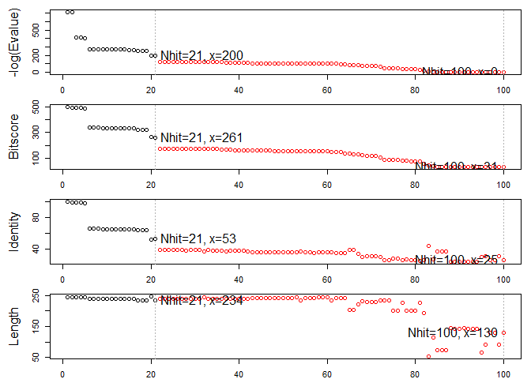
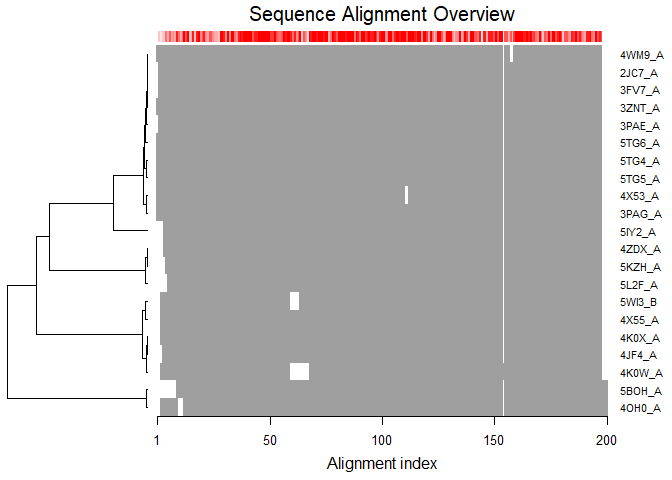
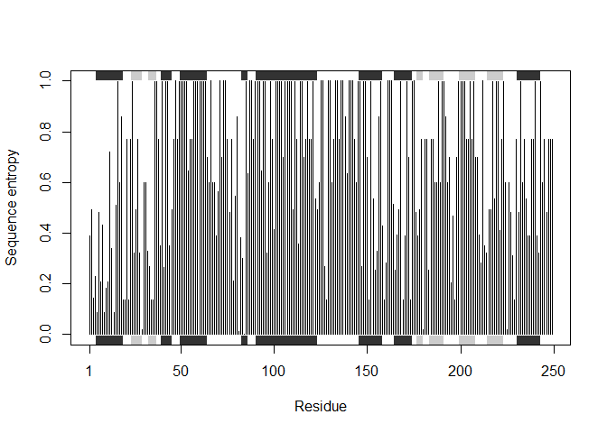

PDB analysis
================

PDB statistics
--------------

import our PDB statistics CSV file and calculate percent structures by experimental method.

``` r
p <- read.csv("Data Export Summary.csv", row.names=1)
```

``` r
percent <- (p$Total / sum(p$Total))*100
names(percent) <- row.names(p)
percent
```

    ##               X-Ray                 NMR Electron Microscopy 
    ##         89.51673340          8.71321614          1.51239392 
    ##               Other        Multi Method 
    ##          0.16986775          0.08778879

``` r
library (bio3d)
```

    ## Warning: package 'bio3d' was built under R version 3.4.4

reading pdb for stripping out drug molecule.

``` r
pdb <- read.pdb("1HSG")
```

    ##   Note: Accessing on-line PDB file

``` r
print(pdb)
```

    ## 
    ##  Call:  read.pdb(file = "1HSG")
    ## 
    ##    Total Models#: 1
    ##      Total Atoms#: 1686,  XYZs#: 5058  Chains#: 2  (values: A B)
    ## 
    ##      Protein Atoms#: 1514  (residues/Calpha atoms#: 198)
    ##      Nucleic acid Atoms#: 0  (residues/phosphate atoms#: 0)
    ## 
    ##      Non-protein/nucleic Atoms#: 172  (residues: 128)
    ##      Non-protein/nucleic resid values: [ HOH (127), MK1 (1) ]
    ## 
    ##    Protein sequence:
    ##       PQITLWQRPLVTIKIGGQLKEALLDTGADDTVLEEMSLPGRWKPKMIGGIGGFIKVRQYD
    ##       QILIEICGHKAIGTVLVGPTPVNIIGRNLLTQIGCTLNFPQITLWQRPLVTIKIGGQLKE
    ##       ALLDTGADDTVLEEMSLPGRWKPKMIGGIGGFIKVRQYDQILIEICGHKAIGTVLVGPTP
    ##       VNIIGRNLLTQIGCTLNF
    ## 
    ## + attr: atom, xyz, seqres, helix, sheet,
    ##         calpha, remark, call

``` r
attributes(pdb)
```

    ## $names
    ## [1] "atom"   "xyz"    "seqres" "helix"  "sheet"  "calpha" "remark" "call"  
    ## 
    ## $class
    ## [1] "pdb" "sse"

``` r
head(pdb$atom)
```

    ##   type eleno elety  alt resid chain resno insert      x      y     z o
    ## 1 ATOM     1     N <NA>   PRO     A     1   <NA> 29.361 39.686 5.862 1
    ## 2 ATOM     2    CA <NA>   PRO     A     1   <NA> 30.307 38.663 5.319 1
    ## 3 ATOM     3     C <NA>   PRO     A     1   <NA> 29.760 38.071 4.022 1
    ## 4 ATOM     4     O <NA>   PRO     A     1   <NA> 28.600 38.302 3.676 1
    ## 5 ATOM     5    CB <NA>   PRO     A     1   <NA> 30.508 37.541 6.342 1
    ## 6 ATOM     6    CG <NA>   PRO     A     1   <NA> 29.296 37.591 7.162 1
    ##       b segid elesy charge
    ## 1 38.10  <NA>     N   <NA>
    ## 2 40.62  <NA>     C   <NA>
    ## 3 42.64  <NA>     C   <NA>
    ## 4 43.40  <NA>     O   <NA>
    ## 5 37.87  <NA>     C   <NA>
    ## 6 38.40  <NA>     C   <NA>

``` r
plot.bio3d(pdb$atom$b[pdb$calpha], sse=pdb, typ="l", ylab="B-factor")
```


selecting protein/ligand elements

``` r
inds.ligand <- atom.select(pdb, "ligand")
inds.protein <- atom.select(pdb, "protein")
inds.ligand
```

    ## 
    ##  Call:  atom.select.pdb(pdb = pdb, string = "ligand")
    ## 
    ##    Atom Indices#: 45  ($atom)
    ##    XYZ  Indices#: 135  ($xyz)
    ## 
    ## + attr: atom, xyz, call

checking we have what we want

``` r
head(pdb$atom[inds.protein$atom,])
```

    ##   type eleno elety  alt resid chain resno insert      x      y     z o
    ## 1 ATOM     1     N <NA>   PRO     A     1   <NA> 29.361 39.686 5.862 1
    ## 2 ATOM     2    CA <NA>   PRO     A     1   <NA> 30.307 38.663 5.319 1
    ## 3 ATOM     3     C <NA>   PRO     A     1   <NA> 29.760 38.071 4.022 1
    ## 4 ATOM     4     O <NA>   PRO     A     1   <NA> 28.600 38.302 3.676 1
    ## 5 ATOM     5    CB <NA>   PRO     A     1   <NA> 30.508 37.541 6.342 1
    ## 6 ATOM     6    CG <NA>   PRO     A     1   <NA> 29.296 37.591 7.162 1
    ##       b segid elesy charge
    ## 1 38.10  <NA>     N   <NA>
    ## 2 40.62  <NA>     C   <NA>
    ## 3 42.64  <NA>     C   <NA>
    ## 4 43.40  <NA>     O   <NA>
    ## 5 37.87  <NA>     C   <NA>
    ## 6 38.40  <NA>     C   <NA>

creating new pdb file outputs

``` r
pdb.ligand <- trim.pdb(pdb,inds = inds.ligand)
pdb.ligand
```

    ## 
    ##  Call:  trim.pdb(pdb = pdb, inds = inds.ligand)
    ## 
    ##    Total Models#: 1
    ##      Total Atoms#: 45,  XYZs#: 135  Chains#: 1  (values: B)
    ## 
    ##      Protein Atoms#: 0  (residues/Calpha atoms#: 0)
    ##      Nucleic acid Atoms#: 0  (residues/phosphate atoms#: 0)
    ## 
    ##      Non-protein/nucleic Atoms#: 45  (residues: 1)
    ##      Non-protein/nucleic resid values: [ MK1 (1) ]
    ## 
    ## + attr: atom, helix, sheet, seqres, xyz,
    ##         calpha, call

``` r
write.pdb(pdb.ligand, file="1hsg_ligand.pdb")

pdb.protein <- trim.pdb(pdb,inds = inds.protein)
write.pdb(pdb.ligand, file="1hsg_protein.pdb")
```

aligning multiple structures

``` r
ids <- c("1TND_B","1AGR_A","1TAG_A","1GG2_A","1KJY_A","4G5Q_A")
files <- get.pdb(ids, split = TRUE)
```

    ## Warning in get.pdb(ids, split = TRUE): ./1TND.pdb exists. Skipping download

    ## Warning in get.pdb(ids, split = TRUE): ./1AGR.pdb exists. Skipping download

    ## Warning in get.pdb(ids, split = TRUE): ./1TAG.pdb exists. Skipping download

    ## Warning in get.pdb(ids, split = TRUE): ./1GG2.pdb exists. Skipping download

    ## Warning in get.pdb(ids, split = TRUE): ./1KJY.pdb exists. Skipping download

    ## Warning in get.pdb(ids, split = TRUE): ./4G5Q.pdb exists. Skipping download

    ## 
      |                                                                       
      |                                                                 |   0%
      |                                                                       
      |===========                                                      |  17%
      |                                                                       
      |======================                                           |  33%
      |                                                                       
      |================================                                 |  50%
      |                                                                       
      |===========================================                      |  67%
      |                                                                       
      |======================================================           |  83%
      |                                                                       
      |=================================================================| 100%

``` r
#extract and align the chains we are interested in 
pdbs <- pdbaln(files, fit = TRUE)
```

    ## Reading PDB files:
    ## ./split_chain/1TND_B.pdb
    ## ./split_chain/1AGR_A.pdb
    ## ./split_chain/1TAG_A.pdb
    ## ./split_chain/1GG2_A.pdb
    ## ./split_chain/1KJY_A.pdb
    ## ./split_chain/4G5Q_A.pdb
    ## .....   PDB has ALT records, taking A only, rm.alt=TRUE
    ## .
    ## 
    ## Extracting sequences
    ## 
    ## pdb/seq: 1   name: ./split_chain/1TND_B.pdb 
    ## pdb/seq: 2   name: ./split_chain/1AGR_A.pdb 
    ## pdb/seq: 3   name: ./split_chain/1TAG_A.pdb 
    ## pdb/seq: 4   name: ./split_chain/1GG2_A.pdb 
    ## pdb/seq: 5   name: ./split_chain/1KJY_A.pdb 
    ## pdb/seq: 6   name: ./split_chain/4G5Q_A.pdb 
    ##    PDB has ALT records, taking A only, rm.alt=TRUE

``` r
pdbs
```

    ##                                1        .         .         .         .         50 
    ## [Truncated_Name:1]1TND_B.pdb   --------------------------ARTVKLLLLGAGESGKSTIVKQMK
    ## [Truncated_Name:2]1AGR_A.pdb   LSAEDKAAVERSKMIDRNLREDGEKAAREVKLLLLGAGESGKSTIVKQMK
    ## [Truncated_Name:3]1TAG_A.pdb   --------------------------ARTVKLLLLGAGESGKSTIVKQMK
    ## [Truncated_Name:4]1GG2_A.pdb   LSAEDKAAVERSKMIDRNLREDGEKAAREVKLLLLGAGESGKSTIVKQMK
    ## [Truncated_Name:5]1KJY_A.pdb   -------------------------GAREVKLLLLGAGESGKSTIVKQMK
    ## [Truncated_Name:6]4G5Q_A.pdb   --------------------------AREVKLLLLGAGESGKSTIVKQMK
    ##                                                          ** ********************* 
    ##                                1        .         .         .         .         50 
    ## 
    ##                               51        .         .         .         .         100 
    ## [Truncated_Name:1]1TND_B.pdb   IIHQDGYSLEECLEFIAIIYGNTLQSILAIVRAMTTLNIQYGDSARQDDA
    ## [Truncated_Name:2]1AGR_A.pdb   IIHEAGYSEEECKQYKAVVYSNTIQSIIAIIRAMGRLKIDFGDAARADDA
    ## [Truncated_Name:3]1TAG_A.pdb   IIHQDGYSLEECLEFIAIIYGNTLQSILAIVRAMTTLNIQYGDSARQDDA
    ## [Truncated_Name:4]1GG2_A.pdb   IIHEAGYSEEECKQYKAVVYSNTIQSIIAIIRAMGRLKIDFGDAARADDA
    ## [Truncated_Name:5]1KJY_A.pdb   IIHEAGYSEEECKQYKAVVYSNTIQSIIAIIRAMGRLKIDFGDSARADDA
    ## [Truncated_Name:6]4G5Q_A.pdb   IIHEAGYSEEECKQYKAVVYSNTIQSIIAIIRAMGRLKIDFGDSARADDA
    ##                                ***  *** ***  ^ *^^* **^***^**^***  * * ^** ** *** 
    ##                               51        .         .         .         .         100 
    ## 
    ##                              101        .         .         .         .         150 
    ## [Truncated_Name:1]1TND_B.pdb   RKLMHMADTIEEGTMPKEMSDIIQRLWKDSGIQACFDRASEYQLNDSAGY
    ## [Truncated_Name:2]1AGR_A.pdb   RQLFVLAGAAEEGFMTAELAGVIKRLWKDSGVQACFNRSREYQLNDSAAY
    ## [Truncated_Name:3]1TAG_A.pdb   RKLMHMADTIEEGTMPKEMSDIIQRLWKDSGIQACFDRASEYQLNDSAGY
    ## [Truncated_Name:4]1GG2_A.pdb   RQLFVLAGAAEEGFMTAELAGVIKRLWKDSGVQACFNRSREYQLNDSAAY
    ## [Truncated_Name:5]1KJY_A.pdb   RQLFVLAGAAEEGFMTAELAGVIKRLWKDSGVQACFNRSREYQLNDSAAY
    ## [Truncated_Name:6]4G5Q_A.pdb   RQLFVLAGAAEEGFMTAELAGVIKRLWKDSGVQACFNRSREYQLNDSAAY
    ##                                * *  ^*   *** *  *^  ^* *******^**** *  ********^* 
    ##                              101        .         .         .         .         150 
    ## 
    ##                              151        .         .         .         .         200 
    ## [Truncated_Name:1]1TND_B.pdb   YLSDLERLVTPGYVPTEQDVLRSRVKTTGIIETQFSFKDLNFRMFDVGGQ
    ## [Truncated_Name:2]1AGR_A.pdb   YLNDLDRIAQPNYIPTQQDVLRTRVKTTGIVETHFTFKDLHFKMFDVGGQ
    ## [Truncated_Name:3]1TAG_A.pdb   YLSDLERLVTPGYVPTEQDVLRSRVKTTGIIETQFSFKDLNFRMFDVGGQ
    ## [Truncated_Name:4]1GG2_A.pdb   YLNDLDRIAQPNYIPTQQDVLRTRVKTTGIVETHFTFKDLHFKMFDVGAQ
    ## [Truncated_Name:5]1KJY_A.pdb   YLNDLDRIAQPNYIPTQQDVLRTRVKTTGIVETHFTFKDLHFKMFDVGGQ
    ## [Truncated_Name:6]4G5Q_A.pdb   YLNDLDRIAQPNYIPTQQDVLRTRVKTTGIVETHFTFKDLHFKMFDVGGQ
    ##                                ** **^*^  * *^** *****^*******^** *^**** *^*****^* 
    ##                              151        .         .         .         .         200 
    ## 
    ##                              201        .         .         .         .         250 
    ## [Truncated_Name:1]1TND_B.pdb   RSERKKWIHCFEGVTCIIFIAALSAYDMVLVEDDEVNRMHESLHLFNSIC
    ## [Truncated_Name:2]1AGR_A.pdb   RSERKKWIHCFEGVTAIIFCVALSDYDLVLAEDEEMNRMHESMKLFDSIC
    ## [Truncated_Name:3]1TAG_A.pdb   RSERKKWIHCFEGVTCIIFIAALSAYDMVLVEDDEVNRMHESLHLFNSIC
    ## [Truncated_Name:4]1GG2_A.pdb   RSERKKWIHCFEGVTAIIFCVALSDYDLVLAEDEEMNRMHESMKLFDSIC
    ## [Truncated_Name:5]1KJY_A.pdb   RSERKKWIHCFEGVTAIIFCVALSDYDLVLAEDEEMNRMHESMKLFDSIC
    ## [Truncated_Name:6]4G5Q_A.pdb   RSERKKWIHCFEGVTAIIFCVALSDYDLVLAEDEEMNRMHESMKLFDSIC
    ##                                *************** ***  *** **^** **^*^******^^** *** 
    ##                              201        .         .         .         .         250 
    ## 
    ##                              251        .         .         .         .         300 
    ## [Truncated_Name:1]1TND_B.pdb   NHRYFATTSIVLFLNKKDVFSEKIKKAHLSICFPDYNGPNTYEDAGNYIK
    ## [Truncated_Name:2]1AGR_A.pdb   NNKWFTDTSIILFLNKKDLFEEKIKKSPLTICYPEYAGSNTYEEAAAYIQ
    ## [Truncated_Name:3]1TAG_A.pdb   NHRYFATTSIVLFLNKKDVFSEKIKKAHLSICFPDYNGPNTYEDAGNYIK
    ## [Truncated_Name:4]1GG2_A.pdb   NNKWFTDTSIILFLNKKDLFEEKIKKSPLTICYPEYAGSNTYEEAAAYIQ
    ## [Truncated_Name:5]1KJY_A.pdb   NNKWFTDTSIILFLNKKDLFEEKIKKSPLTICYPEYAGSNTYEEAAAYIQ
    ## [Truncated_Name:6]4G5Q_A.pdb   NNKWFTDTSIILFLNKKDLFEEKIKKSPLTICYPEYAGSNTYEEAAAYIQ
    ##                                * ^^*  ***^*******^* *****  *^**^*^* * ****^*^ **  
    ##                              251        .         .         .         .         300 
    ## 
    ##                              301        .         .         .         .         350 
    ## [Truncated_Name:1]1TND_B.pdb   VQFLELNMRRDVKEIYSHMTCATDTQNVKFVFDAVTDIIIKE--------
    ## [Truncated_Name:2]1AGR_A.pdb   CQFEDLNKRKDTKEIYTHFTCATDTKNVQFVFDAVTDVIIKNNLKDCGLF
    ## [Truncated_Name:3]1TAG_A.pdb   VQFLELNMRRDVKEIYSHMTCATDTQNVKFVFDAVTDIII----------
    ## [Truncated_Name:4]1GG2_A.pdb   CQFEDLNKRKDTKEIYTHFTCATDTKNVQFVFDAVTDVIIKNNL------
    ## [Truncated_Name:5]1KJY_A.pdb   CQFEDLNKRKDTKEIYTHFTCATDTKNVQFVFDAVTDVIIKNNLK-----
    ## [Truncated_Name:6]4G5Q_A.pdb   CQFEDLNKRKDTKEIYTHFTCATDTKNVQFVFDAVTDVIIKNNLKD----
    ##                                 ** ^** *^* ****^* ****** ** ********^**           
    ##                              301        .         .         .         .         350 
    ## 
    ## Call:
    ##   pdbaln(files = files, fit = TRUE)
    ## 
    ## Class:
    ##   pdbs, fasta
    ## 
    ## Alignment dimensions:
    ##   6 sequence rows; 350 position columns (314 non-gap, 36 gap) 
    ## 
    ## + attr: xyz, resno, b, chain, id, ali, resid, sse, call

getting sequence for interested protein OXA 23

``` r
aa <-  get.seq("4jf4_A")
```

    ## Warning in get.seq("4jf4_A"): Removing existing file: seqs.fasta

``` r
aa
```

    ##              1        .         .         .         .         .         60 
    ## pdb|4JF4|A   QIVQGHNQVIHQYFDEKNTSGVLVIQTDKKINLYGNALSRANTEYVPASTFKMLNALIGL
    ##              1        .         .         .         .         .         60 
    ## 
    ##             61        .         .         .         .         .         120 
    ## pdb|4JF4|A   ENQKTDINEIFKWKGEKRSFTAWEKDMTLGEAMKLSAVPVYQELARRIGLDLMQKEVKRI
    ##             61        .         .         .         .         .         120 
    ## 
    ##            121        .         .         .         .         .         180 
    ## pdb|4JF4|A   GFGNAEIGQQVDNFWLVGPLKVTPIQEVEFVSQLAHTQLPFSEKVQANVKNMLLLEESNG
    ##            121        .         .         .         .         .         180 
    ## 
    ##            181        .         .         .         .         .         240 
    ## pdb|4JF4|A   YKIFGKTGWAMDIKPQVGWLTGWVEQPDGKIVAFALNMEMRSEMPASIRNELLMKSLKQL
    ##            181        .         .         .         .         .         240 
    ## 
    ##            241 243 
    ## pdb|4JF4|A   NII
    ##            241 243 
    ## 
    ## Call:
    ##   read.fasta(file = outfile)
    ## 
    ## Class:
    ##   fasta
    ## 
    ## Alignment dimensions:
    ##   1 sequence rows; 243 position columns (243 non-gap, 0 gap) 
    ## 
    ## + attr: id, ali, call

``` r
b <- blast.pdb(aa)
```

    ##  Searching ... please wait (updates every 5 seconds) RID = F72PTDK8014 
    ##  ...
    ##  Reporting 100 hits

``` r
hits <- plot(b, cutoff = 200)
```

    ##   * Possible cutoff values:    200 -1 
    ##             Yielding Nhits:    21 100 
    ## 
    ##   * Chosen cutoff value of:    200 
    ##             Yielding Nhits:    21



``` r
# Fetch PDBs
files <- get.pdb(hits$pdb.id, path = "pdbs", split = TRUE, gzip =
TRUE)
```

    ## Warning in get.pdb(hits$pdb.id, path = "pdbs", split = TRUE, gzip = TRUE):
    ## pdbs/4JF4.pdb exists. Skipping download

    ## Warning in get.pdb(hits$pdb.id, path = "pdbs", split = TRUE, gzip = TRUE):
    ## pdbs/4K0X.pdb exists. Skipping download

    ## Warning in get.pdb(hits$pdb.id, path = "pdbs", split = TRUE, gzip = TRUE):
    ## pdbs/4K0W.pdb exists. Skipping download

    ## Warning in get.pdb(hits$pdb.id, path = "pdbs", split = TRUE, gzip = TRUE):
    ## pdbs/4X55.pdb exists. Skipping download

    ## Warning in get.pdb(hits$pdb.id, path = "pdbs", split = TRUE, gzip = TRUE):
    ## pdbs/5WI3.pdb exists. Skipping download

    ## Warning in get.pdb(hits$pdb.id, path = "pdbs", split = TRUE, gzip = TRUE):
    ## pdbs/2JC7.pdb exists. Skipping download

    ## Warning in get.pdb(hits$pdb.id, path = "pdbs", split = TRUE, gzip = TRUE):
    ## pdbs/4WM9.pdb exists. Skipping download

    ## Warning in get.pdb(hits$pdb.id, path = "pdbs", split = TRUE, gzip = TRUE):
    ## pdbs/5IY2.pdb exists. Skipping download

    ## Warning in get.pdb(hits$pdb.id, path = "pdbs", split = TRUE, gzip = TRUE):
    ## pdbs/5TG5.pdb exists. Skipping download

    ## Warning in get.pdb(hits$pdb.id, path = "pdbs", split = TRUE, gzip = TRUE):
    ## pdbs/3PAE.pdb exists. Skipping download

    ## Warning in get.pdb(hits$pdb.id, path = "pdbs", split = TRUE, gzip = TRUE):
    ## pdbs/3FV7.pdb exists. Skipping download

    ## Warning in get.pdb(hits$pdb.id, path = "pdbs", split = TRUE, gzip = TRUE):
    ## pdbs/3ZNT.pdb exists. Skipping download

    ## Warning in get.pdb(hits$pdb.id, path = "pdbs", split = TRUE, gzip = TRUE):
    ## pdbs/5TG4.pdb exists. Skipping download

    ## Warning in get.pdb(hits$pdb.id, path = "pdbs", split = TRUE, gzip = TRUE):
    ## pdbs/3PAG.pdb exists. Skipping download

    ## Warning in get.pdb(hits$pdb.id, path = "pdbs", split = TRUE, gzip = TRUE):
    ## pdbs/5TG6.pdb exists. Skipping download

    ## Warning in get.pdb(hits$pdb.id, path = "pdbs", split = TRUE, gzip = TRUE):
    ## pdbs/4X53.pdb exists. Skipping download

    ## Warning in get.pdb(hits$pdb.id, path = "pdbs", split = TRUE, gzip = TRUE):
    ## pdbs/5KZH.pdb exists. Skipping download

    ## Warning in get.pdb(hits$pdb.id, path = "pdbs", split = TRUE, gzip = TRUE):
    ## pdbs/4ZDX.pdb exists. Skipping download

    ## Warning in get.pdb(hits$pdb.id, path = "pdbs", split = TRUE, gzip = TRUE):
    ## pdbs/5L2F.pdb exists. Skipping download

    ## Warning in get.pdb(hits$pdb.id, path = "pdbs", split = TRUE, gzip = TRUE):
    ## pdbs/4OH0.pdb exists. Skipping download

    ## Warning in get.pdb(hits$pdb.id, path = "pdbs", split = TRUE, gzip = TRUE):
    ## pdbs/5BOH.pdb exists. Skipping download

    ## 
      |                                                                       
      |                                                                 |   0%
      |                                                                       
      |===                                                              |   5%
      |                                                                       
      |======                                                           |  10%
      |                                                                       
      |=========                                                        |  14%
      |                                                                       
      |============                                                     |  19%
      |                                                                       
      |===============                                                  |  24%
      |                                                                       
      |===================                                              |  29%
      |                                                                       
      |======================                                           |  33%
      |                                                                       
      |=========================                                        |  38%
      |                                                                       
      |============================                                     |  43%
      |                                                                       
      |===============================                                  |  48%
      |                                                                       
      |==================================                               |  52%
      |                                                                       
      |=====================================                            |  57%
      |                                                                       
      |========================================                         |  62%
      |                                                                       
      |===========================================                      |  67%
      |                                                                       
      |==============================================                   |  71%
      |                                                                       
      |==================================================               |  76%
      |                                                                       
      |=====================================================            |  81%
      |                                                                       
      |========================================================         |  86%
      |                                                                       
      |===========================================================      |  90%
      |                                                                       
      |==============================================================   |  95%
      |                                                                       
      |=================================================================| 100%

``` r
# Align structures
pdbs <- pdbaln(files)
```

    ## Reading PDB files:
    ## pdbs/split_chain/4JF4_A.pdb
    ## pdbs/split_chain/4K0X_A.pdb
    ## pdbs/split_chain/4K0W_A.pdb
    ## pdbs/split_chain/4X55_A.pdb
    ## pdbs/split_chain/5WI3_B.pdb
    ## pdbs/split_chain/2JC7_A.pdb
    ## pdbs/split_chain/4WM9_A.pdb
    ## pdbs/split_chain/5IY2_A.pdb
    ## pdbs/split_chain/5TG5_A.pdb
    ## pdbs/split_chain/3PAE_A.pdb
    ## pdbs/split_chain/3FV7_A.pdb
    ## pdbs/split_chain/3ZNT_A.pdb
    ## pdbs/split_chain/5TG4_A.pdb
    ## pdbs/split_chain/3PAG_A.pdb
    ## pdbs/split_chain/5TG6_A.pdb
    ## pdbs/split_chain/4X53_A.pdb
    ## pdbs/split_chain/5KZH_A.pdb
    ## pdbs/split_chain/4ZDX_A.pdb
    ## pdbs/split_chain/5L2F_A.pdb
    ## pdbs/split_chain/4OH0_A.pdb
    ## pdbs/split_chain/5BOH_A.pdb
    ##    PDB has ALT records, taking A only, rm.alt=TRUE
    ## .   PDB has ALT records, taking A only, rm.alt=TRUE
    ## .   PDB has ALT records, taking A only, rm.alt=TRUE
    ## .   PDB has ALT records, taking A only, rm.alt=TRUE
    ## .   PDB has ALT records, taking A only, rm.alt=TRUE
    ## ...   PDB has ALT records, taking A only, rm.alt=TRUE
    ## .   PDB has ALT records, taking A only, rm.alt=TRUE
    ## .   PDB has ALT records, taking A only, rm.alt=TRUE
    ## ...   PDB has ALT records, taking A only, rm.alt=TRUE
    ## .   PDB has ALT records, taking A only, rm.alt=TRUE
    ## .   PDB has ALT records, taking A only, rm.alt=TRUE
    ## .   PDB has ALT records, taking A only, rm.alt=TRUE
    ## .   PDB has ALT records, taking A only, rm.alt=TRUE
    ## .   PDB has ALT records, taking A only, rm.alt=TRUE
    ## .   PDB has ALT records, taking A only, rm.alt=TRUE
    ## .   PDB has ALT records, taking A only, rm.alt=TRUE
    ## ..
    ## 
    ## Extracting sequences
    ## 
    ## pdb/seq: 1   name: pdbs/split_chain/4JF4_A.pdb 
    ##    PDB has ALT records, taking A only, rm.alt=TRUE
    ## pdb/seq: 2   name: pdbs/split_chain/4K0X_A.pdb 
    ##    PDB has ALT records, taking A only, rm.alt=TRUE
    ## pdb/seq: 3   name: pdbs/split_chain/4K0W_A.pdb 
    ##    PDB has ALT records, taking A only, rm.alt=TRUE
    ## pdb/seq: 4   name: pdbs/split_chain/4X55_A.pdb 
    ##    PDB has ALT records, taking A only, rm.alt=TRUE
    ## pdb/seq: 5   name: pdbs/split_chain/5WI3_B.pdb 
    ##    PDB has ALT records, taking A only, rm.alt=TRUE
    ## pdb/seq: 6   name: pdbs/split_chain/2JC7_A.pdb 
    ## pdb/seq: 7   name: pdbs/split_chain/4WM9_A.pdb 
    ## pdb/seq: 8   name: pdbs/split_chain/5IY2_A.pdb 
    ##    PDB has ALT records, taking A only, rm.alt=TRUE
    ## pdb/seq: 9   name: pdbs/split_chain/5TG5_A.pdb 
    ##    PDB has ALT records, taking A only, rm.alt=TRUE
    ## pdb/seq: 10   name: pdbs/split_chain/3PAE_A.pdb 
    ##    PDB has ALT records, taking A only, rm.alt=TRUE
    ## pdb/seq: 11   name: pdbs/split_chain/3FV7_A.pdb 
    ## pdb/seq: 12   name: pdbs/split_chain/3ZNT_A.pdb 
    ## pdb/seq: 13   name: pdbs/split_chain/5TG4_A.pdb 
    ##    PDB has ALT records, taking A only, rm.alt=TRUE
    ## pdb/seq: 14   name: pdbs/split_chain/3PAG_A.pdb 
    ##    PDB has ALT records, taking A only, rm.alt=TRUE
    ## pdb/seq: 15   name: pdbs/split_chain/5TG6_A.pdb 
    ##    PDB has ALT records, taking A only, rm.alt=TRUE
    ## pdb/seq: 16   name: pdbs/split_chain/4X53_A.pdb 
    ##    PDB has ALT records, taking A only, rm.alt=TRUE
    ## pdb/seq: 17   name: pdbs/split_chain/5KZH_A.pdb 
    ##    PDB has ALT records, taking A only, rm.alt=TRUE
    ## pdb/seq: 18   name: pdbs/split_chain/4ZDX_A.pdb 
    ##    PDB has ALT records, taking A only, rm.alt=TRUE
    ## pdb/seq: 19   name: pdbs/split_chain/5L2F_A.pdb 
    ##    PDB has ALT records, taking A only, rm.alt=TRUE
    ## pdb/seq: 20   name: pdbs/split_chain/4OH0_A.pdb 
    ##    PDB has ALT records, taking A only, rm.alt=TRUE
    ## pdb/seq: 21   name: pdbs/split_chain/5BOH_A.pdb

``` r
# Vector containing PDB codes
ids <- basename.pdb(pdbs$id)
# Draw schematic alignment
plot(pdbs, labels=ids)
```

 5.2 Sequence conservation analysis

``` r
# Calculate sequence conservation
cons <- conserv(pdbs, method="entropy22")
# SSE annotations
sse <- pdbs2sse(pdbs, ind=1, rm.gaps=FALSE)
```

    ## Extracting SSE from pdbs$sse attribute

``` r
# Plot conservation per residue
plotb3(cons, sse=sse, ylab="Sequence entropy")
```



``` r
# find invariant core
core <- core.find(pdbs)
```

    ##  core size 216 of 217  vol = 12.725 
    ##  core size 215 of 217  vol = 11.304 
    ##  core size 214 of 217  vol = 10.148 
    ##  core size 213 of 217  vol = 9.187 
    ##  core size 212 of 217  vol = 8.41 
    ##  core size 211 of 217  vol = 7.792 
    ##  core size 210 of 217  vol = 7.4 
    ##  core size 209 of 217  vol = 6.958 
    ##  core size 208 of 217  vol = 6.581 
    ##  core size 207 of 217  vol = 6.2 
    ##  core size 206 of 217  vol = 5.846 
    ##  core size 205 of 217  vol = 5.563 
    ##  core size 204 of 217  vol = 5.284 
    ##  core size 203 of 217  vol = 5.072 
    ##  core size 202 of 217  vol = 4.848 
    ##  core size 201 of 217  vol = 4.634 
    ##  core size 200 of 217  vol = 4.461 
    ##  core size 199 of 217  vol = 4.281 
    ##  core size 198 of 217  vol = 4.121 
    ##  core size 197 of 217  vol = 3.953 
    ##  core size 196 of 217  vol = 3.809 
    ##  core size 195 of 217  vol = 3.671 
    ##  core size 194 of 217  vol = 3.537 
    ##  core size 193 of 217  vol = 3.398 
    ##  core size 192 of 217  vol = 3.273 
    ##  core size 191 of 217  vol = 3.138 
    ##  core size 190 of 217  vol = 3.017 
    ##  core size 189 of 217  vol = 2.912 
    ##  core size 188 of 217  vol = 2.815 
    ##  core size 187 of 217  vol = 2.739 
    ##  core size 186 of 217  vol = 2.646 
    ##  core size 185 of 217  vol = 2.585 
    ##  core size 184 of 217  vol = 2.529 
    ##  core size 183 of 217  vol = 2.469 
    ##  core size 182 of 217  vol = 2.409 
    ##  core size 181 of 217  vol = 2.353 
    ##  core size 180 of 217  vol = 2.302 
    ##  core size 179 of 217  vol = 2.256 
    ##  core size 178 of 217  vol = 2.201 
    ##  core size 177 of 217  vol = 2.15 
    ##  core size 176 of 217  vol = 2.098 
    ##  core size 175 of 217  vol = 2.058 
    ##  core size 174 of 217  vol = 2 
    ##  core size 173 of 217  vol = 1.956 
    ##  core size 172 of 217  vol = 1.918 
    ##  core size 171 of 217  vol = 1.884 
    ##  core size 170 of 217  vol = 1.84 
    ##  core size 169 of 217  vol = 1.802 
    ##  core size 168 of 217  vol = 1.766 
    ##  core size 167 of 217  vol = 1.734 
    ##  core size 166 of 217  vol = 1.696 
    ##  core size 165 of 217  vol = 1.659 
    ##  core size 164 of 217  vol = 1.622 
    ##  core size 163 of 217  vol = 1.584 
    ##  core size 162 of 217  vol = 1.547 
    ##  core size 161 of 217  vol = 1.515 
    ##  core size 160 of 217  vol = 1.486 
    ##  core size 159 of 217  vol = 1.455 
    ##  core size 158 of 217  vol = 1.425 
    ##  core size 157 of 217  vol = 1.395 
    ##  core size 156 of 217  vol = 1.365 
    ##  core size 155 of 217  vol = 1.336 
    ##  core size 154 of 217  vol = 1.307 
    ##  core size 153 of 217  vol = 1.281 
    ##  core size 152 of 217  vol = 1.253 
    ##  core size 151 of 217  vol = 1.226 
    ##  core size 150 of 217  vol = 1.198 
    ##  core size 149 of 217  vol = 1.169 
    ##  core size 148 of 217  vol = 1.142 
    ##  core size 147 of 217  vol = 1.118 
    ##  core size 146 of 217  vol = 1.094 
    ##  core size 145 of 217  vol = 1.071 
    ##  core size 144 of 217  vol = 1.049 
    ##  core size 143 of 217  vol = 1.024 
    ##  core size 142 of 217  vol = 1.003 
    ##  core size 141 of 217  vol = 0.982 
    ##  core size 140 of 217  vol = 0.961 
    ##  core size 139 of 217  vol = 0.938 
    ##  core size 138 of 217  vol = 0.917 
    ##  core size 137 of 217  vol = 0.897 
    ##  core size 136 of 217  vol = 0.878 
    ##  core size 135 of 217  vol = 0.857 
    ##  core size 134 of 217  vol = 0.84 
    ##  core size 133 of 217  vol = 0.823 
    ##  core size 132 of 217  vol = 0.806 
    ##  core size 131 of 217  vol = 0.789 
    ##  core size 130 of 217  vol = 0.771 
    ##  core size 129 of 217  vol = 0.756 
    ##  core size 128 of 217  vol = 0.739 
    ##  core size 127 of 217  vol = 0.72 
    ##  core size 126 of 217  vol = 0.704 
    ##  core size 125 of 217  vol = 0.688 
    ##  core size 124 of 217  vol = 0.672 
    ##  core size 123 of 217  vol = 0.659 
    ##  core size 122 of 217  vol = 0.641 
    ##  core size 121 of 217  vol = 0.627 
    ##  core size 120 of 217  vol = 0.612 
    ##  core size 119 of 217  vol = 0.599 
    ##  core size 118 of 217  vol = 0.587 
    ##  core size 117 of 217  vol = 0.575 
    ##  core size 116 of 217  vol = 0.562 
    ##  core size 115 of 217  vol = 0.547 
    ##  core size 114 of 217  vol = 0.535 
    ##  core size 113 of 217  vol = 0.524 
    ##  core size 112 of 217  vol = 0.513 
    ##  core size 111 of 217  vol = 0.502 
    ##  core size 110 of 217  vol = 0.49 
    ##  FINISHED: Min vol ( 0.5 ) reached

``` r
# superimpose all structures to core
pdbs$xyz = pdbfit(pdbs, core)
# Perform PCA
pc.xray <- pca(pdbs)
```

rmsd structure based clustering

``` r
# find invariant core
core <- core.find(pdbs)
```

    ##  core size 216 of 217  vol = 12.725 
    ##  core size 215 of 217  vol = 11.304 
    ##  core size 214 of 217  vol = 10.148 
    ##  core size 213 of 217  vol = 9.187 
    ##  core size 212 of 217  vol = 8.41 
    ##  core size 211 of 217  vol = 7.792 
    ##  core size 210 of 217  vol = 7.4 
    ##  core size 209 of 217  vol = 6.958 
    ##  core size 208 of 217  vol = 6.581 
    ##  core size 207 of 217  vol = 6.2 
    ##  core size 206 of 217  vol = 5.846 
    ##  core size 205 of 217  vol = 5.563 
    ##  core size 204 of 217  vol = 5.284 
    ##  core size 203 of 217  vol = 5.072 
    ##  core size 202 of 217  vol = 4.848 
    ##  core size 201 of 217  vol = 4.634 
    ##  core size 200 of 217  vol = 4.461 
    ##  core size 199 of 217  vol = 4.281 
    ##  core size 198 of 217  vol = 4.121 
    ##  core size 197 of 217  vol = 3.953 
    ##  core size 196 of 217  vol = 3.809 
    ##  core size 195 of 217  vol = 3.671 
    ##  core size 194 of 217  vol = 3.537 
    ##  core size 193 of 217  vol = 3.398 
    ##  core size 192 of 217  vol = 3.273 
    ##  core size 191 of 217  vol = 3.138 
    ##  core size 190 of 217  vol = 3.017 
    ##  core size 189 of 217  vol = 2.912 
    ##  core size 188 of 217  vol = 2.815 
    ##  core size 187 of 217  vol = 2.739 
    ##  core size 186 of 217  vol = 2.646 
    ##  core size 185 of 217  vol = 2.585 
    ##  core size 184 of 217  vol = 2.529 
    ##  core size 183 of 217  vol = 2.469 
    ##  core size 182 of 217  vol = 2.409 
    ##  core size 181 of 217  vol = 2.353 
    ##  core size 180 of 217  vol = 2.302 
    ##  core size 179 of 217  vol = 2.256 
    ##  core size 178 of 217  vol = 2.201 
    ##  core size 177 of 217  vol = 2.15 
    ##  core size 176 of 217  vol = 2.098 
    ##  core size 175 of 217  vol = 2.058 
    ##  core size 174 of 217  vol = 2 
    ##  core size 173 of 217  vol = 1.956 
    ##  core size 172 of 217  vol = 1.918 
    ##  core size 171 of 217  vol = 1.884 
    ##  core size 170 of 217  vol = 1.84 
    ##  core size 169 of 217  vol = 1.802 
    ##  core size 168 of 217  vol = 1.766 
    ##  core size 167 of 217  vol = 1.734 
    ##  core size 166 of 217  vol = 1.696 
    ##  core size 165 of 217  vol = 1.659 
    ##  core size 164 of 217  vol = 1.622 
    ##  core size 163 of 217  vol = 1.584 
    ##  core size 162 of 217  vol = 1.547 
    ##  core size 161 of 217  vol = 1.515 
    ##  core size 160 of 217  vol = 1.486 
    ##  core size 159 of 217  vol = 1.455 
    ##  core size 158 of 217  vol = 1.425 
    ##  core size 157 of 217  vol = 1.395 
    ##  core size 156 of 217  vol = 1.365 
    ##  core size 155 of 217  vol = 1.336 
    ##  core size 154 of 217  vol = 1.307 
    ##  core size 153 of 217  vol = 1.281 
    ##  core size 152 of 217  vol = 1.253 
    ##  core size 151 of 217  vol = 1.226 
    ##  core size 150 of 217  vol = 1.198 
    ##  core size 149 of 217  vol = 1.169 
    ##  core size 148 of 217  vol = 1.142 
    ##  core size 147 of 217  vol = 1.118 
    ##  core size 146 of 217  vol = 1.094 
    ##  core size 145 of 217  vol = 1.071 
    ##  core size 144 of 217  vol = 1.049 
    ##  core size 143 of 217  vol = 1.024 
    ##  core size 142 of 217  vol = 1.003 
    ##  core size 141 of 217  vol = 0.982 
    ##  core size 140 of 217  vol = 0.961 
    ##  core size 139 of 217  vol = 0.938 
    ##  core size 138 of 217  vol = 0.917 
    ##  core size 137 of 217  vol = 0.897 
    ##  core size 136 of 217  vol = 0.878 
    ##  core size 135 of 217  vol = 0.857 
    ##  core size 134 of 217  vol = 0.84 
    ##  core size 133 of 217  vol = 0.823 
    ##  core size 132 of 217  vol = 0.806 
    ##  core size 131 of 217  vol = 0.789 
    ##  core size 130 of 217  vol = 0.771 
    ##  core size 129 of 217  vol = 0.756 
    ##  core size 128 of 217  vol = 0.739 
    ##  core size 127 of 217  vol = 0.72 
    ##  core size 126 of 217  vol = 0.704 
    ##  core size 125 of 217  vol = 0.688 
    ##  core size 124 of 217  vol = 0.672 
    ##  core size 123 of 217  vol = 0.659 
    ##  core size 122 of 217  vol = 0.641 
    ##  core size 121 of 217  vol = 0.627 
    ##  core size 120 of 217  vol = 0.612 
    ##  core size 119 of 217  vol = 0.599 
    ##  core size 118 of 217  vol = 0.587 
    ##  core size 117 of 217  vol = 0.575 
    ##  core size 116 of 217  vol = 0.562 
    ##  core size 115 of 217  vol = 0.547 
    ##  core size 114 of 217  vol = 0.535 
    ##  core size 113 of 217  vol = 0.524 
    ##  core size 112 of 217  vol = 0.513 
    ##  core size 111 of 217  vol = 0.502 
    ##  core size 110 of 217  vol = 0.49 
    ##  FINISHED: Min vol ( 0.5 ) reached

``` r
# superimpose all structures to core
pdbs$xyz = pdbfit(pdbs, core)
# Perform PCA
pc.xray <- pca(pdbs)
```

generating trajectory pdb file

``` r
mktrj(pc.xray, pc=1, file="pc_1.pdb")
```
