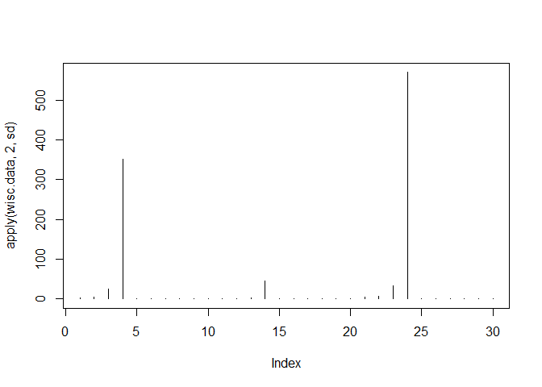
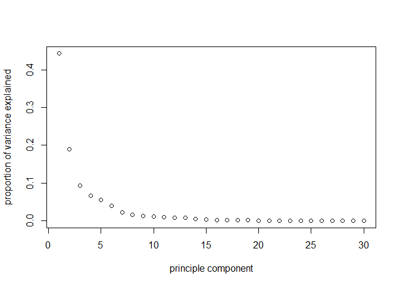
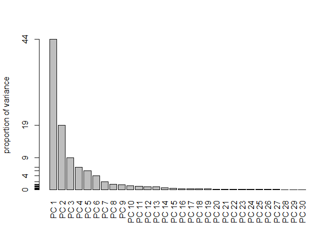
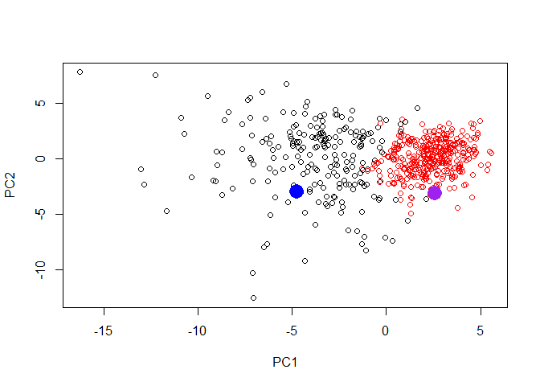

#unsupervised learning analysis of cancer cells. 

reading input data 


```r
wisc.df<- read.csv ("https://bioboot.github.io/bggn213_S18/class-material/WisconsinCancer.csv")
head(wisc.df)
```

```
##         id diagnosis radius_mean texture_mean perimeter_mean area_mean
## 1   842302         M       17.99        10.38         122.80    1001.0
## 2   842517         M       20.57        17.77         132.90    1326.0
## 3 84300903         M       19.69        21.25         130.00    1203.0
## 4 84348301         M       11.42        20.38          77.58     386.1
## 5 84358402         M       20.29        14.34         135.10    1297.0
## 6   843786         M       12.45        15.70          82.57     477.1
##   smoothness_mean compactness_mean concavity_mean concave.points_mean
## 1         0.11840          0.27760         0.3001             0.14710
## 2         0.08474          0.07864         0.0869             0.07017
## 3         0.10960          0.15990         0.1974             0.12790
## 4         0.14250          0.28390         0.2414             0.10520
## 5         0.10030          0.13280         0.1980             0.10430
## 6         0.12780          0.17000         0.1578             0.08089
##   symmetry_mean fractal_dimension_mean radius_se texture_se perimeter_se
## 1        0.2419                0.07871    1.0950     0.9053        8.589
## 2        0.1812                0.05667    0.5435     0.7339        3.398
## 3        0.2069                0.05999    0.7456     0.7869        4.585
## 4        0.2597                0.09744    0.4956     1.1560        3.445
## 5        0.1809                0.05883    0.7572     0.7813        5.438
## 6        0.2087                0.07613    0.3345     0.8902        2.217
##   area_se smoothness_se compactness_se concavity_se concave.points_se
## 1  153.40      0.006399        0.04904      0.05373           0.01587
## 2   74.08      0.005225        0.01308      0.01860           0.01340
## 3   94.03      0.006150        0.04006      0.03832           0.02058
## 4   27.23      0.009110        0.07458      0.05661           0.01867
## 5   94.44      0.011490        0.02461      0.05688           0.01885
## 6   27.19      0.007510        0.03345      0.03672           0.01137
##   symmetry_se fractal_dimension_se radius_worst texture_worst
## 1     0.03003             0.006193        25.38         17.33
## 2     0.01389             0.003532        24.99         23.41
## 3     0.02250             0.004571        23.57         25.53
## 4     0.05963             0.009208        14.91         26.50
## 5     0.01756             0.005115        22.54         16.67
## 6     0.02165             0.005082        15.47         23.75
##   perimeter_worst area_worst smoothness_worst compactness_worst
## 1          184.60     2019.0           0.1622            0.6656
## 2          158.80     1956.0           0.1238            0.1866
## 3          152.50     1709.0           0.1444            0.4245
## 4           98.87      567.7           0.2098            0.8663
## 5          152.20     1575.0           0.1374            0.2050
## 6          103.40      741.6           0.1791            0.5249
##   concavity_worst concave.points_worst symmetry_worst
## 1          0.7119               0.2654         0.4601
## 2          0.2416               0.1860         0.2750
## 3          0.4504               0.2430         0.3613
## 4          0.6869               0.2575         0.6638
## 5          0.4000               0.1625         0.2364
## 6          0.5355               0.1741         0.3985
##   fractal_dimension_worst  X
## 1                 0.11890 NA
## 2                 0.08902 NA
## 3                 0.08758 NA
## 4                 0.17300 NA
## 5                 0.07678 NA
## 6                 0.12440 NA
```

How many diagnosis are malign?


```r
table(wisc.df$diagnosis)
```

```
## 
##   B   M 
## 357 212
```

conversion to datatable (matrix of columns 3 through 32)
and assigning ID's as a rowname. removal of first two columns as they are ID's and diagnosis. last column becuase it is all NA's


```r
#datam<- as.matrix(wisc.df[ , 3:32])
# OR use - 
wisc.data <- wisc.df[-c(1:2,33)]
#converting ID's to rownames
rownames(wisc.data) <- wisc.df$id
```


using equality check to get numeric vector. 

```r
diagnosis <- as.numeric(wisc.df$diagnosis == "M")
sum(diagnosis)
```

```
## [1] 212
```
calculating number of observations (patients) and 
use `dim()` or more specifically `nrow()`
and how many are suffixed with _nmean?

```r
nrow(wisc.df)
```

```
## [1] 569
```

```r
length(grep("mean", colnames(wisc.df), value = TRUE)) # "invert = TRUE" arguement will return what does NOT match. need to add length arguement to count length of vector 
```

```
## [1] 10
```

## principal component analysis.
It is important to check if the data need to be scaled before performing PCA. Recall two common reasons for scaling data include:

The input variables use different units of measurement.
The input variables have significantly different variances.
Check the mean and standard deviation of the features (i.e. columns) of the wisc.data to determine if the data should be scaled. Use the colMeans() and apply() functions like you’ve done before.


```r
colMeans(wisc.data)
```

```
##             radius_mean            texture_mean          perimeter_mean 
##            1.412729e+01            1.928965e+01            9.196903e+01 
##               area_mean         smoothness_mean        compactness_mean 
##            6.548891e+02            9.636028e-02            1.043410e-01 
##          concavity_mean     concave.points_mean           symmetry_mean 
##            8.879932e-02            4.891915e-02            1.811619e-01 
##  fractal_dimension_mean               radius_se              texture_se 
##            6.279761e-02            4.051721e-01            1.216853e+00 
##            perimeter_se                 area_se           smoothness_se 
##            2.866059e+00            4.033708e+01            7.040979e-03 
##          compactness_se            concavity_se       concave.points_se 
##            2.547814e-02            3.189372e-02            1.179614e-02 
##             symmetry_se    fractal_dimension_se            radius_worst 
##            2.054230e-02            3.794904e-03            1.626919e+01 
##           texture_worst         perimeter_worst              area_worst 
##            2.567722e+01            1.072612e+02            8.805831e+02 
##        smoothness_worst       compactness_worst         concavity_worst 
##            1.323686e-01            2.542650e-01            2.721885e-01 
##    concave.points_worst          symmetry_worst fractal_dimension_worst 
##            1.146062e-01            2.900756e-01            8.394582e-02
```

```r
plot( apply(wisc.data,2,sd), type = "h")
```

<!-- -->

pca analysis will scale becuase of differences. 
on first try get error because column X is all NA. 

```r
wisc.pr <- prcomp(wisc.data, scale. = TRUE)
summary(wisc.pr)
```

```
## Importance of components:
##                           PC1    PC2     PC3     PC4     PC5     PC6
## Standard deviation     3.6444 2.3857 1.67867 1.40735 1.28403 1.09880
## Proportion of Variance 0.4427 0.1897 0.09393 0.06602 0.05496 0.04025
## Cumulative Proportion  0.4427 0.6324 0.72636 0.79239 0.84734 0.88759
##                            PC7     PC8    PC9    PC10   PC11    PC12
## Standard deviation     0.82172 0.69037 0.6457 0.59219 0.5421 0.51104
## Proportion of Variance 0.02251 0.01589 0.0139 0.01169 0.0098 0.00871
## Cumulative Proportion  0.91010 0.92598 0.9399 0.95157 0.9614 0.97007
##                           PC13    PC14    PC15    PC16    PC17    PC18
## Standard deviation     0.49128 0.39624 0.30681 0.28260 0.24372 0.22939
## Proportion of Variance 0.00805 0.00523 0.00314 0.00266 0.00198 0.00175
## Cumulative Proportion  0.97812 0.98335 0.98649 0.98915 0.99113 0.99288
##                           PC19    PC20   PC21    PC22    PC23   PC24
## Standard deviation     0.22244 0.17652 0.1731 0.16565 0.15602 0.1344
## Proportion of Variance 0.00165 0.00104 0.0010 0.00091 0.00081 0.0006
## Cumulative Proportion  0.99453 0.99557 0.9966 0.99749 0.99830 0.9989
##                           PC25    PC26    PC27    PC28    PC29    PC30
## Standard deviation     0.12442 0.09043 0.08307 0.03987 0.02736 0.01153
## Proportion of Variance 0.00052 0.00027 0.00023 0.00005 0.00002 0.00000
## Cumulative Proportion  0.99942 0.99969 0.99992 0.99997 1.00000 1.00000
```

## plotting the PCA results

```r
plot(wisc.pr$x[,1], wisc.pr$x[,2], col=diagnosis+1)
```

<!-- -->

##skree-plot: variance explained. 
pca plot gives standard deviation- we need variance for skree plot, 

```r
pve<- (wisc.pr$sdev^2)/sum(wisc.pr$sdev^2)
plot(pve, xlab = "principle component",
     ylab = "proportion of variance explained")
```

<!-- -->

```r
#maybe barplot will look better
barplot(pve, names.arg = paste("PC", 1:length(pve)), las=2, axes = FALSE, ylab = "proportion of variance")
axis(2, at=pve, labels=round(pve,2)*100)
```

<!-- -->

##hierarchical clustering. 


```r
data.dist <- dist(scale(wisc.data))
wisc.hclust <- hclust(data.dist, method="complete" )
wisc.hclust.clusters<- cutree(wisc.hclust, k = 4)
```

```r
plot(wisc.hclust)
abline(h = 20, col = 2)
```

<!-- -->

informative tables doing cross tabulation


```r
table(wisc.hclust.clusters, diagnosis)
```

```
##                     diagnosis
## wisc.hclust.clusters   0   1
##                    1  12 165
##                    2   2   5
##                    3 343  40
##                    4   0   2
```

## kmeans clusters


```r
data.scaled <- scale(wisc.data)
wisc.km <- kmeans(data.scaled, centers = 2, nstart = 20)

#cluster membership vector
table(wisc.km$cluster)
```

```
## 
##   1   2 
## 380 189
```

comparing to expert `diagnosis` 

```r
table(wisc.km$cluster, diagnosis)
```

```
##    diagnosis
##       0   1
##   1 343  37
##   2  14 175
```

## clustering on PCA results 

```r
wisc.pr.hclust <- hclust(dist(wisc.pr$x[, 1:7]), method = "ward.D2")
plot(wisc.pr.hclust)
```

<!-- -->

```r
table((cutree(wisc.pr.hclust, k = 2)), diagnosis)
```

```
##    diagnosis
##       0   1
##   1  28 188
##   2 329  24
```

```r
wisc.pr.hclust.clusters <- cutree(wisc.pr.hclust, k = 2)
plot(wisc.pr$x[,1:2], col = wisc.pr.hclust.clusters)
```

<!-- -->

Predicting MAlignancy of new samples. 

```r
new <- read.csv("https://tinyurl.com/new-samples-CSV")
npc <- predict(wisc.pr, newdata = new)

plot(wisc.pr$x[, 1:2], col= wisc.pr.hclust.clusters)
points(npc[,1], npc[,2], col=c("purple", "blue"), pch=16, cex = 2.5)
```

<!-- -->

